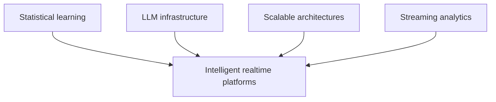
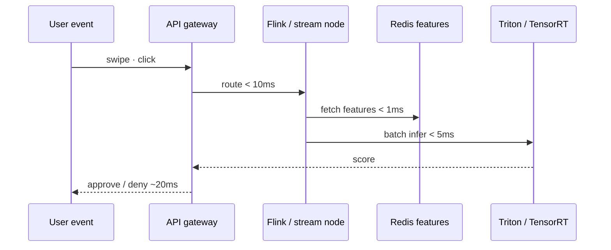

# Intelligent Real-Time Platforms: Sub-Millisecond AI

## Prerequisites



## When to use

- **Sub-100ms decisions** on live events (fraud, pricing, routing) with ML in the critical path.
- **Stateful stream processing** where per-user context must live beside the compute, not round-trip to SQL.
- **Feature stores** that pre-materialize aggregates so inference sees only O(1) lookups.

## When not to use

- **Overnight batch analytics** — MapReduce or warehouse SQL is cheaper and simpler.
- **Cold-start users** with no precomputed features unless you accept higher latency on first event.
- **Exact nearest-neighbor over huge catalogs** without ANN — latency budgets will break.

## How to read the diagrams

Follow the **real-time inference sequence** end to end (gateway → stream processor → model → response), then **dynamic batching** for how a short wait window trades latency for GPU throughput. The ascii pipeline below lists the same stages.

---

## Simple Fundamental Explanation
Imagine you are applying for a mortgage at a bank.
- **Batch Processing**: You hand the teller your paperwork. They put it in a pile. Overnight, a massive mainframe processes the pile. You get a letter in the mail 3 days later saying "Approved."
- **Real-Time Platform**: You swipe your credit card at a gas station. In the 1.5 seconds it takes for the machine to beep "Approved", a massive data center in another state checked your balance, verified your location, ran your purchase through an AI fraud detection model, and returned the result.

An **Intelligent Real-Time Platform** is an architecture specifically engineered to execute complex business logic and advanced Machine Learning inference in under 100 milliseconds, on millions of simultaneous events, without ever using traditional batch processing.

---

## Deep Dive: How It Works Under the Hood

Achieving sub-millisecond AI inference requires stripping out every single bottleneck in the traditional software stack.

### 1. The Death of the Database Trip
In a traditional system, when an event arrives, the server queries the database (`SELECT * FROM Users`) to get context before running the AI model. That network hop to the database takes 5-10ms. Too slow.

Intelligent Real-Time Platforms use **Stateful Stream Processing** (like Apache Flink). The context (the User's history) is kept in the local RAM (RocksDB) of the stream processing node itself. When the event arrives, the data is already there. Latency drops to microseconds.

### 2. In-Memory Feature Stores
Machine learning models need "Features" (e.g., "Number of times this user tried to log in today"). Calculating this from raw data on the fly is too slow.
Platforms use ultra-low-latency Feature Stores (like Redis). Background jobs pre-calculate all features and push them to Redis. The Real-Time platform instantly fetches the pre-calculated integer and feeds it to the AI.

### Visual Diagram: The Real-Time ML Pipeline

### Diagram 1 — Sub-100ms inference path



### Diagram 2 — Dynamic batching wait window


```ascii
[ User Swipes Credit Card ]
           | (< 10ms network transit)
           v
[ API Gateway ]
           |
           v
[ Stateful Stream Processor (Flink) ]
   - Instantly fetches User Profile from Local RAM (< 1ms).
   - Instantly fetches dynamic Features from Redis (< 1ms).
           |
           v
[ Model Inference Engine (e.g., Triton / TensorRT) ]
   - Executes pre-compiled Neural Network weights in GPU memory.
   - Calculates P(Fraud) = 0.02 (< 5ms).
           |
           v
[ API Gateway ] -> Returns "Approved" to Gas Station.

Total Time: ~20 milliseconds.
```

---

## Practical Example: Uber's Michelangelo

When you open the Uber app, the system has to calculate an ETA, a Price, and route a driver to you. All of this requires running dozens of complex Machine Learning models. If it takes 5 seconds to load, you will close the app and use Lyft.

Uber built an internal platform called Michelangelo to solve this. Michelangelo manages the lifecycle of ML models. More importantly, it provides the low-latency serving infrastructure. It automatically bridges the gap between massive offline batch processing (Hadoop, which takes hours to calculate your user profile) and the real-time online serving layer (Cassandra/Redis, which serves that profile to the ETA prediction model in 2 milliseconds).

---

## The Mathematics: Equations and In-Depth Analysis

### 1. Amortizing Inference Costs (Batching)
GPUs are terrible at processing exactly 1 request. They are designed to process 1,000 requests simultaneously.
If an intelligent platform sends 1 transaction to the GPU, the math might take 3ms.
If it sends 128 transactions to the GPU in a batch, the math might take 4ms total.

The system uses a mathematical technique called **Dynamic Batching**.
When a request arrives, the system intentionally pauses it for a tiny fraction of a second (e.g., $W = 2ms$), hoping other requests arrive to form a batch.

Let $\lambda$ be the arrival rate. The expected batch size $B$ is $\lambda \cdot W$.
The total latency for a request is the wait time plus the inference time $I(B)$:

$$
\text{Total Latency} = W + I(B)
$$

Because inference time $I(B)$ grows extremely slowly relative to $B$ on a GPU, engineers mathematically optimize the wait window $W$ to find the exact sweet spot that maximizes cluster throughput while strictly guaranteeing that Total Latency never exceeds the business SLA (e.g., 50ms).

### 2. Approximate Nearest Neighbors (ANN)
Many real-time AI tasks involve similarity search (e.g., "Find the 5 products most similar to this one" for a recommendation engine).
If there are 100 million products, calculating the exact Cosine Similarity between your vector and 100 million other vectors is mathematically $O(N)$ and takes seconds.

Real-time platforms use **Approximate Nearest Neighbors (ANN)** algorithms, like Hierarchical Navigable Small Worlds (HNSW).
HNSW builds a multi-layered probabilistic graph. It searches the sparse top layer to find the general "neighborhood" of the vector, then drops down to denser layers to refine the search.
The search time drops mathematically from $O(N)$ to $O(\log N)$. It might not return the absolute #1 most mathematically similar product, but it returns a top-5 product in 1 millisecond, satisfying the real-time constraint with probabilistic efficiency.
