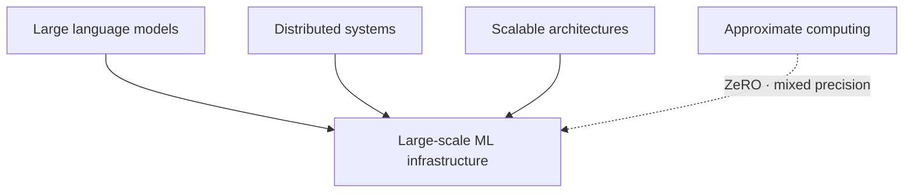
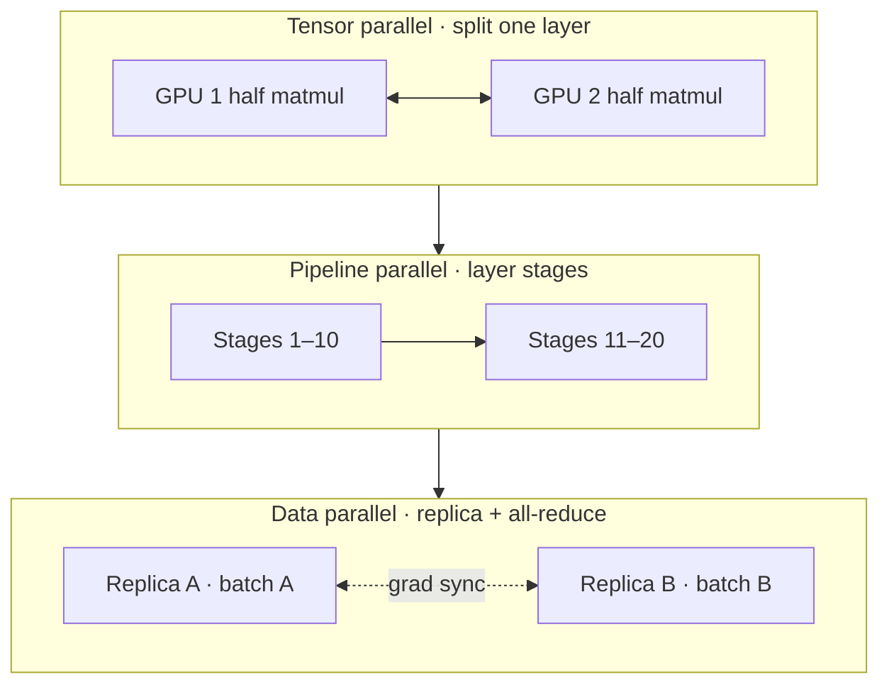

# Large-Scale ML Infrastructure: Training the Titans

## Prerequisites



## When to use

- **Models that do not fit one GPU** — weights, optimizer state, and activations exceed single-node VRAM.
- **Internet-scale datasets** requiring synchronized gradients across hundreds or thousands of accelerators.
- **Training SLOs** where stragglers and network all-reduce dominate step time.

## When not to use

- **Small models on one GPU** — DDP overhead may exceed benefit.
- **No high-bandwidth interconnect** — tensor parallelism needs NVLink-class links.
- **Inference-only serving** — see LLM infrastructure; training stacks differ.

## How to read the diagrams

Map the **3D parallelism grid** (data, pipeline, tensor) to which bottleneck each axis solves, then the **ring all-reduce** for why gradient sync scales to thousands of GPUs. The ascii GPU grid below labels the same axes.

---

## Simple Fundamental Explanation
Imagine you have to read 10 million books and memorize every fact inside them.
- **Single Node**: You sit at a desk and read one book at a time. It will take you a lifetime.
- **Data Parallelism**: You hire 1,000 friends. You print 1,000 copies of your brain. You give each friend a copy of your brain and 10,000 books. They all read their books at the same time, learning different things. At the end of the day, everyone meets up, shares what they learned, mathematically merges the knowledge together into one "Master Brain", and makes new copies for the next day.
- **Model Parallelism**: The "Brain" is so massive (e.g., 1 Trillion parameters) that it literally cannot fit inside a single person's head (a single GPU). So, you split the brain in half. Person A holds the left hemisphere. Person B holds the right hemisphere. When reading a book, A processes the first half of the thought, passes the electrical signal to B, who finishes the thought.

**Large-Scale ML Infrastructure** is the immense, distributed orchestration of thousands of GPUs required to train models like ChatGPT. It requires solving extreme bottlenecks in networking bandwidth, memory limits, and probabilistic gradient synchronization.

---

## Deep Dive: How It Works Under the Hood

Training an LLM involves two massive matrices: The Model Weights (parameters), and the Data (the internet).
A single Nvidia H100 GPU has 80GB of VRAM. A 100-Billion parameter model requires over 200GB of VRAM just to store the weights, plus another 600GB to store the optimizer states and gradients during training. You *must* distribute the workload.

### 1. Data Parallelism (DDP)
The model fits on one GPU, but the dataset is too big.
Every GPU gets a full copy of the model. GPU 1 looks at Data Batch 1. GPU 2 looks at Data Batch 2. They both calculate their gradients (how the model *should* change).
Before applying the changes, they must synchronize. They use a network primitive called `All-Reduce` to average all their gradients together, ensuring every GPU updates its weights identically.

### 2. Pipeline Parallelism
The model is too big for one GPU.
GPU 1 holds Layers 1-10. GPU 2 holds Layers 11-20.
GPU 1 computes the math for the first 10 layers, then sends the intermediate activations over the network cable to GPU 2. GPU 2 finishes the math.
Problem: While GPU 2 is working, GPU 1 is sitting completely idle (the "Pipeline Bubble"). Infrastructure engineers use micro-batching to keep all GPUs constantly fed with data.

### 3. Tensor Parallelism
The model is so big that even a *single layer* doesn't fit on one GPU.
The matrix multiplication itself is mathematically sliced in half. GPU 1 multiplies the left half of the matrix. GPU 2 multiplies the right half. They must synchronize their partial answers over the network literally millions of times per second. This requires ultra-fast physical interconnects (like NVLink), because standard Ethernet is too slow.

### Visual Diagram: The 3D Parallelism Grid

### Diagram 1 — Data · pipeline · tensor parallelism



### Diagram 2 — Ring all-reduce gradient sync

```mermaid
sequenceDiagram
  participant G0 as GPU 0
  participant G1 as GPU 1
  participant G2 as GPU 2
  participant G3 as GPU 3
  Note over G0,G3: Each sends chunk to neighbor; reduce in ring
  G0->>G1: chunk c0
  G1->>G2: reduced partial
  G2->>G3: reduced partial
  G3->>G0: full average gradient
```

```ascii
[ GPU 1 ]  [ GPU 2 ]  <-- (Tensor Parallelism: Splitting a single layer)
    |          |
 (Network) (Network)  <-- (Pipeline Parallelism: Passing data to next layers)
    v          v
[ GPU 3 ]  [ GPU 4 ]

===================== (All-Reduce Ring) =====================

[ GPU 5 ]  [ GPU 6 ]  <-- (Data Parallelism: Exact replica of the setup above,
    |          |           but processing a different batch of text data.
    v          v           They sync gradients via All-Reduce).
[ GPU 7 ]  [ GPU 8 ]
```

---

## Practical Example: DeepSpeed and Megatron-LM

Microsoft (DeepSpeed) and Nvidia (Megatron) built the foundational software libraries used to train massive models.

They invented **ZeRO (Zero Redundancy Optimizer)**.
In standard Data Parallelism, every GPU holds a 100% complete copy of the model weights, gradients, and optimizer states. This is a massive waste of redundant memory.
ZeRO probabilistically partitions this memory. GPU 1 only holds the optimizer state for the first 10% of the model. When GPU 2 needs to update the first 10% of the model, it asks GPU 1 for the data over the network.

By aggressively trading network bandwidth for memory savings, ZeRO allows training models with Trillions of parameters on existing hardware clusters without running into Out-Of-Memory (OOM) errors.

---

## The Mathematics: Equations and In-Depth Analysis

### 1. The Gradient Descent Update Rule
The core of ML training is Stochastic Gradient Descent (SGD).
Let $w_t$ be the model weights at step $t$. Let $\eta$ be the learning rate. Let $\nabla L(w_t, x_i)$ be the gradient of the Loss function with respect to the weights, calculated on a mini-batch of data $x_i$.

In a distributed Data Parallel system with $K$ GPUs, each GPU calculates a local gradient $g_k$. The global synchronous update rule requires calculating the true average gradient across all GPUs:

$$
w_{t+1} = w_t - \eta \left( \frac{1}{K} \sum_{k=1}^{K} g_k \right)
$$

### 2. The Communication Bottleneck (All-Reduce)
To compute $\frac{1}{K} \sum g_k$, all $K$ GPUs must send their massive gradient arrays over the network. If the model is 100GB, this means broadcasting 100GB $\times K$ across the switch. This takes minutes per step, halting training.

Infrastructure uses the **Ring All-Reduce** algorithm.
Instead of sending 100GB to a central master node, the GPUs form a logical ring. GPU $k$ sends a small chunk $c$ of its gradient to GPU $k+1$, while simultaneously receiving a chunk from GPU $k-1$.
The total amount of data transmitted by any single node in a Ring All-Reduce is independent of the number of nodes!

$$
\text{Data Transmitted} = 2 \times \frac{K-1}{K} \times \text{Model Size}
$$

As $K \to \infty$, the data transmitted per node approaches exactly $2 \times \text{Model Size}$. This mathematical property is what makes distributed training on 10,000 GPUs physically possible.

### 3. Asynchronous SGD (Hogwild!)
If you have 10,000 GPUs, waiting for the absolute slowest GPU to finish its math before triggering the All-Reduce (Straggler problem) destroys efficiency.
*Hogwild!* introduced Asynchronous SGD. GPUs don't wait for each other. They calculate gradients and instantly overwrite the shared global weights, entirely ignoring locks or synchronization.

This means GPU A might be calculating a gradient based on weights that GPU B has already overwritten! This introduces severe mathematical noise into the gradient $\tilde{g}$.
However, under the assumptions of sparse gradients and convex optimization, the math proves that the noise acts as a regularizer, and the system still probabilistically converges to the optimal solution $w^*$, but does so vastly faster because network locking is eliminated.
