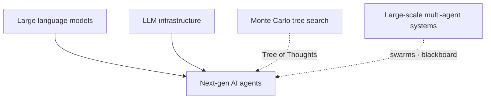
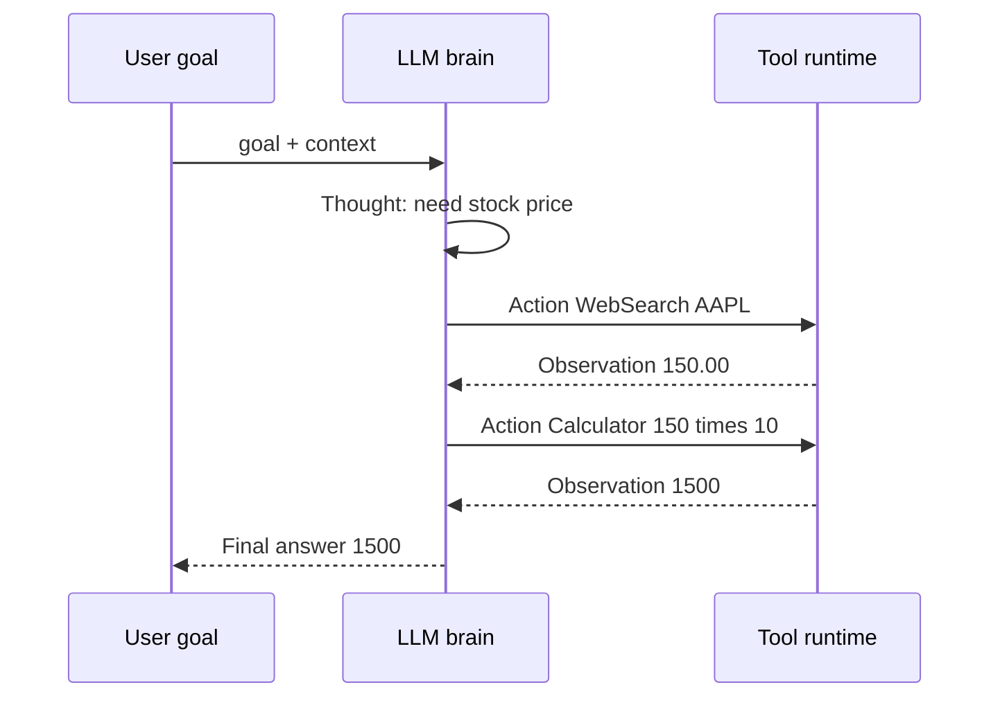
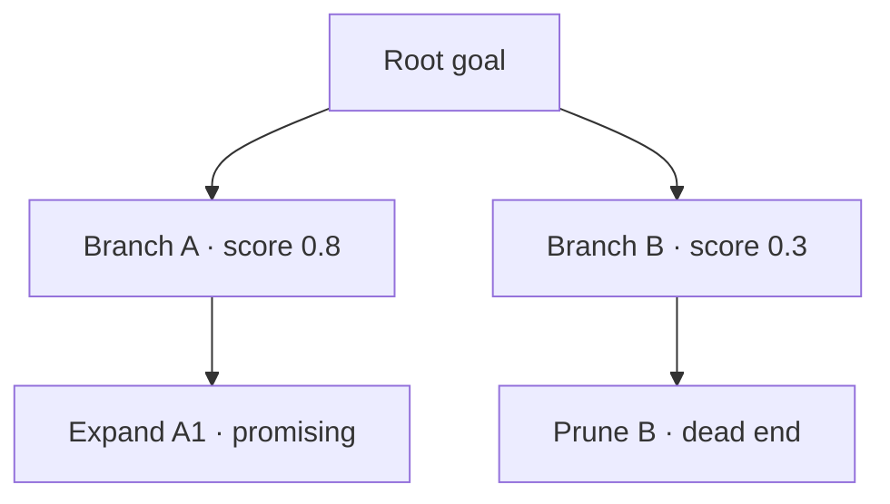

# Next-Gen AI Agents: Autonomous Digital Workers

## Prerequisites



## When to use

- **Multi-step goals** that require tools (browser, APIs, shell) rather than a single chat reply.
- **Ambiguous tasks** where replanning after tool errors is part of the product (booking, dev automation).
- **Human-in-the-loop oversight** on high-stakes actions while the agent handles routine steps.

## When not to use

- **Single-shot Q&A** — a plain LLM completion is cheaper and easier to evaluate.
- **Untrusted tool access** without sandboxing — agents can execute harmful side effects.
- **Hard real-time loops** — LLM latency and nondeterminism break tight control deadlines.

## How to read the diagrams

Trace the **ReAct sequence** (thought → action → observation) for one tool call cycle, then **Tree of Thoughts** for branching and pruning bad plans. The ascii agent loop below is the same ReAct narrative.

---

## Simple Fundamental Explanation
Imagine a traditional search engine. You type "Book a flight to Paris." It gives you a list of links to airline websites. You have to click the links, find the flight, enter your credit card, and click "Buy." The computer was just an index.

A **Next-Gen AI Agent** does not give you links. It is a probabilistic software program given an overarching goal, a set of tools (like a web browser, a calculator, and your credit card API), and autonomy.
You type "Book a flight to Paris."
The Agent thinks: "I need to open a browser. I will go to Expedia. I will search for Paris. I will read the screen to find the cheapest flight. I will use the credit card API to book it."
The Agent executes all these steps autonomously. If Expedia is down, it probabilistically re-evaluates its plan and tries Kayak instead.

Next-Gen AI Agents transition computers from "tools that answer questions" into "workers that accomplish goals."

---

## Deep Dive: How It Works Under the Hood

An AI Agent is built around a core Large Language Model (the "Brain"), surrounded by an orchestration loop.

### The ReAct Pattern (Reason + Act)
The most common architecture for Agents is ReAct. The LLM is prompted to output a specific format:
1. **Thought**: The agent analyzes the current situation and decides what to do next.
2. **Action**: The agent selects a specific tool to use (e.g., `Search("Paris Weather")`).
3. **Observation**: The system executes the tool and feeds the result back into the LLM's context window.

This loop repeats until the Agent's "Thought" determines that the overarching goal has been achieved, at which point it outputs the final answer.

### Probabilistic Tool Use (Function Calling)
How does an LLM (which just predicts text) actually click a button or search a database?
The developer provides a JSON schema of available functions. The LLM is trained to output a probabilistically highly-confident JSON string that matches the schema if it believes a tool is necessary.
The surrounding Python/Go infrastructure parses the JSON, executes the real-world Python function, and returns the result as text back to the LLM.

### Visual Diagram: The Agent Loop

### Diagram 1 — ReAct thought–action–observation



### Diagram 2 — Tree of Thoughts branching



```ascii
Goal: "How much is Apple's stock worth, times 10?"

[ Agent Brain (LLM) ]
Thought: I need to find the current price of Apple stock. I will use the WebSearch tool.
Action: {"tool": "WebSearch", "query": "AAPL stock price"}

     [ Infrastructure ] -> Executes Google Search -> Result: "$150.00"

[ Agent Brain (LLM) ]
Observation: The price is $150.00.
Thought: Now I need to multiply 150 by 10. I am bad at math, so I will use the Calculator tool.
Action: {"tool": "Calculator", "formula": "150 * 10"}

     [ Infrastructure ] -> Executes Python Eval -> Result: "1500"

[ Agent Brain (LLM) ]
Observation: The result is 1500.
Thought: I have the final answer.
Final Output: "Apple's stock times 10 is $1,500."
```

---

## Practical Example: AutoGPT and Devin

Early experiments like AutoGPT and Devin (an autonomous software engineer) pushed agents to the limit.

Devin is given a prompt: "Build a website that tracks the weather in Tokyo and deploy it to AWS."
Devin has access to a command-line interface, a code editor, and a web browser.
It writes the React code. It tries to compile it. The compiler throws an error. Devin reads the error, searches StackOverflow for a solution, rewrites the code to fix the bug, compiles it successfully, writes the Terraform script, and deploys it.

It handles the chaotic, probabilistic nature of software development by continuously reacting to errors and adjusting its state machine.

---

## The Mathematics: Equations and In-Depth Analysis

### 1. Markov Decision Processes for Agents
An autonomous agent navigating the internet or a software environment is formally solving a Partially Observable Markov Decision Process (POMDP).

At step $t$:
- The agent receives an observation $o_t$ (e.g., the HTML of a webpage).
- It infers a hidden state $s_t$ (e.g., "I am on the checkout page").
- It selects an action $a_t$ from a policy $\pi(a \mid s_t)$ (e.g., "Click the Buy button").
- The environment transitions to a new state $s_{t+1}$ with transition probability $P(s_{t+1} \mid s_t, a_t)$.
- The agent receives a reward $r_t$.

The agent's objective is to maximize the expected sum of future rewards (completing the task). In ReAct agents, the LLM's pre-trained weights act as a massive, zero-shot approximation of the optimal policy $\pi^*$.

### 2. Tree of Thoughts (ToT)
When a ReAct agent makes a mistake (e.g., navigating to a broken website), it often gets stuck in a loop.
Advanced agents use **Tree of Thoughts (ToT)**, which integrates Monte Carlo Tree Search (see `MONTE_CARLO_TREE_SEARCH.md`) with the LLM.

Instead of generating one linear sequence of thoughts, the LLM generates $K$ different possible next steps. A separate prompt evaluates each step, assigning a probabilistic score to how likely that step is to solve the problem. The agent navigates the complex problem space by maintaining multiple active branches of reasoning, abandoning dead ends, and backtracking mathematically when a branch's expected value drops too low.
