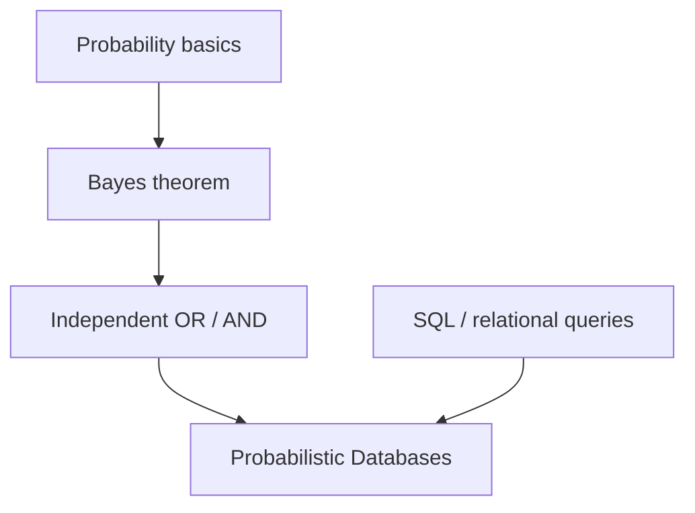

# Probabilistic Databases: Querying Uncertainty

## Prerequisites



## When to use

- **Noisy sensors and IoT** — combine readings with confidence instead of hard-filtering spikes in application code.
- **Incomplete data pipelines** — store extraction or linkage scores with tuples (entity resolution, OCR, LLM extractions).
- **Decision support with graded answers** — return “District 7 (99%)” vs “District 3 (55%)” instead of a false binary.

## When not to use

- **Strong dependencies between tuples** — independent OR/AND plans are wrong; you need factor graphs, BDDs, or Monte Carlo (#P-hard joins).
- **Regulatory audit trails** — you often need a single committed fact table, not a distribution over worlds.
- **Low latency on huge unsafe queries** — exact inference does not scale; approximate engines or deterministic ETL may be cheaper.

## Lab

On the [interactive probabilistic databases lab](/topics/probabilistic-databases#lab), browse **Sensors** or **Users** uncertain tables, pick an **EXISTS** or **SELECT** query, drag **confidence threshold τ**, read per-row **P(match query)**, try **Kitchen EXISTS**, **Threshold mistake**, or **Users age > 30** presets, predict whether **P(high temp in Kitchen) > 95%**, then reveal **probabilistic OR ≈ 98%** vs **deterministic conf ≥ 50%**.

## Simple Fundamental Explanation
Imagine you are a detective trying to build a timeline of a crime. You have witnesses, but they are unreliable.
- Witness 1 says: "The car was red (80% sure) or blue (20% sure)."
- Witness 2 says: "The license plate started with 'XYZ' (60% sure)."

In a standard, deterministic database (like MySQL or PostgreSQL), you must insert absolute facts. You either insert `Color = Red`, or you leave it `NULL`. If you query the database for "Red cars starting with XYZ", it will give you a hard "Yes" or "No" based on whatever absolute fact you chose to store. You lose the nuance of the uncertainty.

A **Probabilistic Database** is designed to store data that is inherently uncertain, noisy, or incomplete.
Instead of storing just values, it stores values *paired with confidence scores*.
When you write a SQL query against a probabilistic database, the result is not just a list of rows. The result is a list of rows, and for every row, a calculated percentage representing the probability that the row actually exists and matches your query.

---

## Deep Dive: How It Works Under the Hood

Probabilistic Databases are fundamentally different from standard relational databases. They represent the data not as a single table, but as a probability distribution over *all possible deterministic tables* (called "Possible Worlds").

### 1. Tuple-Level Uncertainty
The database knows a row exists, but doesn't know its exact values.
`Row 1: {ID: 1, Name: "Alice", Age: [30 (60%), 31 (40%)]}`

### 2. Existence-Level Uncertainty
The database knows the exact values, but isn't sure if the row actually exists in reality.
`Row 2: {ID: 2, Name: "Bob", Age: 45} (Confidence: 70%)`

### 3. Query Evaluation
When you run a query like `SELECT * FROM Users WHERE Age > 30`, the database engine performs probabilistic inference. It evaluates the query across all mathematical "Possible Worlds" and returns the aggregated probability.

For Alice, the probability she is >30 is 40%.
For Bob, if he exists (70% chance), he is definitely >30.
The database returns:
`Alice: 40% match`
`Bob: 70% match`

### Visual Diagram

```ascii
Uncertain Database Table: Sensors
SensorID | Location  | Temp_High | Confidence
---------------------------------------------
S1       | Kitchen   | True      | 0.90
S2       | Kitchen   | True      | 0.80
S3       | Bedroom   | True      | 0.50

SQL Query:
"Is there a high temperature in the Kitchen?"
SELECT EXISTS(SELECT 1 FROM Sensors WHERE Location='Kitchen' AND Temp_High=True)

Engine Calculation (Assuming sensors are independent):
Prob(S1 is false) = 0.10
Prob(S2 is false) = 0.20
Prob(Both are false) = 0.10 * 0.20 = 0.02
Prob(At least one is true) = 1.00 - 0.02 = 0.98

Output:
Result: TRUE (Confidence: 98%)
```

---

## Practical Example: IoT and Sensor Networks

Imagine a massive smart-city project with thousands of cheap, unreliable pollution sensors.

Because the sensors are cheap, they often report bad data due to wind, bugs, or hardware glitches. If you feed this raw data into a standard database and build a dashboard, the city planners will see wild, impossible spikes in pollution and make terrible policy decisions.

Instead, the data is fed into a Probabilistic Database (like the historical system *MayBMS* or modern data pipelines using Bayesian inference). The database combines the raw sensor readings with a historical confidence model.

When the mayor queries, "Which districts had dangerous pollution levels yesterday?", the database doesn't just return a raw list. It returns:
- "District 7 (99% probability)"
- "District 3 (55% probability)"

This allows decision-makers to act on highly confident data and ignore the noisy, low-probability anomalies, without writing complex statistical filtering scripts in their application code.

---

## The Mathematics: Equations and In-Depth Analysis

### 1. The Possible Worlds Semantics
Let $\mathcal{D}$ be a probabilistic database. The semantics of $\mathcal{D}$ is defined as a finite set of deterministic database instances $W = \{W_1, W_2, \dots, W_n\}$ called *possible worlds*.

Each possible world $W_i$ has an associated probability $P(W_i)$, such that:

$$
\sum_{W_i \in W} P(W_i) = 1
$$

### 2. Querying Possible Worlds
Let $Q$ be a boolean SQL query (e.g., "Is Bob in the table?").
The probability that $Q$ is true on the probabilistic database $\mathcal{D}$ is the sum of the probabilities of all possible worlds where $Q$ evaluates to true:

$$
P(Q(\mathcal{D}) = \text{True}) = \sum_{W_i \in W : Q(W_i) = \text{True}} P(W_i)
$$

### 3. The Complexity Problem (#P-Hardness)
The math above is beautiful but computationally catastrophic. If a table has 100 uncertain rows, there are $2^{100}$ possible worlds. Iterating over them takes longer than the lifespan of the universe.
In fact, evaluating complex relational queries (specifically, queries with joins and projections) on probabilistic databases is often `#P-Hard` (a complexity class significantly harder than NP-Complete).

### 4. Extensional vs. Intensional Query Evaluation
To make queries fast, modern engines try to use **Extensional Evaluation** (also called Safe Plans).
If the query structure is simple enough (a "Safe Query"), the engine can push the probability calculations directly into the relational algebra (the SQL execution plan) using rules of independent probability:

- AND (Join): $P(A \land B) = P(A) \cdot P(B)$
- OR (Union): $P(A \lor B) = 1 - (1 - P(A)) \cdot (1 - P(B))$

If the query is "Unsafe" (complex dependencies between rows), the database must fall back to **Intensional Evaluation**, which often involves compiling the query into a complex mathematical structure (like a Binary Decision Diagram or a factor graph) and running Monte Carlo simulations or approximate inference algorithms to get the answer.
