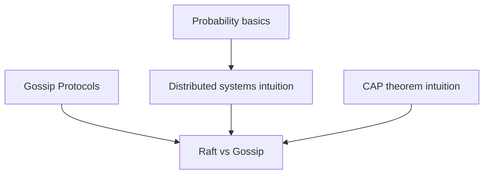

# Raft vs Gossip: The Architect's Dilemma

## Prerequisites



## When to use

- **Raft (or Paxos)** when you need **linearizable** state — Kubernetes etcd, service discovery with strict ordering, financial ledgers.
- **Gossip** when you need **massive scale** and can accept **eventual consistency** — Cassandra/Scylla membership, metrics fan-out, anti-entropy.
- **Side-by-side comparison** when architects must justify CP vs AP trade-offs on the same cluster size.

## When not to use

- **Raft** for 100+ node write-heavy clusters — leader fan-out is \(O(N)\) per write and saturates the leader NIC.
- **Gossip** when every read must see the latest write — use quorum reads on Raft or a primary-replica log instead.
- **Either alone** when the real requirement is CRDT merge semantics — pair gossip with conflict-free data types (`crdts-plus-probability`).

## Lab

On the [interactive Raft vs gossip lab](/topics/raft-vs-gossip#lab), use the **same N-node grid** and toggle **Raft** vs **Gossip**. Step **replication** or **gossip ticks**, try **Etcd (N=5)**, **Cassandra scale**, or **Raft O(N) load** presets, predict quorum commit or full epidemic spread within the suggested step budget, then reveal **committed vs informed** counts against \(O(N)\) vs \(O(\log N)\) message models.

## Simple Fundamental Explanation
Imagine you need to keep a group of 5 generals perfectly in sync about a battle plan.
- **The Raft Way (Strong Leadership)**: The generals vote to elect one Supreme Commander. The Commander writes the plan in a ledger, makes copies, and forces the other 4 generals to sign a receipt confirming they received the exact copy. If the Commander dies, everything pauses until a new one is elected. Everyone is always 100% in agreement, but it requires massive coordination.
- **The Gossip Way (Epidemic Spread)**: There is no commander. Any general who hears a new piece of intel just leans over and whispers it to two random generals nearby. They whisper to others. The news spreads like a virus. It's incredibly fast and impossible to stop, but for a brief period, half the generals know the plan and half don't.

In distributed systems, **Raft** is a deterministic consensus algorithm designed for absolute correctness and strict consistency. **Gossip** is a probabilistic protocol designed for extreme scale and eventual consistency. Choosing between them dictates the fundamental limits of your architecture.

---

## Deep Dive: How It Works Under the Hood

### Raft: The Dictator
Raft was designed to be a simpler, more understandable alternative to Paxos.
It enforces Strong Consistency using a strict Leader-Follower model.
1. **Leader Election**: Nodes vote. A leader is established.
2. **Log Replication**: All writes *must* go to the Leader. The Leader appends the write to its local log, then sends an `AppendEntries` RPC to all followers.
3. **Commit**: The Leader waits until a **majority** ($>50\%$) of followers acknowledge the write. Only then does the Leader apply the write to its state machine and return "Success" to the client.

**Pros**: Perfect linearizability. No split-brain. You can build banking systems on it.
**Cons**: The Leader is a massive bottleneck. If you have a 1,000-node cluster, the Leader has to wait for 501 network acknowledgments for *every single write*. Raft clusters rarely exceed 7 to 9 nodes in production.

### Gossip: The Swarm
Gossip protocols (Epidemic Broadcasts) have no leaders. All nodes are equal (peer-to-peer).
1. **Infection**: Node A receives a write. It accepts it locally.
2. **Spread**: Every 1 second, Node A picks 3 random nodes and syncs state with them.
3. **Convergence**: The data ripples outward exponentially.

**Pros**: Infinite scalability. You can easily run 10,000 Gossip nodes. There is no single point of failure. Write latency is near-zero because you don't wait for network acknowledgments.
**Cons**: Eventual consistency. Data conflicts will occur and must be resolved mathematically (e.g., Last-Write-Wins or CRDTs).

### Visual Diagram

```ascii
[ RAFT (5 Nodes) ]
Client -> [ LEADER ]
             |---> [Follower 1] (ACK)
             |---> [Follower 2] (ACK)
             |---> [Follower 3] (ACK)
             |---> [Follower 4] (Waiting...)
(Leader waits for 3 ACKs. Slower, perfect consistency).

[ GOSSIP (500 Nodes) ]
Client -> [ Node 42 ] (Instantly returns Success)
             |
             |---> [Node 108]
             |---> [Node 311]
                     |---> [Node 12]
                     |---> [Node 499]
(Data spreads organically. Massive throughput, temporary inconsistency).
```

---

## Practical Example: Etcd vs Cassandra

**Etcd (Raft)**: Kubernetes uses Etcd to store the state of the cluster (which containers are running where). Kubernetes needs to know *for absolute certain* if a container is alive or dead before starting a new one. Etcd uses Raft. It usually runs on 3 or 5 nodes. It is perfectly accurate, but cannot handle millions of writes per second.

**Apache Cassandra (Gossip)**: Apple uses Cassandra to store millions of iCloud messages and user configurations. They run clusters of over 100,000 nodes. A Raft leader would instantly melt under that load. Cassandra uses a Gossip protocol. When you save a photo, it saves to a few random nodes instantly. The cluster gossips the data around in the background to ensure redundancy.

---

## The Mathematics: Equations and In-Depth Analysis

### 1. Scaling Bottlenecks (Big-O Notation)
The fundamental mathematical limit of Raft is message complexity.
In Raft, for every write, the Leader must send a message to $N-1$ followers and receive $N-1$ replies.
Message Complexity per write = $O(N)$.
As $N$ approaches 1,000, the Leader's network interface card (NIC) mathematically saturates. It literally cannot physically transmit packets fast enough.

In Gossip, the message complexity per node per tick is a constant $O(c)$ (the fanout factor, usually 3).
The total network bandwidth used scales linearly with the cluster size, but no single node ever takes the full brunt of the traffic.

### 2. Time to Convergence
In Raft, the time to commit a transaction (Time to Finality) is exactly 1 Round Trip Time (1 RTT) between the leader and the majority of followers. It is deterministic and constant: $O(1)$.

In Gossip, the time for a message to reach all $N$ nodes is probabilistic. It follows the mathematics of epidemiology (the Susceptible-Infected model).
The expected time to infect the entire cluster scales logarithmically with the size of the cluster:

$$
E[\text{Time}] \approx O(\log N)
$$

### 3. Fault Tolerance Equations
In Raft, the system can tolerate $f$ failures, where the total cluster size $N = 2f + 1$.
If $N=5$, it can tolerate $f=2$ nodes failing. If 3 nodes fail, the system loses quorum, completely freezes, and refuses all writes. It favors Consistency over Availability (CP in the CAP theorem).

In Gossip, the system is fundamentally AP (Available and Partition-tolerant). If 99 out of 100 nodes fail, the 1 surviving node will still cheerfully accept your write and store it locally. When the other 99 nodes boot back up a week later, the 1 node will gossip the saved data to them, and the cluster will seamlessly heal.
