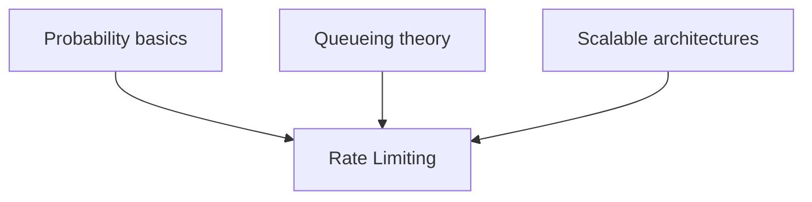

# Probabilistic Rate Limiting: Security at Scale

## Prerequisites



## When to use

- **Public APIs and edge gateways** where you must cap per-client throughput without melting a central counter store.
- **Overload protection** when backends return 429/503 and clients should **throttle locally** (Google SRE drop formula).
- **Traffic shaping** when a hard token bucket would create micro-spikes but probabilistic smearing smooths load (Stripe-style).

## When not to use

- You need **legally exact quotas** or billing-grade metering (use durable counters + audit logs).
- **Per-request fairness** matters more than throughput (use deterministic token bucket or leaky bucket with sync).
- The cluster is **small** and Redis (or similar) latency is negligible for your QPS.

## Lab

On the [interactive rate limiting lab](/topics/rate-limiting#lab), tune **Bucket capacity**, **Refill rate**, and **Request rate**, then read the **accept vs drop timeline** (green = 200, red = 429). Use **Burst traffic**, **Steady rate**, or **Empty bucket start** presets, predict how many requests survive the token bucket, then reveal **accepted vs dropped** counts.

## Simple Fundamental Explanation
Imagine you run a very popular bakery. You allow customers to take a maximum of 5 free samples per day.
- **Deterministic Approach**: You keep a massive ledger of every person's name and the exact time they took a sample. Every time someone asks for a sample, you search the whole ledger. This is perfectly accurate, but the line out the door stops moving because you are spending all your time checking the ledger.
- **Probabilistic Approach**: You have a small notepad. Every time someone asks for a sample, you roll a 20-sided die. If it lands on 1, you write their name down. If someone's name shows up on your notepad 3 times, you assume they are statistically likely to have taken way too many samples, and you ban them.

You might accidentally let someone take 10 samples before banning them, but the line moves instantly.

In highly distributed systems handling millions of requests per second, tracking the *exact* number of requests an IP address has made across hundreds of microservices requires extreme database synchronization. Instead, systems use **Probabilistic Rate Limiting** to estimate abusive traffic and drop connections when the *likelihood* of an attack crosses a threshold.

---

## Deep Dive: How It Works Under the Hood

A classic exact rate limiter uses algorithms like the Token Bucket or Leaky Bucket. It stores a counter in a centralized database (like Redis) for every single user.
`Redis: GET user_123_requests` -> `if < 100: increment and allow`.
This requires a network hop to Redis for *every single API request*. At massive scale, the rate limiter itself becomes the bottleneck and the single point of failure.

Probabilistic Rate Limiting allows edge nodes to make immediate, local decisions about dropping traffic without perfectly synchronizing with a central database on every request.

### The Probabilistic Drop Algorithm
When a server begins experiencing heavy load or suspects an attack, it doesn't need to definitively prove a user crossed the limit.
It calculates a drop probability based on:
1. The current load of the server.
2. The estimated rate of the specific user.

If a user is sending 500 requests/sec, and the limit is 100 requests/sec, the server calculates: "I need to drop 80% of this user's traffic to enforce the limit."
The server then generates a random number between 0.0 and 1.0 for every incoming request. If the number is $< 0.8$, the request is dropped.

No counters need to be incremented during the drop. No database is checked. The CPU load to execute `if (rand() < 0.8) return 429_TOO_MANY_REQUESTS` is practically zero.

### Visual Diagram

```ascii
Attacker sending 10 reqs/sec. Limit is 2 reqs/sec.
Target Drop Rate: 80% (Probability P = 0.8)

Req 1: rand() = 0.45 -> DROP (429)
Req 2: rand() = 0.91 -> ALLOW (200 OK)
Req 3: rand() = 0.12 -> DROP (429)
Req 4: rand() = 0.77 -> DROP (429)
Req 5: rand() = 0.85 -> ALLOW (200 OK)
Req 6: rand() = 0.33 -> DROP (429)
...

Result: Out of 10 requests, ~2 are allowed, ~8 are dropped.
The limit is enforced probabilistically without stateful counters!
```

---

## Practical Example: Stripe's Smear Rate Limiting

Stripe, the payment processor, handles massive spikes of API traffic. They use a technique they call "Smearing" to probabilistically enforce rate limits.

Instead of keeping track of an exact Token Bucket that refills every 1 second, they apply a probability curve.
If a customer's API limit is 100 requests per second, and they send 1,000 requests in the very first millisecond, a deterministic limiter might allow the first 100 instantly, then block the remaining 900. This causes backend microservices to experience a violent spike of 100 instant requests.

Stripe applies a probabilistic smear. They calculate the likelihood of the limit being breached over the time window. For that burst of 1,000 requests, Stripe's edge servers will probabilistically accept roughly 1 request every 10 milliseconds, rejecting the others with HTTP 429. This smooths the traffic out probabilistically, protecting the database from the micro-spike.

---

## The Mathematics: Equations and In-Depth Analysis

### Client-Side Throttling (Google SRE Model)
Google's Site Reliability Engineering (SRE) book defines a probabilistic client-side throttling mechanism.
When a backend service starts failing or slowing down, the client (the microservice sending the requests) should probabilistically stop sending requests *before* they even hit the network.

The client tracks two values:
- $requests$: The total number of requests the client attempted.
- $accepts$: The total number of requests the backend successfully processed (HTTP 200).

Under normal conditions, $requests == accepts$.
Under overload, the backend starts returning HTTP 503 or 429, so $requests > accepts$.

The client calculates the probability of dropping a new request locally:

$$
P_{\text{drop}} = \max\left(0, \frac{requests - K \cdot accepts}{requests + 1}\right)
$$

Where $K$ is a multiplier (usually $K=2$).

### Example Analysis
If $K=2$:
- If $requests = 100$ and $accepts = 100$, $P_{\text{drop}} = 0$. All traffic goes through.
- The backend degrades. $requests$ climbs to 300, but $accepts$ stays at 100.
- $P_{\text{drop}} = \frac{300 - 2(100)}{301} \approx 0.33$.
- The client starts randomly dropping 33% of its own outgoing requests locally, returning a simulated error to the user without ever using the network.

If the attacker ramps up to $requests = 1000$ but the backend still only $accepts = 100$:
- $P_{\text{drop}} = \frac{1000 - 2(100)}{1001} \approx 0.80$.
- The client drops 80% of traffic. The backend is shielded probabilistically.
