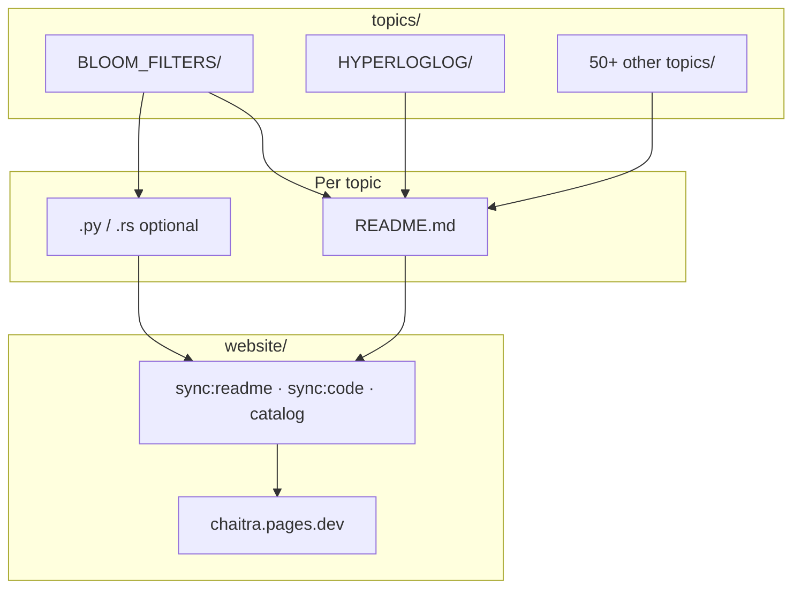

# Chaitra

**An open curriculum on scalable probabilistic systems** — the sketches, protocols, and tradeoffs behind systems that answer “probably correct, much faster” instead of “exact, eventually.”

**Learn online:** [chaitra.pages.dev](https://chaitra.pages.dev) · **Browse the catalog:** [/catalog](https://chaitra.pages.dev/catalog)

---

## What we are trying to do

At large scale, exact answers are often too slow, too large, or too coordinated. Production systems deliberately use **probability**: Bloom filters, HyperLogLog, gossip, power-of-two choices, approximate caches, rate limits, LLM token distributions, and more.

**Chaitra** is one repository that holds:

1. **Deep narratives** — each topic is a folder under [`topics/`](topics/) with a `README.md` (math, diagrams, where it shows up in the wild).
2. **Reference code** — Python and/or Rust where we have implemented the idea (e.g. `topics/BLOOM_FILTERS/bloom_filter.py`).
3. **A public website** — static Astro app in [`website/`](website/) that syncs those READMEs, hosts **interactive labs**, and runs **in-browser code** (Pyodide, WASM where available).

We are building a **guided path**, not a wiki dump:

| Layer | Where it lives | What you get |
|-------|----------------|--------------|
| **Story** | `topics/*/README.md` → synced to the site | Intuition, formulas, Mermaid diagrams |
| **Lab** | `website/src/components/` + topic MDX | Sliders, simulations, play/pause |
| **Code** | Repo sources + `website` Code workbench | Edit Python in the browser; read Rust; WASM demo on Bloom filters |
| **Source of truth** | This repo on GitHub | Clone, test, extend implementations |

The long-form “textbook” content stays in **`topics/`**. This root README explains **the project**; each `topics/TOPIC_NAME/README.md` explains **that topic**.

---

## How it works (repository model)



- **One folder per topic** — under `topics/`, `SCREAMING_SNAKE_CASE` (e.g. `topics/COUNT_MIN_SKETCH/`) with at least a `README.md`.
- **Website slugs** — kebab-case URLs (`/topics/count-min-sketch`) generated by `website/scripts/generate-catalog.mjs`.
- **Catalog status** — `golden`, `live`, `preview`, `readme-only`, `coded` (see [website README](website/README.md#catalog-status-what-ready-means)).

**Flagship starting point:** [Bloom filters](https://chaitra.pages.dev/topics/bloom-filters) — full story, lab, Python + Rust + WASM code workbench.

---

## What are “scalable probabilistic systems”?

Traditional systems optimize for: *same input → same output*.

Probabilistic systems at scale optimize for: *high-confidence answer, much lower cost* — memory, coordination, latency, or compute.

That shows up as:

- **Probabilistic data structures** — Bloom filters, HyperLogLog, Count–Min Sketch
- **Weaker coordination** — gossip, eventual consistency, probabilistic load balancing
- **Approximate policies** — cache admission (TinyLFU), RED in networking, rate limiting
- **ML / LLM stacks** — token probabilities, MoE routing, large-scale inference

Each topic folder in [`topics/`](topics/) goes deeper on one slice of that landscape. The site’s [learning path](https://chaitra.pages.dev/) orders a beginner-friendly subset; the [catalog](https://chaitra.pages.dev/catalog) lists everything we track.

---

## Repository layout

```
chaitra/
├── topics/                 # All curriculum modules (README + code)
│   ├── BLOOM_FILTERS/
│   ├── HYPERLOGLOG/
│   └── …
├── website/                # Astro site → Cloudflare Pages
│   ├── src/content/topics/ # Per-slug MDX + synced readme-body.md
│   └── README.md           # Build, deploy, contributor details
├── docs/
└── README.md               # You are here
```

---

## For learners

1. Open **[chaitra.pages.dev](https://chaitra.pages.dev)** and pick a topic from the catalog or learning path.
2. Read **Story**, try the **Lab**, experiment in **Code** where available.
3. Clone this repo and open the matching folder (e.g. `topics/BLOOM_FILTERS/`) to run Python or Rust locally.

```bash
git clone https://github.com/07AMIT10/chaitra.git
cd chaitra/topics/BLOOM_FILTERS
python bloom_filter.py
```

---

## For contributors

**Add or improve a topic**

1. Edit or create `topics/YOUR_TOPIC/README.md` (and add `.py` / `.rs` if you have reference code).
2. If the topic should appear on the site, add or update `website/src/content/topics/<slug>/` (`index.mdx`, optional `code.mdx`, lab component).
3. From `website/`:

   ```bash
   npm run sync:readme    # after README changes
   npm run sync:code      # after Rust snippets used in Code tabs
   npm run catalog        # refresh topics.json
   npm run build
   ```

4. Open a PR — Cloudflare can preview `website/` changes.

**Site development, deploy, CSP, WASM:** see [`website/README.md`](website/README.md) and [`website/DEPLOY-CLOUDFLARE.md`](website/DEPLOY-CLOUDFLARE.md).

**CI:** pushes touching `website/**` or `topics/**` run the site build via [`.github/workflows/website-ci.yml`](.github/workflows/website-ci.yml).

---

## Topic index (on GitHub)

Every module with a `README.md` lives under [`topics/`](topics/). Highlights with labs and/or code on the site:

| Topic folder | Site |
|--------------|------|
| `topics/BLOOM_FILTERS/` | [/topics/bloom-filters](https://chaitra.pages.dev/topics/bloom-filters) |
| `topics/HYPERLOGLOG/` | [/topics/hyperloglog](https://chaitra.pages.dev/topics/hyperloglog) |
| `topics/COUNT_MIN_SKETCH/` | [/topics/count-min-sketch](https://chaitra.pages.dev/topics/count-min-sketch) |
| `topics/CONSISTENT_HASHING/` | [/topics/consistent-hashing](https://chaitra.pages.dev/topics/consistent-hashing) |
| `topics/GOSSIP_PROTOCOLS/` | [/topics/gossip-protocols](https://chaitra.pages.dev/topics/gossip-protocols) |

For the full list and status badges, use the **[catalog](https://chaitra.pages.dev/catalog)** (generated from `topics/`).

---

## Status

Early but active: many topics have rich READMEs; labs and code workbench coverage grow topic by topic. Issues and PRs welcome.

---

## Links

- **Live site:** https://chaitra.pages.dev  
- **Curriculum index:** [topics/README.md](topics/README.md)  
- **Website docs:** [website/README.md](website/README.md)  
- **Deploy:** [website/DEPLOY-CLOUDFLARE.md](website/DEPLOY-CLOUDFLARE.md)
