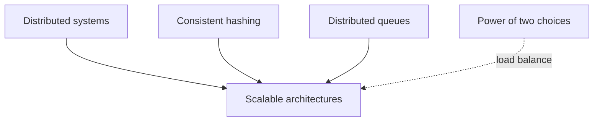
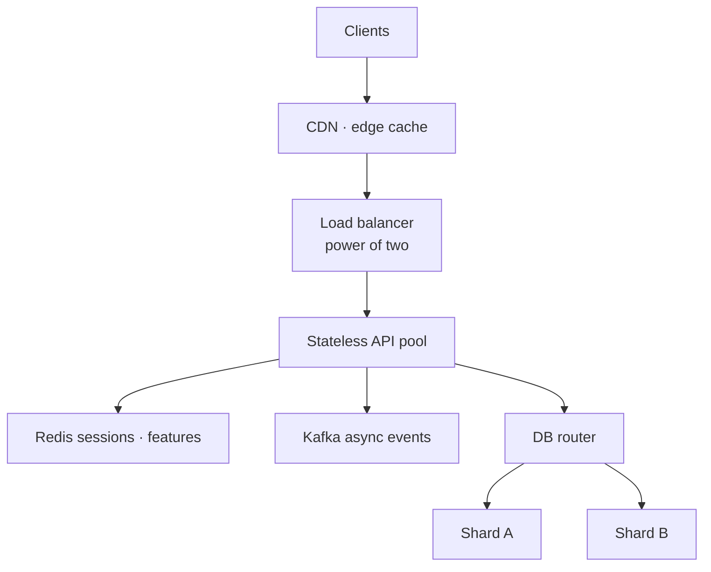
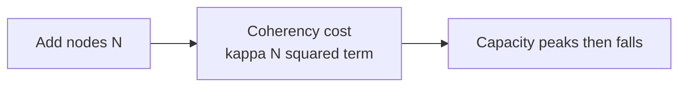

# Scalable Architectures: Designing for the Infinite

## Prerequisites



## When to use

- **Traffic growth** you expect to outpace vertical scaling of one machine.
- **Independent scaling** of read-heavy APIs, async workers, and storage tiers.
- **Fault isolation** so one hot microservice does not take down unrelated paths.

## When not to use

- **Early product** with unknown boundaries — a modular monolith may ship faster.
- **Strong cross-entity transactions** across many services without saga design.
- **Tiny teams** that cannot operate dozens of deployables and observability surfaces.

## How to read the diagrams

The **reference cloud topology** shows CDN → stateless API → cache/queue → shards; the **USL scaling curve** explains when adding nodes stops helping. The ascii diagram below is the same layer cake.

---

## Simple Fundamental Explanation
Imagine you own a small lemonade stand.
- **Vertical Scaling (Scaling Up)**: Your stand gets popular. To serve more people, you buy a bigger juicer. Then an industrial juicer. Then a factory-sized juicer. Eventually, there is no juicer on Earth big enough, and if that one giant juicer breaks, your entire business stops.
- **Horizontal Scaling (Scaling Out)**: Your stand gets popular. You hire another kid and build a second stand next door. Then 10 stands. Then 1,000 stands. If one kid gets sick, 999 stands are still open. You can keep building stands infinitely.

**Scalable Architectures** (specifically Distributed Systems and Microservices) focus on designing software so that it can handle $10\times$, $100\times$, or $1,000,000\times$ more traffic simply by adding more cheap, identical computers (Horizontal Scaling) rather than trying to build one impossible supercomputer.

---

## Deep Dive: How It Works Under the Hood

To achieve true horizontal scalability, an architecture must eliminate bottlenecks and statefulness.

### 1. Stateless Web Tiers
If User A logs into Web Server 1, and Server 1 saves their session data in its local RAM, User A *must* always be routed back to Server 1. If Server 1 dies, User A is logged out.
Scalable architectures make servers **Stateless**. The session data is stored in a highly available, distributed cache (like Redis). Now, User A can hit Server 1, 2, or 10,000, and the experience is identical. Servers can be killed or booted probabilistically based on load without any data loss.

### 2. Sharding the Database
A single relational database (SQL) can only handle so many writes per second.
Scalable architectures "Shard" (partition) the database.
- Users A-M are stored on Database Server 1.
- Users N-Z are stored on Database Server 2.
This halves the load on each server. Consistent Hashing (see `CONSISTENT_HASHING.md`) is used to probabilistically balance this data across hundreds of shards.

### 3. Asynchronous Decoupling
If Service A calls Service B synchronously, and Service B is slow, Service A is blocked.
Scalable architectures decouple services using Distributed Queues (see `DISTRIBUTED_QUEUES.md`). Service A fires a message into Kafka and immediately goes back to work. Service B consumes it when ready.

### Visual Diagram: The Standard Scalable Cloud

### Diagram 1 — Horizontal scale reference architecture



### Diagram 2 — USL: when more nodes hurt



```ascii
[ Users ] (Millions of mobile apps)
    |
    v
[ Global CDN / Edge Cache ] (Serves static images, absorbs 80% of traffic)
    |
    v
[ Load Balancer ] (Uses Power of Two Choices to distribute traffic)
    |
    +-----> [ Stateless API Server 1 ]
    |             | (Reads/Writes State)
    +-----> [ Stateless API Server 2 ] ---> [ Distributed Cache (Redis) ]
    |             | (Fires Async Events)
    +-----> [ Stateless API Server 3 ] ---> [ Event Queue (Kafka) ]
                  |
                  v
       [ Database Router ]
          |           |
    [ DB Shard A ] [ DB Shard B ]
```

---

## Practical Example: Microservices vs Monoliths

Early Twitter was a giant Ruby on Rails "Monolith". The code for logging in, posting a tweet, and processing analytics were all bundled into one massive program.
When a major world event happened, the analytics engine spiked in CPU, causing the login engine to crash. They couldn't scale the login servers without simultaneously scaling the analytics servers.

They broke the architecture into **Microservices**.
The "Login Service" became a tiny, independent Go application. The "Tweet Routing Service" became a massive Java application.
Now, if a world event causes a massive spike in tweet routing, the cloud orchestrator independently scales the "Tweet Routing" microservice from 100 to 5,000 containers, while the "Login" microservice stays safely at 10 containers.

---

## The Mathematics: Equations and In-Depth Analysis

### 1. The Universal Scalability Law (USL)
Amdahl's Law (see `GO_BACKEND_SYSTEMS.md`) only accounts for the sequential bottleneck. In the real world, as you add more servers, they have to talk to each other (Coherence delay) to synchronize state.
Neil Gunther's Universal Scalability Law mathematically defines this.

Let $C(N)$ be the relative capacity of a system with $N$ nodes.
Let $\sigma$ be the contention factor (time wasted waiting for sequential locks).
Let $\kappa$ be the coherency factor (time wasted exchanging data to keep caches in sync).

$$
C(N) = \frac{N}{1 + \sigma(N - 1) + \kappa N(N - 1)}
$$

**The Brutal Reality:**
Look at the $\kappa N(N - 1)$ term. This is $O(N^2)$.
As you scale horizontally ($N$ grows), the communication overhead grows *quadratically*.
Eventually, the denominator becomes so large that $C(N)$ starts to **drop**. Adding more servers actually makes the system *slower*.

The entire point of Scalable Architectures (Statelessness, Sharding, Eventual Consistency, Probabilistic Consensus) is to mathematically drive $\sigma \to 0$ and $\kappa \to 0$. By embracing probabilistic, eventual consistency (where nodes don't have to perfectly synchronize every millisecond), the $\kappa$ term is crushed, allowing $C(N)$ to grow linearly with $N$ toward infinity.
