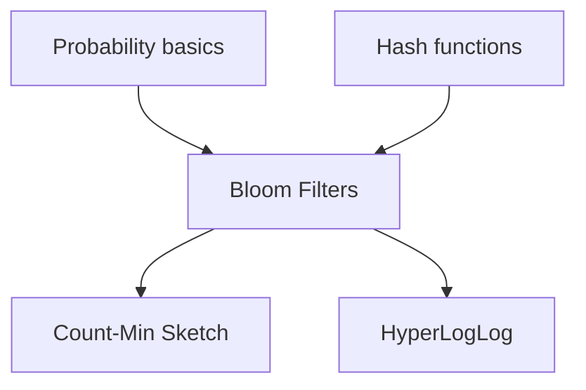

# Chaitra Website Implementation Plan

> **For agentic workers:** REQUIRED SUB-SKILL: Use superpowers:subagent-driven-development (recommended) or superpowers:executing-plans to implement this plan task-by-task. Steps use checkbox (`- [ ]`) syntax for tracking.

**Goal:** Ship Phase 1 of the Chaitra discoverability site: Astro + MDX + React islands on Cloudflare Pages, with Bloom filters as the end-to-end golden topic (narrative, viz lab, Pyodide, WASM stub, catalog).

**Architecture:** Static Astro site in `website/` imports topic content from repo READMEs via a sync script; interactive pieces hydrate as React islands; Pyodide and wasm-pack artifacts live under `public/`; deploy is Cloudflare Pages `dist/` output.

**Tech Stack:** Astro 5, MDX, React 19, TypeScript, Pyodide (CDN), wasm-pack, Cloudflare Pages, Mermaid (README + site), pytest-benchmark / Criterion (repo deepen only).

---

## File structure (Phase 1)

| Path | Responsibility |
|------|----------------|
| `website/package.json` | Scripts: `dev`, `build`, `build:wasm`, `sync:readme` |
| `website/astro.config.mjs` | MDX, React integration, `site` URL |
| `website/src/layouts/BaseLayout.astro` | HTML shell, fonts, tokens |
| `website/src/layouts/TopicLayout.astro` | Topic page sections |
| `website/src/styles/tokens.css` | Design tokens |
| `website/src/pages/index.astro` | Home |
| `website/src/pages/catalog.astro` | Topic catalog |
| `website/src/pages/topics/[slug].astro` | Dynamic topic route |
| `website/src/content/topics/bloom-filters/index.mdx` | Bloom MDX |
| `website/src/data/topics.json` | Catalog metadata |
| `website/src/components/BloomFilterLab.tsx` | Viz island |
| `website/src/components/PyodideRunner.tsx` | Python runner island |
| `website/src/components/WasmBloomRunner.tsx` | WASM loader island |
| `website/scripts/sync-readme.mjs` | README → content mirror |
| `website/wasm/bloom_filter/` | Rust WASM crate |
| `website/README.md` | Dev + Cloudflare deploy |
| `BLOOM_FILTERS/README.md` | Deepened source docs |
| `tests/fixtures/bloom_filter/` | Parity JSON (deepen task) |

---

## Phase 1 tasks

### Task 1: Astro scaffold and design tokens

**Files:**
- Create: `website/package.json`
- Create: `website/astro.config.mjs`
- Create: `website/tsconfig.json`
- Create: `website/src/styles/tokens.css`
- Create: `website/src/layouts/BaseLayout.astro`
- Create: `website/src/pages/index.astro`

- [ ] **Step 1: Create `website/package.json`**

```json
{
  "name": "chaitra-website",
  "type": "module",
  "version": "0.1.0",
  "scripts": {
    "dev": "astro dev",
    "build": "astro build",
    "preview": "astro preview",
    "sync:readme": "node scripts/sync-readme.mjs",
    "build:wasm": "cd wasm/bloom_filter && wasm-pack build --target web --out-dir ../../public/wasm/bloom_filter"
  },
  "dependencies": {
    "@astrojs/mdx": "^4.0.0",
    "@astrojs/react": "^4.0.0",
    "astro": "^5.0.0",
    "react": "^19.0.0",
    "react-dom": "^19.0.0"
  },
  "devDependencies": {
    "@types/react": "^19.0.0",
    "@types/react-dom": "^19.0.0",
    "typescript": "^5.6.0"
  }
}
```

- [ ] **Step 2: Create `website/astro.config.mjs`**

```javascript
import { defineConfig } from "astro/config";
import mdx from "@astrojs/mdx";
import react from "@astrojs/react";

export default defineConfig({
  site: process.env.PUBLIC_SITE_URL ?? "https://chaitra.pages.dev",
  integrations: [mdx(), react()],
  output: "static",
});
```

- [ ] **Step 3: Create `website/src/styles/tokens.css`**

```css
:root {
  --color-bg: #0f1419;
  --color-surface: #1a2332;
  --color-text: #e6edf3;
  --color-muted: #8b9cb3;
  --color-accent: #3d9eff;
  --color-accent-hover: #6bb5ff;
  --font-sans: system-ui, sans-serif;
  --font-mono: ui-monospace, monospace;
  --space-2: 0.5rem;
  --space-4: 1rem;
  --space-6: 1.5rem;
  --radius-md: 8px;
  --focus-ring: 0 0 0 3px var(--color-accent);
}
```

- [ ] **Step 4: Create minimal `BaseLayout.astro` and home page**

`website/src/layouts/BaseLayout.astro`:

```astro
---
import "../styles/tokens.css";
const { title = "Chaitra" } = Astro.props;
---
<!doctype html>
<html lang="en">
  <head>
    <meta charset="utf-8" />
    <meta name="viewport" content="width=device-width" />
    <title>{title}</title>
  </head>
  <body>
    <header><a href="/">Chaitra</a> · <a href="/catalog">Catalog</a></header>
    <main><slot /></main>
  </body>
</html>
```

`website/src/pages/index.astro`:

```astro
---
import BaseLayout from "../layouts/BaseLayout.astro";
---
<BaseLayout title="Chaitra — Probabilistic systems">
  <h1>Scalable probabilistic systems</h1>
  <p>Narrative → visual lab → implementation.</p>
  <p><a href="/topics/bloom-filters">Start with Bloom filters</a></p>
</BaseLayout>
```

- [ ] **Step 5: Install and verify dev server**

Run: `cd website && npm install && npm run dev`  
Expected: Server starts; `http://localhost:4321/` shows home heading.

- [ ] **Step 6: Commit**

```bash
cd /home/amit/dev/probablitiy/chaitra
git add website/
git commit -m "feat(website): scaffold Astro app with design tokens"
```

**Depends on:** none

---

### Task 2: Topic layout and dynamic route

**Files:**
- Create: `website/src/layouts/TopicLayout.astro`
- Create: `website/src/pages/topics/[slug].astro`
- Create: `website/src/data/topics.json`

- [ ] **Step 1: Create `website/src/data/topics.json`**

```json
[
  {
    "slug": "bloom-filters",
    "title": "Bloom Filters",
    "folder": "BLOOM_FILTERS",
    "phase": 1,
    "status": "golden",
    "hasPython": true,
    "hasRust": true,
    "prerequisites": []
  }
]
```

- [ ] **Step 2: Create `TopicLayout.astro` with section slots**

```astro
---
const { title, repoFolder } = Astro.props;
---
<BaseLayout title={title}>
  <article class="topic">
    <nav aria-label="Topic sections">
      <a href="#narrative">Story</a> · <a href="#lab">Lab</a> · <a href="#code">Code</a>
    </nav>
    <slot name="hero" />
    <section id="prerequisites"><slot name="prerequisites" /></section>
    <section id="narrative"><slot name="narrative" /></section>
    <section id="lab"><slot name="lab" /></section>
    <section id="code"><slot name="code" /></section>
    <footer>
      <a href={`https://github.com/07AMIT10/chaitra/tree/main/${repoFolder}`}>View on GitHub</a>
    </footer>
  </article>
</BaseLayout>
```

- [ ] **Step 3: Create `website/src/pages/topics/[slug].astro`**

```astro
---
import TopicLayout from "../../layouts/TopicLayout.astro";
import topics from "../../data/topics.json";

export function getStaticPaths() {
  return topics
    .filter((t) => t.status === "golden" || t.status === "live")
    .map((t) => ({ params: { slug: t.slug }, props: { topic: t } }));
}

const { topic } = Astro.props;
const Content = (await import(`../../content/topics/${topic.slug}/index.mdx`)).default;
---
<TopicLayout title={topic.title} repoFolder={topic.folder}>
  <Content slot="narrative" />
</TopicLayout>
```

- [ ] **Step 4: Verify route (stub MDX in Task 3)**

Run: `cd website && npm run build`  
Expected: Build succeeds after Task 3 adds stub MDX.

**Depends on:** Task 1

---

### Task 3: README sync script and Bloom MDX stub

**Files:**
- Create: `website/scripts/sync-readme.mjs`
- Create: `website/src/content/topics/bloom-filters/index.mdx`
- Create: `website/src/content/topics/bloom-filters/readme-body.md` (generated)

- [ ] **Step 1: Create `website/scripts/sync-readme.mjs`**

```javascript
import fs from "node:fs";
import path from "node:path";

const repoRoot = path.resolve(import.meta.dirname, "../..");
const topics = JSON.parse(
  fs.readFileSync(path.join(repoRoot, "website/src/data/topics.json"), "utf8")
);

for (const t of topics) {
  const src = path.join(repoRoot, t.folder, "README.md");
  const destDir = path.join(repoRoot, "website/src/content/topics", t.slug);
  const dest = path.join(destDir, "readme-body.md");
  if (!fs.existsSync(src)) {
    console.warn(`skip ${t.slug}: no README at ${src}`);
    continue;
  }
  fs.mkdirSync(destDir, { recursive: true });
  fs.copyFileSync(src, dest);
  console.log(`synced ${t.slug}`);
}
```

- [ ] **Step 2: Create Bloom MDX stub**

`website/src/content/topics/bloom-filters/index.mdx`:

```mdx
---
title: Bloom Filters
slug: bloom-filters
---

import ReadmeBody from "./readme-body.md";

## The probabilistic bouncer

<ReadmeBody />

## Lab

Use the interactive lab below to change **m**, **n**, and **k**.

export const BloomFilterLab = null;
```

(Replace lab placeholder in Task 4.)

- [ ] **Step 3: Run sync**

Run: `cd website && npm run sync:readme`  
Expected: `synced bloom-filters` and `readme-body.md` exists.

- [ ] **Step 4: Build**

Run: `cd website && npm run build`  
Expected: `/topics/bloom-filters/index.html` in `dist/`.

- [ ] **Step 5: Commit**

```bash
git add website/scripts/sync-readme.mjs website/src/content/topics/bloom-filters/
git commit -m "feat(website): sync README into Bloom MDX content"
```

**Depends on:** Task 2

---

### Task 4: Bloom filter visual lab (React island)

**Files:**
- Create: `website/src/components/BloomFilterLab.tsx`
- Modify: `website/src/content/topics/bloom-filters/index.mdx`
- Create: `website/src/lib/bloom-math.ts`

- [ ] **Step 1: Add `website/src/lib/bloom-math.ts`**

```typescript
export function falsePositiveRate(m: number, n: number, k: number): number {
  if (m <= 0 || n < 0 || k < 1) return 0;
  const exponent = (-k * n) / m;
  return Math.pow(1 - Math.exp(exponent), k);
}

export function optimalK(m: number, n: number): number {
  if (n <= 0) return 1;
  return Math.max(1, Math.round((m / n) * Math.LN2));
}
```

- [ ] **Step 2: Create `BloomFilterLab.tsx`**

```tsx
import { useMemo, useState } from "react";
import { falsePositiveRate, optimalK } from "../lib/bloom-math";

export default function BloomFilterLab() {
  const [m, setM] = useState(64);
  const [n, setN] = useState(8);
  const [k, setK] = useState(4);
  const fp = useMemo(() => falsePositiveRate(m, n, k), [m, n, k]);
  const bits = useMemo(() => {
    const arr = new Uint8Array(m);
    for (let i = 0; i < n; i++) {
      for (let h = 0; h < k; h++) {
        const idx = (i * 31 + h * 17) % m;
        arr[idx] = 1;
      }
    }
    return arr;
  }, [m, n, k]);

  return (
    <div>
      <label>
        m (bits){" "}
        <input
          type="range"
          min={16}
          max={256}
          value={m}
          onChange={(e) => setM(Number(e.target.value))}
          aria-valuetext={`${m} bits`}
        />
      </label>
      <label>
        n (items){" "}
        <input
          type="range"
          min={0}
          max={Math.floor(m / 2)}
          value={n}
          onChange={(e) => setN(Number(e.target.value))}
        />
      </label>
      <label>
        k (hashes){" "}
        <input
          type="range"
          min={1}
          max={8}
          value={k}
          onChange={(e) => setK(Number(e.target.value))}
        />
      </label>
      <p role="status" aria-live="polite">
        Estimated false positive rate: {(fp * 100).toFixed(2)}%. Optimal k ≈{" "}
        {optimalK(m, n)}.
      </p>
      <canvas
        role="img"
        aria-label={`Bloom filter bit array, ${n} items, fill ${((bits.filter(Boolean).length / m) * 100).toFixed(0)} percent`}
        width={m * 8}
        height={32}
        ref={(el) => {
          if (!el) return;
          const ctx = el.getContext("2d");
          if (!ctx) return;
          ctx.clearRect(0, 0, el.width, el.height);
          for (let i = 0; i < m; i++) {
            ctx.fillStyle = bits[i] ? "#3d9eff" : "#2a3544";
            ctx.fillRect(i * 8, 0, 6, 28);
          }
        }}
      />
    </div>
  );
}
```

- [ ] **Step 3: Wire island in MDX**

At top of `index.mdx`:

```mdx
import BloomFilterLab from "../../../components/BloomFilterLab.tsx";
```

In lab section:

```mdx
<BloomFilterLab client:visible />
```

- [ ] **Step 4: Manual test**

Run: `cd website && npm run dev`  
Expected: Sliders update FP text and canvas without full page reload.

- [ ] **Step 5: Commit**

```bash
git add website/src/components/BloomFilterLab.tsx website/src/lib/bloom-math.ts
git commit -m "feat(website): add Bloom filter visual lab island"
```

**Depends on:** Task 3

---

### Task 5: Pyodide runner component

**Files:**
- Create: `website/src/components/PyodideRunner.tsx`
- Create: `website/src/assets/code/bloom_filter.py.txt` (copied from repo)
- Modify: `website/src/content/topics/bloom-filters/index.mdx`

- [ ] **Step 1: Copy Python reference into assets**

Run:

```bash
cp BLOOM_FILTERS/bloom_filter.py website/src/assets/code/bloom_filter.py.txt
```

- [ ] **Step 2: Create `PyodideRunner.tsx`**

```tsx
import { useCallback, useState } from "react";

const PYODIDE_CDN = "https://cdn.jsdelivr.net/pyodide/v0.26.4/full/";

export default function PyodideRunner({ defaultCode }: { defaultCode: string }) {
  const [code, setCode] = useState(defaultCode);
  const [output, setOutput] = useState("");
  const [loading, setLoading] = useState(false);

  const run = useCallback(async () => {
    setLoading(true);
    setOutput("");
    try {
      // @ts-expect-error global loadPyodide from CDN script
      const loadPyodide = window.loadPyodide;
      if (!loadPyodide) {
        setOutput("Pyodide not loaded. Check network or use GitHub fallback.");
        return;
      }
      const pyodide = await loadPyodide({ indexURL: PYODIDE_CDN });
      const result = await pyodide.runPythonAsync(code);
      setOutput(String(result ?? pyodide.runPython("import sys; sys.stdout.getvalue()")));
    } catch (e) {
      setOutput(String(e));
    } finally {
      setLoading(false);
    }
  }, [code]);

  return (
    <div>
      <textarea
        aria-label="Python code"
        value={code}
        onChange={(e) => setCode(e.target.value)}
        rows={12}
        style={{ width: "100%", fontFamily: "var(--font-mono)" }}
      />
      <button type="button" onClick={run} disabled={loading}>
        {loading ? "Running…" : "Run Python"}
      </button>
      <pre aria-live="polite">{output}</pre>
    </div>
  );
}
```

- [ ] **Step 3: Load Pyodide script in `TopicLayout` or Bloom page only**

Add to `TopicLayout.astro` `<head>` when `slug === 'bloom-filters'`:

```html
<script src="https://cdn.jsdelivr.net/pyodide/v0.26.4/full/pyodide.js" defer></script>
```

- [ ] **Step 4: Import runner in MDX with default code**

```mdx
import PyodideRunner from "../../../components/PyodideRunner.tsx";
import bloomPy from "../../../assets/code/bloom_filter.py.txt?raw";

<PyodideRunner client:visible defaultCode={bloomPy} />
```

Configure Vite `?raw` import in Astro (default supported).

- [ ] **Step 5: Verify**

Run dev server; click Run Python on Bloom page.  
Expected: Pyodide loads (may take 5–15s first time); code runs or prints import error to fix in follow-up.

- [ ] **Step 6: Commit**

```bash
git add website/src/components/PyodideRunner.tsx website/src/assets/
git commit -m "feat(website): add Pyodide runner for Bloom topic"
```

**Depends on:** Task 4

---

### Task 6: WASM build pipeline stub (Bloom Rust)

**Files:**
- Create: `website/wasm/bloom_filter/Cargo.toml`
- Create: `website/wasm/bloom_filter/src/lib.rs`
- Create: `website/src/components/WasmBloomRunner.tsx`
- Modify: `website/package.json` (confirm `build:wasm` script)

- [ ] **Step 1: Create minimal WASM crate**

`website/wasm/bloom_filter/Cargo.toml`:

```toml
[package]
name = "bloom_filter_wasm"
version = "0.1.0"
edition = "2021"

[lib]
crate-type = ["cdylib"]

[dependencies]
wasm-bindgen = "0.2"
```

`website/wasm/bloom_filter/src/lib.rs`:

```rust
use wasm_bindgen::prelude::*;

#[wasm_bindgen]
pub struct BloomFilter {
    bits: Vec<u8>,
    k: u32,
}

#[wasm_bindgen]
impl BloomFilter {
    #[wasm_bindgen(constructor)]
    pub fn new(m: usize, k: u32) -> BloomFilter {
        BloomFilter { bits: vec![0u8; m], k }
    }

    pub fn add(&mut self, key: &str) {
        for h in 0..self.k {
            let idx = hash(key, h) % self.bits.len();
            self.bits[idx] = 1;
        }
    }

    pub fn contains(&self, key: &str) -> bool {
        (0..self.k).all(|h| self.bits[hash(key, h) % self.bits.len()] == 1)
    }
}

fn hash(s: &str, seed: u32) -> usize {
    let mut h = seed as usize;
    for b in s.bytes() {
        h = h.wrapping_mul(31).wrapping_add(b as usize);
    }
    h
}
```

- [ ] **Step 2: Build WASM**

Run: `cd website && npm run build:wasm`  
Expected: `public/wasm/bloom_filter/bloom_filter_wasm_bg.wasm` and `.js` glue exist.  
Prerequisite: `wasm-pack` installed (`cargo install wasm-pack`).

- [ ] **Step 3: Create `WasmBloomRunner.tsx`**

```tsx
import { useEffect, useState } from "react";

export default function WasmBloomRunner() {
  const [status, setStatus] = useState<"loading" | "ready" | "error">("loading");
  const [contains, setContains] = useState<boolean | null>(null);

  useEffect(() => {
    let cancelled = false;
    (async () => {
      try {
        const mod = await import(
          /* @vite-ignore */ "/wasm/bloom_filter/bloom_filter_wasm.js"
        );
        const bf = new mod.BloomFilter(64, 4);
        bf.add("apple");
        if (!cancelled) {
          setContains(bf.contains("apple"));
          setStatus("ready");
        }
      } catch {
        if (!cancelled) setStatus("error");
      }
    })();
    return () => {
      cancelled = true;
    };
  }, []);

  if (status === "error") {
    return (
      <p>
        WASM failed to load.{" "}
        <a href="https://github.com/07AMIT10/chaitra/tree/main/BLOOM_FILTERS/bloom_filter.rs">
          Open Rust source on GitHub
        </a>
      </p>
    );
  }
  if (status === "loading") return <p>Loading Rust WASM…</p>;
  return <p>WASM Bloom filter: contains(&quot;apple&quot;) = {String(contains)}</p>;
}
```

- [ ] **Step 4: Add to MDX**

```mdx
import WasmBloomRunner from "../../../components/WasmBloomRunner.tsx";
<WasmBloomRunner client:visible />
```

- [ ] **Step 5: Verify production build includes WASM**

Run: `cd website && npm run build:wasm && npm run build`  
Expected: `dist/wasm/bloom_filter/*` present.

- [ ] **Step 6: Commit**

```bash
git add website/wasm/ website/src/components/WasmBloomRunner.tsx website/public/wasm/
git commit -m "feat(website): add Bloom filter WASM stub and loader"
```

**Depends on:** Task 4

---

### Task 7: Deepen BLOOM_FILTERS README

**Files:**
- Modify: `BLOOM_FILTERS/README.md`
- Create: `tests/fixtures/bloom_filter/cases.json`
- Create: `BLOOM_FILTERS/test_bloom_parity.py` (minimal pytest)
- Modify: `BLOOM_FILTERS/bloom_filter.py` (only if needed for `if __name__` quickstart)

- [ ] **Step 1: Add prerequisite Mermaid graph after title**

```markdown
## Prerequisites


```

- [ ] **Step 2: Add Quickstart section**

```markdown
## Quickstart

```bash
cd BLOOM_FILTERS
python bloom_filter.py
# Optional: pytest test_bloom_parity.py -q
cargo test --manifest-path ../website/wasm/bloom_filter/Cargo.toml  # after WASM crate exists
```
```

- [ ] **Step 3: Create parity fixture `tests/fixtures/bloom_filter/cases.json`**

```json
[
  { "ops": [["add", "a"], ["add", "b"], ["query", "a"]], "expect_contains": true },
  { "ops": [["add", "a"], ["query", "z"]], "expect_contains": false }
]
```

- [ ] **Step 4: Add minimal pytest that loads fixture**

```python
import json
from pathlib import Path
import pytest

@pytest.mark.parametrize("case", json.loads(
    Path(__file__).resolve().parents[1].joinpath(
        "fixtures/bloom_filter/cases.json"
    ).read_text()
))
def test_bloom_ops(case):
    from bloom_filter import BloomFilter  # adjust to actual API
    bf = BloomFilter(size=128, hash_count=4)
    for op in case["ops"]:
        if op[0] == "add":
            bf.add(op[1])
    last = case["ops"][-1]
    assert bf.__contains__(last[1]) == case["expect_contains"]
```

Adapt imports to match `bloom_filter.py` public API.

- [ ] **Step 5: Add Benchmarks section with reproduce command**

```markdown
## Benchmarks

| Scenario | m | n | k | Notes |
|----------|---|---|---|-------|
| Baseline | 1024 | 500 | 7 | 1% target FP |

Reproduce (Python): `pytest BLOOM_FILTERS/test_bloom_parity.py --benchmark-only` (after adding pytest-benchmark).
```

- [ ] **Step 6: Add site link at bottom**

```markdown
**Interactive version:** [Bloom filters (web)](https://chaitra.pages.dev/topics/bloom-filters) — update hostname after Cloudflare custom domain is set.
```

- [ ] **Step 7: Run tests**

Run: `cd BLOOM_FILTERS && python -m pytest test_bloom_parity.py -q`  
Expected: PASS (or fix API mismatch).

- [ ] **Step 8: Commit**

```bash
git add BLOOM_FILTERS/ tests/fixtures/bloom_filter/
git commit -m "docs(bloom): deepen README with graph, benchmarks, parity tests"
```

**Depends on:** none (parallel with website tasks)

---

### Task 8: Catalog page from topic folders

**Files:**
- Create: `website/scripts/generate-catalog.mjs`
- Modify: `website/src/data/topics.json` (generated or merged)
- Create: `website/src/pages/catalog.astro`

- [ ] **Step 1: Create `generate-catalog.mjs`**

```javascript
import fs from "node:fs";
import path from "node:path";

const repoRoot = path.resolve(import.meta.dirname, "../..");
const skip = new Set([".git", ".research", "website", "docs", "tests"]);
const entries = fs.readdirSync(repoRoot, { withFileTypes: true });
const topics = [];

for (const e of entries) {
  if (!e.isDirectory() || skip.has(e.name) || e.name.startsWith(".")) continue;
  const readme = path.join(repoRoot, e.name, "README.md");
  if (!fs.existsSync(readme)) continue;
  const slug = e.name.toLowerCase().replace(/_/g, "-");
  const hasPy = fs.existsSync(path.join(repoRoot, e.name, `${e.name.toLowerCase()}.py`))
    || fs.readdirSync(path.join(repoRoot, e.name)).some((f) => f.endsWith(".py"));
  const hasRs = fs.readdirSync(path.join(repoRoot, e.name)).some((f) => f.endsWith(".rs"));
  topics.push({
    slug,
    title: e.name.replace(/_/g, " "),
    folder: e.name,
    status: ["BLOOM_FILTERS", "COUNT_MIN_SKETCH", "CONSISTENT_HASHING", "HYPERLOGLOG"].includes(e.name)
      ? "coded"
      : "readme-only",
    hasPython: hasPy,
    hasRust: hasRs,
  });
}

fs.writeFileSync(
  path.join(repoRoot, "website/src/data/topics.json"),
  JSON.stringify(topics, null, 2)
);
console.log(`wrote ${topics.length} topics`);
```

- [ ] **Step 2: Add npm script `"catalog": "node scripts/generate-catalog.mjs"`**

- [ ] **Step 3: Create `catalog.astro`**

```astro
---
import BaseLayout from "../layouts/BaseLayout.astro";
import topics from "../data/topics.json";
---
<BaseLayout title="Catalog">
  <h1>Topic catalog</h1>
  <ul>
    {topics.map((t) => (
      <li>
        {t.status === "golden" || t.status === "live" ? (
          <a href={`/topics/${t.slug}`}>{t.title}</a>
        ) : (
          <span>{t.title}</span>
        )}
        {" "}
        ({t.status}) {t.hasPython ? "Py" : ""} {t.hasRust ? "Rs" : ""}
      </li>
    ))}
  </ul>
</BaseLayout>
```

- [ ] **Step 4: Run generator and build**

Run: `cd website && npm run catalog && npm run build`  
Expected: Catalog lists 50+ README folders; Bloom link works.

- [ ] **Step 5: Commit**

```bash
git add website/scripts/generate-catalog.mjs website/src/pages/catalog.astro
git commit -m "feat(website): add catalog page from topic folders"
```

**Depends on:** Task 1

---

### Task 9: Cloudflare Pages deploy documentation

**Files:**
- Create: `website/README.md`
- Create: `website/wrangler.toml` (optional)
- Create: `.github/workflows/website-ci.yml` (optional)

- [ ] **Step 1: Write `website/README.md` with deploy table**

Document: Node 20, root `website`, `npm ci && npm run build`, output `dist`, custom domain steps, `npm run build:wasm` before build when WASM changes.

- [ ] **Step 2: Add optional `wrangler.toml`**

```toml
name = "chaitra"
compatibility_date = "2024-09-23"
pages_build_output_dir = "dist"
```

- [ ] **Step 3: Add CI workflow `.github/workflows/website-ci.yml`**

```yaml
name: website
on:
  push:
    paths: ["website/**", "BLOOM_FILTERS/**"]
  pull_request:
    paths: ["website/**"]
jobs:
  build:
    runs-on: ubuntu-latest
    defaults:
      run:
        working-directory: website
    steps:
      - uses: actions/checkout@v4
      - uses: actions/setup-node@v4
        with:
          node-version: "20"
          cache: npm
          cache-dependency-path: website/package-lock.json
      - run: npm ci
      - run: npm run catalog
      - run: npm run build
```

- [ ] **Step 4: Verify CI locally**

Run: `cd website && npm ci && npm run catalog && npm run build`  
Expected: exit 0.

- [ ] **Step 5: Commit**

```bash
git add website/README.md website/wrangler.toml .github/workflows/website-ci.yml
git commit -m "docs(website): Cloudflare Pages deploy and CI"
```

**Depends on:** Task 1

---

### Task 10: Phase 1 integration and accessibility pass

**Files:**
- Modify: `website/src/layouts/TopicLayout.astro`
- Modify: `website/src/components/BloomFilterLab.tsx`

- [ ] **Step 1: Add skip link and landmark roles in `TopicLayout`**

```html
<a class="skip-link" href="#narrative">Skip to content</a>
```

- [ ] **Step 2: Verify keyboard path through lab controls**

Manual: Tab through sliders; Enter on Run buttons.

- [ ] **Step 3: Run Lighthouse on `/topics/bloom-filters`**

Run: `cd website && npm run build && npx serve dist` then Lighthouse accessibility audit.  
Expected: score ≥ 90.

- [ ] **Step 4: Fix any contrast/focus issues found**

- [ ] **Step 5: Commit**

```bash
git commit -am "fix(website): a11y pass on topic layout and Bloom lab"
```

**Depends on:** Tasks 4, 5, 6, 9

---

## Phase 2 task group (coded four on site)

| Task | Goal | Depends on |
|------|------|------------|
| **11** | Extend `topics.json` + catalog statuses for Count-Min, Consistent Hashing, HLL | Task 8 |
| **12** | MDX + sync for three topics; shared `ParameterPanel` component | Task 11 |
| **13** | Count-Min Sketch canvas lab (frequency heatmap) | Task 12 |
| **14** | Consistent hashing ring SVG lab | Task 12 |
| **15** | HyperLogLog register + cardinality lab | Task 12 |
| **16** | Deepen READMEs for COUNT_MIN_SKETCH, CONSISTENT_HASHING, HYPERLOGLOG (checklist §10) | parallel |
| **17** | Pyodide assets for three `.py` files; WASM stubs or GitHub-only fallback | Task 12 |

**Phase 2 exit:** All four coded topics reachable at `/topics/<slug>` with narrative + lab; catalog shows `live` status.

---

## Phase 3 task group (new curriculum)

| Task | Goal |
|------|------|
| **18** | `QUANTILE_SKETCHES/` folder + py/rs + README + site page |
| **19** | `TINYLFU/` implementations + site page (depends Count-Min) |
| **20** | `RATE_LIMITING/` token bucket + GCRA code + site page |
| **21** | Gossip/SWIM module + site page |
| **22** | Vector clocks + OR-Set/G-Counter CRDTs + site page |
| **23** | HLL++ extension in HYPERLOGLOG + site page |

Order matches design spec §9 backlog.

---

## Phase 4 task group (polish)

| Task | Goal |
|------|------|
| **24** | Publish Criterion/pytest-benchmark HTML to `/benchmarks/` on Pages |
| **25** | Shared `crates/algorithms` + maturin PyO3 bridge |
| **26** | WebGL stream demo (optional heavy viz) |

---

## Plan self-review (spec coverage)

| Spec section | Task(s) |
|--------------|---------|
| Vision / audience paths | Task 2 TopicLayout |
| Astro + MDX + React | Task 1 |
| Cloudflare Pages | Task 9 |
| Pyodide / WASM / GitHub fallback | Tasks 5, 6 |
| Content sync | Task 3 |
| Topic routes | Task 2, 8 |
| Accessibility | Task 10 |
| Phase 1 Bloom golden | Tasks 3–7 |
| Catalog | Task 8 |
| Deepen checklist | Task 7, 16 |
| Backlog order | Phase 3 tasks 18–23 |
| Out of scope v1 | No LLM (—), no full auto-sync (Task 3 one-way only) |

**Placeholder scan:** No TBD steps; GitHub links use `07AMIT10/chaitra` per `git remote`.

---

## Execution handoff

**Plan complete and saved to `docs/superpowers/plans/2026-05-28-chaitra-website-implementation-plan.md`.**

**Two execution options:**

1. **Subagent-Driven (recommended)** — Dispatch a fresh subagent per Phase 1 task (1–10), review between tasks.
2. **Inline Execution** — Run tasks in one session using superpowers:executing-plans with checkpoints.

**Which approach?**
