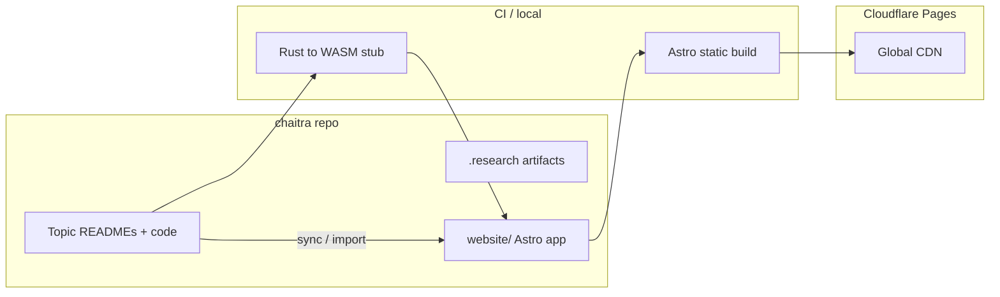

# Chaitra Website & Curriculum — Design Specification

**Date:** 2026-05-28  
**Status:** Approved  
**Repository:** `chaitra/` (nested git)  
**Site root:** `chaitra/website/`

---

## 1. Vision

**Chaitra** is a discoverability-first educational site for scalable probabilistic systems. It turns the existing topic README corpus into a guided learning experience: narrative intuition → explorable visual lab → runnable implementation (Python in-browser, Rust via WASM, GitHub as fallback).

**Audience:** Mixed tracks—curious generalists and engineers—on the same topic page. Optional **Story path** (narrative + viz, minimal math) and **Engineer path** (formalism, benchmarks, code) share one URL; toggles or in-page anchors switch tone without duplicating routes.

**Scope (approved):**

| Area | In scope |
|------|----------|
| **B** | Public website for discovery, SEO, and structured learning |
| **C** | New curriculum topics (repo folders + site pages) |
| **Deepen** | Existing READMEs: prerequisite graphs, benchmarks, parity tests |

**North-star outcome:** A learner can land on chaitra, understand *why* Bloom filters exist, play with false-positive tradeoffs, run Python/Rust-aligned code in the browser, and follow links to deepen in-repo.

---

## 2. Architecture

### 2.1 High-level system



### 2.2 Tech stack (decided)

| Layer | Choice | Rationale |
|-------|--------|-----------|
| Site framework | **Astro 5** + **MDX** | Content-first static site; partial hydration for labs only |
| Interactivity | **React islands** (`client:load` / `client:visible`) | Viz labs, Pyodide runner, WASM loader |
| Styling | **CSS variables** (design tokens) + minimal global CSS | No heavy UI framework in Phase 1 |
| Viz | **SVG** (UI, diagrams) + **Canvas 2D** (bit arrays, heatmaps) | Hybrid per research; WebGL deferred |
| Python in browser | **Pyodide** | Matches existing `.py` reference implementations |
| Rust in browser | **wasm-pack** → WASM + JS glue | Matches `.rs` implementations; GitHub link if WASM load fails |
| Deploy | **Cloudflare Pages** | Static `dist/` from `website/`; optional Wrangler for previews |
| Diagrams in READMEs | **Mermaid** (GitHub-native + site via integration) | Prerequisite graphs in repo and site |

Research compared Docusaurus; **Astro** is the approved choice for lighter static output and explicit island boundaries.

### 2.3 Repository layout (target)

```
chaitra/
├── BLOOM_FILTERS/          # topic source of truth
├── COUNT_MIN_SKETCH/
├── CONSISTENT_HASHING/
├── HYPERLOGLOG/
├── …/                      # future topics
├── docs/superpowers/       # specs & plans
├── website/                # Astro app (deploy root)
│   ├── astro.config.mjs
│   ├── package.json
│   ├── public/
│   ├── src/
│   │   ├── layouts/
│   │   ├── pages/
│   │   ├── content/topics/ # MDX overrides / front matter
│   │   ├── components/     # React islands
│   │   └── styles/
│   └── README.md           # local dev + Cloudflare deploy
└── .research/              # read-only research JSON
```

### 2.4 Content sync strategy

**Source of truth:** Topic folder `README.md` + `*.py` / `*.rs` in repo.

**Site consumption (Phase 1):**

1. **Catalog metadata** — `website/src/data/topics.json` generated or hand-maintained from folder list: `slug`, `title`, `folder`, `hasPython`, `hasRust`, `phase`, `prerequisites[]`.
2. **Topic body** — MDX pages under `website/src/content/topics/<slug>/index.mdx` initially **import or transcribe** key sections from README (not full auto-sync in v1). Front matter links `repoPath: BLOOM_FILTERS`.
3. **Sync script (Phase 1 Task)** — `website/scripts/sync-readme.mjs` copies README into `src/content/topics/<slug>/readme-body.md` for diff review; MDX composes narrative + components. Full bi-directional sync is out of scope for v1.
4. **Code display** — Static snippets via Astro `Code` component from repo files at build time (`import.meta.glob` or readFile in sync script). Runners execute bundled copies, not live filesystem reads in production.

**Link parity:** Every topic page footer links: `View on GitHub` → `https://github.com/07AMIT10/chaitra/tree/main/<FOLDER>/`.

---

## 3. Page template

Every topic route uses **`TopicLayout`** with consistent sections and optional path toggle.

### 3.1 URL structure

| Route | Purpose |
|-------|---------|
| `/` | Home: value prop, featured topics, learning map entry |
| `/catalog` | All topics: filters (coded / planned / theory-only) |
| `/topics/<slug>` | Single topic (e.g. `bloom-filters`) |
| `/topics/<slug>/lab` | Optional deep-link to viz anchor (same page hash `#lab`) |

### 3.2 Topic page sections (in order)

1. **Hero** — Title, one-line promise, badges (Python ✓ Rust ✓), path toggle: Story | Engineer.
2. **Prerequisites** — Mermaid graph (embedded); links to `/topics/<slug>`.
3. **Narrative** — Story path: analogy + hook from README; Engineer path: adds math blocks (collapsible).
4. **Explorable lab** (`#lab`) — React island: parameter controls + live metrics + Canvas/SVG viz.
5. **Worked example** — Static walkthrough (pedagogy: reduce cognitive load before exercise).
6. **Implementation** — Tabs: **Run Python (Pyodide)** | **Run Rust (WASM)** | **Open in GitHub**.
7. **Benchmarks** — Table from README (or placeholder with reproduce commands); link to future HTML reports.
8. **Retrieval check** — 2–3 inline questions (no LLM chat in v1).
9. **Next topics** — From prerequisite graph edges.

### 3.3 Design tokens (Phase 1)

CSS variables in `website/src/styles/tokens.css`:

- `--color-bg`, `--color-surface`, `--color-text`, `--color-muted`
- `--color-accent`, `--color-accent-hover`
- `--font-sans`, `--font-mono`
- `--space-*` (4px scale), `--radius-md`, `--shadow-sm`
- `--focus-ring` (visible keyboard focus, 3px offset)

Dark mode: `prefers-color-scheme` with manual toggle stored in `localStorage` (Phase 1 optional; AA contrast required in both).

---

## 4. Cloudflare Pages setup

### 4.1 Build settings (dashboard)

| Setting | Value |
|---------|--------|
| Production branch | `main` |
| Root directory | `website` |
| Build command | `npm ci && npm run build` |
| Build output directory | `dist` |
| Node version | 20 LTS |

### 4.2 Environment

No secrets required for static Phase 1. Optional `PUBLIC_SITE_URL` for canonical URLs in `astro.config.mjs`.

### 4.3 Wrangler (optional, previews)

`website/wrangler.toml` (optional):

```toml
name = "chaitra"
compatibility_date = "2024-09-23"
pages_build_output_dir = "dist"
```

Local preview: `npx wrangler pages dev dist` after `npm run build`.

### 4.4 CI recommendation (documented, not required Phase 1)

GitHub Action in `chaitra/.github/workflows/deploy-website.yml`: on push to `main`, run build in `website/` and let Cloudflare Pages Git integration deploy (or upload via Wrangler API). Document both paths in `website/README.md`.

---

## 5. In-browser execution strategy

### 5.1 Python — Pyodide

- Load Pyodide from CDN (`pyodide.asm.js` + `micropip`) only on topic pages with `client:visible` runner island.
- Pre-bundle topic code as string assets (from `bloom_filter.py`, etc.) injected into editor default.
- **Run** executes in a Web Worker where feasible to avoid blocking UI; stdout/stderr streamed to output panel.
- **Limits:** No arbitrary pip install in v1; stdlib + inlined code only. Network: micropip disabled in v1 or allowlist `numpy` later.
- **Fallback:** “Open full notebook on GitHub” → link to raw `.py` in repo.

### 5.2 Rust — WASM

- **Phase 1:** wasm-pack crate `website/wasm/bloom_filter/` wrapping core logic extracted or duplicated minimally from `BLOOM_FILTERS/bloom_filter.rs`.
- Build script: `npm run build:wasm` → `website/public/wasm/bloom_filter/`.
- Loader island: fetch WASM, instantiate, expose `insert` / `contains` to UI; on failure show GitHub + local `cargo test` instructions.
- **Future:** Shared workspace crate under `chaitra/crates/` for parity with repo `.rs` files.

### 5.3 GitHub fallback

Always visible when:

- WASM unsupported (older Safari edge cases),
- Pyodide load timeout (>15s),
- User prefers local dev.

Links: tree URL for folder, `bloom_filter.py`, `bloom_filter.rs`, and “Clone repo” `README.md#quickstart` (to be added in deepen task).

### 5.4 Security

- No `eval` of user code beyond Pyodide sandbox.
- CSP headers via Cloudflare: restrict script-src to self + Pyodide CDN + wasm-unsafe-eval as required for WASM.

---

## 6. Topic route mapping

Slug = lowercase kebab-case of folder name without redundant words where obvious.

| Slug | Repo folder | Site phase | Coded (py/rs) |
|------|-------------|------------|---------------|
| `bloom-filters` | `BLOOM_FILTERS` | **1 — golden** | ✓ ✓ |
| `count-min-sketch` | `COUNT_MIN_SKETCH` | 2 | ✓ ✓ |
| `consistent-hashing` | `CONSISTENT_HASHING` | 2 | ✓ ✓ |
| `hyperloglog` | `HYPERLOGLOG` | 2 | ✓ ✓ |
| `quantile-sketches` | *(planned)* `QUANTILE_SKETCHES/` | 3 | — |
| `tinylfu` | `TINYLFU` (README exists) | 3 | — |
| `rate-limiting` | `RATE_LIMITING` (README exists) | 3 | — |
| `gossip-swim` | *(planned)* `GOSSIP_PROTOCOLS/` or `RAFT_VS_GOSSIP/` | 4 | — |
| `vector-clocks-crdts` | `CRDTS_PLUS_PROBABILITY` / `EVENTUAL_CONSISTENCY` | 4 | — |
| `hyperloglog-plus-plus` | extends `HYPERLOGLOG` | 4 | — |

**Catalog-only (v1):** Remaining ~40 README folders appear on `/catalog` with status `readme-only` and link to GitHub until a site page exists.

---

## 7. Accessibility

Target: **WCAG 2.2 Level AA** for all Phase 1 interactive UI.

| Requirement | Implementation |
|-------------|----------------|
| Keyboard | All lab controls tabbable; sliders use native `<input type="range">` |
| Focus | `--focus-ring` on interactive elements |
| Canvas | `role="img"` + `aria-label`; live region announces FP rate / fill % changes |
| Motion | `prefers-reduced-motion: reduce` disables non-essential animations |
| Contrast | AA for text; do not rely on color alone in heatmaps (patterns + labels) |
| Touch | Minimum 44×44px tap targets on lab controls |
| SEO text | Prose narrative is HTML; canvas includes `<canvas>…fallback text…</canvas>` |

No conversational assistant in v1 (reduces distraction and a11y risk).

---

## 8. Phased roadmap

### Phase 1 — Golden topic (4–6 weeks)

- Astro scaffold + `TopicLayout` + tokens
- Cloudflare Pages docs + first deploy
- Bloom filter: MDX page, viz lab, Pyodide runner, WASM stub pipeline
- Catalog page (all folders, status badges)
- Deepen `BLOOM_FILTERS/README.md` (graph, benchmarks, parity)

**Exit criteria:** `https://<pages-domain>/topics/bloom-filters` loads narrative, lab works on desktop Chrome/Firefox, Pyodide runs insert/query demo, WASM loads or shows fallback, Lighthouse a11y ≥ 90 on topic page.

### Phase 2 — Ship coded four on site

- Port MDX + labs for Count-Min, Consistent Hashing, HyperLogLog
- Shared viz primitives (`BitArrayCanvas`, `ParameterPanel`)
- Deepen four READMEs per checklist

### Phase 3 — New curriculum (repo + site)

Order (merge brief + research):

1. Quantile sketches (t-digest, KLL) — mergeability foundation  
2. TinyLFU / W-TinyLFU — builds on Count-Min  
3. Rate limiting (token bucket, GCRA)  
4. Gossip / SWIM  
5. Vector clocks & core CRDTs  
6. HyperLogLog++ — capstone on HLL  

Each: new folder, py/rs stubs, README, then site page.

### Phase 4 — Polish

- WebGL for massive stream demos
- ASV / Criterion HTML reports on Pages subpath
- PyO3/maturin bridge for shared tests
- i18n (if needed)

---

## 9. Topic backlog table

| Priority | Topic | Repo action | Site action | Depends on |
|----------|-------|-------------|-------------|------------|
| P0 | Bloom filters | Deepen README | Full golden page | — |
| P1 | Count-Min Sketch | Deepen | Topic page + lab | Bloom |
| P1 | Consistent hashing | Deepen | Topic page + lab | Hashing intuition |
| P1 | HyperLogLog | Deepen | Topic page + lab | Bloom |
| P2 | Quantile sketches | New `QUANTILE_SKETCHES/` | Topic page | Streaming alg literacy |
| P2 | TinyLFU | Expand `TINYLFU/README` + code | Topic page | Count-Min |
| P2 | Rate limiting | Expand `RATE_LIMITING/` + code | Topic page | — |
| P3 | Gossip / SWIM | New or expand `GOSSIP_PROTOCOLS/` | Topic page | Distributed systems |
| P3 | Vector clocks & CRDTs | Expand `CRDTS_PLUS_PROBABILITY/` | Topic page | Gossip |
| P3 | HLL++ | Extend `HYPERLOGLOG/` | Topic page | HyperLogLog |

---

## 10. Deepening checklist (per topic README)

Apply when deepening any topic folder (Phase 1 for Bloom; Phase 2 for coded four):

- [ ] **Header** — One-sentence value prop + status badges (build, py/rs, license)
- [ ] **Quickstart** — `python bloom_filter.py` / `cargo test` in &lt;90 seconds
- [ ] **Prerequisites graph** — Mermaid `graph TD` with links to sibling folders
- [ ] **Content map** — Links to narrative sections, code files, tests, benchmarks
- [ ] **Worked example** — Step-by-step before exercises
- [ ] **Benchmarks** — `pytest-benchmark` or `criterion` commands, env notes, results table
- [ ] **Parity tests** — Shared JSON fixtures in `tests/fixtures/<topic>/` consumed by pytest + `cargo test`
- [ ] **Python/Rust parity** — Document API equivalence table
- [ ] **Contributing** — How to run tests and update fixtures
- [ ] **Site link** — “Read interactively” → `https://<site>/topics/<slug>`

---

## 11. Out of scope for v1

- Conversational / LLM tutoring UI  
- Full automatic bi-directional README ↔ MDX sync  
- Binder, Codespaces, or cloud notebooks (GitHub fallback only)  
- All 50+ topics as full interactive pages (catalog links only)  
- WebGL stream visualizations  
- Distributed Pyodide micropip package installs  
- i18n / RTL  
- CAPTCHA or user accounts  
- Observable/Docusaurus migration (research reference only)  

---

## 12. References

- Research: `chaitra/.research/edu-website-viz.json`, `curriculum-next-topics.json`, `deepen-existing-content.json`
- Pedagogy: narrative → explorable explanation → implementation (Explorable Explanations, VisuAlgo e-Lecture + quiz model)
- Curriculum order: quantile → TinyLFU → rate limit → gossip → CRDTs → HLL++ (research `recommended_implementation_order`)

---

## Self-review (2026-05-28)

- **Stack:** Astro chosen over research-default Docusaurus; documented in §2.2.
- **GitHub URLs:** `07AMIT10/chaitra` from `git remote origin`.
- **Topic slug `hyperloglog-plus-plus`:** Distinct from `hyperloglog` to avoid route clash when HLL++ ships.
- **Sync:** One-way README → `readme-body.md` in v1; no bi-directional edit loop.

---

## Appendix A — Bloom filter lab (Phase 1 functional spec)

**Parameters:** `m` (bits), `n` (inserted keys), `k` (hash functions), optional key set preset (small / collision-heavy).

**Visual:** Canvas bit array; highlighted indices on insert/query; FP rate estimate live from \(P \approx (1 - e^{-kn/m})^k\).

**Metrics panel:** fill ratio, estimated FP rate, “definitely not” vs “probably yes” counts on test batch.

**Pyodide default:** Minimal `BloomFilter` class mirroring `bloom_filter.py` API (`add`, `__contains__`).

**WASM exports:** `bloom_new(m, k)`, `bloom_add(ptr, key)`, `bloom_contains(ptr, key)`.
