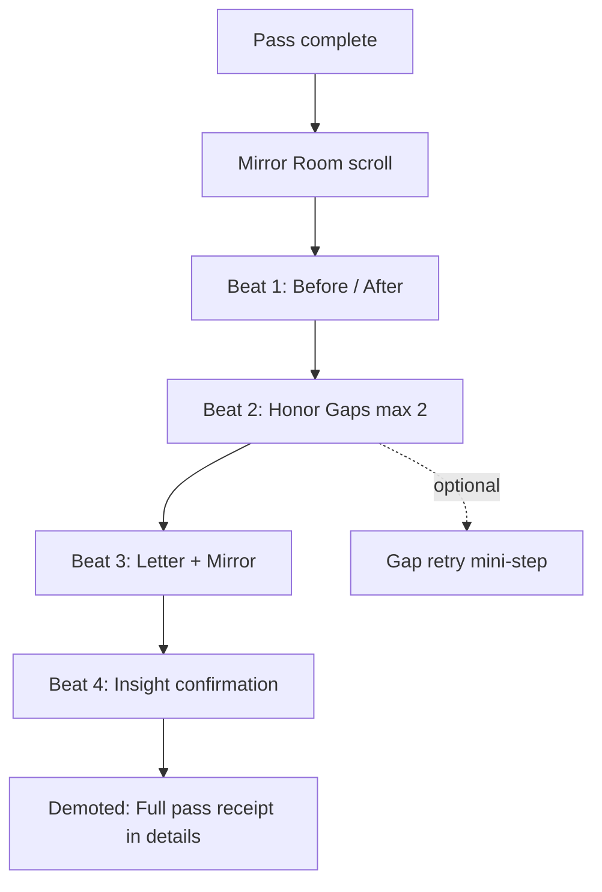
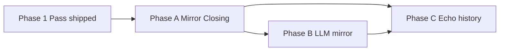

# Drishti Mirror Closing — Design Spec

**Date:** 2026-06-21  
**Status:** Approved (brainstorming)  
**Builds on:** [Drishti UX Revamp design spec](./2026-06-21-drishti-ux-revamp-design.md) (Phase 1 Pass shipped)

---

## 1. Context & problem

### What works

User feedback confirms the **7-lens pass** delivers value when the flow is: **examples → apply to own phenomenon → think**. Learners who complete a pass report using the lenses on real material, not just reading about them.

### What fails

The current **`DrishtiPassSummary`** feels like a **receipt**, not a **mirror**:

| Receipt behavior (current) | Mirror behavior (desired) |
|----------------------------|---------------------------|
| Lists all seven notes in order | Shows before/after contrast |
| Treats empty or "idk" notes as gaps to hide | Honors gaps as valid, not failure |
| Ends with optional "What shifted?" textarea | Ends with letter + rule-based mirror + insight confirmation |
| Full pass dump is the hero | Full pass dump is demoted to expandable details |

**"idk" answers are valid, not failure.** A learner who honestly marks uncertainty on two lenses has still done real work. The closing should reflect that without shame or pressure to fill every box.

### Closure mix chosen (user Q&A)

During brainstorming the user selected a hybrid of three closure patterns:

| Option | Element | Included |
|--------|---------|----------|
| **B** | Letter + mirror | Yes — rule-based mirror v1, LLM mirror Phase B |
| **C** | Before/after | Yes — phenomenon + context vs `nowSentence` |
| **D** | Honor gaps | Yes — max 2 surfaced, with `gapNudge` from pass-hints |

---

## 2. Research basis (brief)

| Concept | Application to Mirror Closing |
|---------|-------------------------------|
| **Double-loop learning** (Argyris) | Closing asks "how did *you* change?" not "what did you write?" — second loop beyond note collection |
| **Kolb cycle** | Concrete experience (7 lenses) → reflective observation (before/after) → abstract conceptualization (letter + mirror) → active testing (insight confirmation, optional gap retry) |
| **Desirable difficulty** | Gap honor + mirror confirmation add friction that improves retention vs passive receipt |
| **Witness / paraphrase patterns** (therapy, coaching) | Rule-based mirror reflects back patterns in the learner's own words without adding new claims |

**Current state:** `DrishtiPassSummary` is an **archive** of notes — useful for copy/paste, not for transformation. `formatPassSummary()` mirrors the same receipt shape for clipboard export.

---

## 3. Approach chosen

### Layout: Mirror Room (single scroll)

Three layout options were evaluated:

| Layout | Pros | Cons | Verdict |
|--------|------|------|---------|
| **Stepped wizard** (3–4 screens) | Clear progression | Feels like more work after 7 steps; breaks scroll momentum | Rejected |
| **Letter-first** (letter hero, rest below) | Emotional peak early | Before/after and gaps lose prominence | Rejected |
| **Mirror Room (single scroll)** | One reflective beat; all elements visible; natural on mobile | Longer page — mitigated by hierarchy + collapsed receipt | **Chosen** |

The Mirror Room is a **single scroll completion view** with four beats in fixed order (see §4). No additional stepper. Primary actions (confirm insight, new pass, done) stay pinned or repeated at bottom on mobile.



---

## 4. Mirror Closing beats

### Beat 1 — Before / after

**Purpose:** Make the reframing visible in one glance.

| Column | Content | Source |
|--------|---------|--------|
| **Before** | Phenomenon title + optional context | `pass.phenomenon`, `pass.context` |
| **After** | One sentence: how they see it now | `pass.nowSentence` (new field, collected in Beat 3 or inline prompt before letter) |

**UI:** Side-by-side on desktop (`≥640px`); stacked on mobile. Before uses muted typography; After uses Drishti accent and slightly larger type. Visual connector (arrow or "→") between columns.

**Copy prompt for `nowSentence`:** *"In one sentence, how do you see [phenomenon] differently now?"* (max 200 chars)

If user skips `nowSentence`, Before/After still renders with After showing placeholder: *"You finished the pass — add one sentence when you're ready."* Inline edit allowed without leaving Mirror Room.

### Beat 2 — Honor gaps (max 2)

**Purpose:** Normalize uncertainty; offer gentle nudge, not remediation.

**Gap detection rules** (see §8): A lens note qualifies as a gap if it is empty, whitespace-only, or matches an "idk" pattern (case-insensitive: `idk`, `i don't know`, `not sure`, `?`, `—`, `-`, `n/a`, `skip`).

**Surfacing:** Show **at most 2** gaps, prioritized by lens order (first gaps in site-wide lens order win).

**Per gap card:**

| Element | Source |
|---------|--------|
| Lens glyph + title | `DRISHTI_LENSES` |
| User's note (or "left blank") | `pass.lenses[slug]` |
| **Gap nudge** | `pass-hints.json` → `gapNudge` per lens |
| Optional action | "Try this lens again" → opens inline mini-step or slide-over retry for that lens only |

**Tone:** *"You didn't have to know everything. These two lenses stayed open — that's useful information."*

**No gap cards** when all lenses have substantive notes → beat collapses to single line: *"You engaged with all seven lenses."*

### Beat 3 — Letter + rule-based mirror

**Purpose:** Synthesize the pass into a second-person letter, then mirror back a pattern for confirmation.

#### Letter (rule-based, no LLM v1)

Generated from pass data using deterministic templates. Stored in `pass.letter`.

**Letter structure:**

1. Opening: address the learner by phenomenon ("You looked at **[phenomenon]** through seven lenses.")
2. Body: 2–4 sentences weaving **non-gap** lens notes (paraphrased lightly — trim, join; no new claims)
3. Closing: bridge to `nowSentence` if present, else invitation ("Something may still be forming.")

**Audience tone:** From `pass-hints.json` → `letterAudience` (default: `"friend"` — warm, direct, mechanism-first).

#### Rule-based mirror (no LLM v1)

After the letter, show a **mirror block** — one paragraph reflecting a **pattern** across their notes.

**Algorithm (v1):**

1. Collect substantive notes (non-gap) with lens metadata
2. Score lenses for "pattern signals" using keyword buckets per lens (e.g. flows → queue/bottleneck/wait; learns → feedback/repeat/habit)
3. Pick top 2 lenses by signal strength; if tie, earlier in lens order wins
4. Compose mirror sentence: *"You kept returning to [theme A] and [theme B] — as if [connection phrase from template library]."*
5. If &lt;2 substantive notes, fallback mirror: *"You named the phenomenon and sat with the questions — that counts."*

**No LLM in Phase A.** Mirror text is reproducible and testable.

#### Insight confirmation

Below mirror, prompt: *"Does this reflect what shifted for you?"*

| Control | Behavior |
|---------|----------|
| **Yes, that's it** | Sets `pass.mirrorConfirmed: true`; optional auto-fill `insight` from `nowSentence` if insight empty |
| **Close, but not quite** | Expands inline edit for `insight` (400 char max, existing field) |
| **Skip** | Allowed; `mirrorConfirmed` stays undefined |

### Beat 4 — Demoted receipt (details)

Full seven-lens note list moves to **`<details>`** accordion: *"Full pass notes"*.

**Contents:** Same as current `DrishtiPassSummary` list — lens glyph, title, note text (light or deep per `pass.depth`).

**Actions row (primary, outside details):**

| Action | Behavior |
|--------|----------|
| **Copy pass** | Uses updated `formatPassSummary()` — see §8 |
| **New pass** | Same as today |
| **Done** | Closes overlay |

---

## 5. Phasing

### Phase A — Ship next (v1 Mirror Closing)

**Goal:** Replace receipt summary with full Mirror Room; no LLM.

| Deliverable | Notes |
|-------------|-------|
| `DrishtiPassSummary` redesign | Mirror Room layout; four beats; demoted details |
| Schema extension | `nowSentence`, `letter`, `gapRetries`, `mirrorConfirmed` on `DrishtiPassState` |
| `pass-hints.json` | Add `gapNudge`, `letterAudience` per lens |
| `formatPassSummary()` update | Lead with before/after + letter; full notes in appendix section |
| Per-step **idk whisper** | During pass: when note matches idk pattern, show one-line validation (*"Not knowing is data."*) — no blocking |
| `lib/drishti-pass.ts` | `detectGaps()`, `generateLetter()`, `generateMirror()`, migration tolerant of missing new fields |
| Styles | `drishti.css` — mirror room, before/after grid, gap cards, letter block |
| Tests | Unit tests for gap detection, letter/mirror generation, formatPassSummary |

**Explicitly out of scope (Phase A):** LLM mirror, tension detection, gap retry merge into pass state, 72-hour echo, pass history UI.

### Phase B — Intelligent mirror

| Deliverable | Notes |
|-------------|-------|
| LLM mirror | Replace or augment rule-based mirror when API available; keep rule-based fallback |
| Tension detection | Flag contradictory notes across lenses; surface in mirror ("You named X here and Y there") |
| Gap retry merge | `gapRetries` persisted when user completes mini-step; merged into pass on save |

### Phase C — Echo & history

| Deliverable | Notes |
|-------------|-------|
| 72-hour echo | Optional notification/prompt: *"Three days ago you saw [phenomenon] differently — still true?"* |
| Pass history | Browse past passes from hub; reopen Mirror Room for any complete pass |

### Dependency map



---

## 6. UX details, edge cases, accessibility, success signals

### UX details

| Topic | Behavior |
|-------|----------|
| Entry to Mirror Room | Same overlay as today; triggered on light or deep pass complete |
| Scroll | Single column; beats separated by generous whitespace and subtle dividers |
| `nowSentence` timing | Prompt appears at top of Beat 1 if empty; editable inline throughout |
| Letter regeneration | Re-run `generateLetter()` on pass complete only; not live on every keystroke |
| Deep pass | Letter prefers `deep` notes, falls back to `light` (same as summary today) |
| Copy | Clipboard export uses new format; includes letter + before/after + appendix notes |

### Edge cases

| Case | Behavior |
|------|----------|
| All notes are gaps | Letter uses phenomenon + context only; mirror uses fallback; gap beat shows 2 cards |
| Zero notes at all | Unlikely (phenomenon required); mirror fallback; before/after still works |
| User confirms mirror then edits insight | Both saved; `mirrorConfirmed` remains true |
| localStorage full | Same warning as today; Mirror Room still usable in-session |
| Resume draft | Mirror Room not shown until `status: "complete"` |
| Gap retry abandoned | No write to `gapRetries`; gap card remains on next open |
| Very long notes | Letter paraphrase truncates each note to ~80 chars for composition; full text stays in details |

### Accessibility

| Requirement | Implementation |
|-------------|----------------|
| WCAG 2.1 AA | Contrast on before/after, gap cards, letter block |
| Focus management | Overlay retains focus trap; return focus to chip on Done |
| Screen reader | Beats as `<section>` with `aria-labelledby`; before/after announced as comparison |
| Live regions | Gap retry save → `aria-live="polite"` confirmation |
| Reduced motion | No scroll-triggered animations; optional fade on beat enter disabled when `prefers-reduced-motion` |
| Keyboard | All actions (confirm, skip, expand details, gap retry) reachable without pointer |

### Success signals

| Signal | How we know | Phase |
|--------|-------------|-------|
| **Mirror engagement** | User sets `nowSentence` or confirms mirror | A |
| **Gap acceptance** | User completes pass with gaps and does not abandon at Mirror Room | A |
| **Insight quality** | Non-empty `insight` or `mirrorConfirmed: true` on ≥60% of completes (manual sample v1) | A |
| **Copy shift** | Copy action includes letter section (analytics attribute) | A |
| **Return pass** | Second pass within 30 days (existing signal from UX revamp spec) | A |
| **Gap retry** | User clicks retry on ≥1 gap card | B |
| **Echo response** | User opens 72-hour echo prompt | C |

---

## 7. Technical shape

### Schema extension — `DrishtiPassState`

Add to existing interface in `website/src/lib/drishti-pass.ts`:

```typescript
export interface DrishtiPassState {
  // ... existing fields ...
  nowSentence?: string;              // max 200 chars — "how I see it now"
  letter?: string;                   // generated on complete; regenerated if missing on open
  mirrorConfirmed?: boolean;         // user confirmed mirror reflects shift
  gapRetries?: Partial<Record<LensSlug, {
    note: string;
    retriedAt: string;               // ISO 8601
  }>>;
}
```

**Migration:** `isDrishtiPassState` remains permissive — new fields optional. On Mirror Room open for legacy complete passes without `letter`, run `generateLetter()` + `generateMirror()` once and persist.

**Generation timing:** `letter` (and embedded mirror paragraph) computed in `finalizePass()` before save, and backfilled on read if absent.

### `pass-hints.json` — new fields

Per lens slug, extend each entry:

```json
{
  "what-flows": {
    "microExample": "...",
    "deepPrompts": ["..."],
    "gapNudge": "Not sure what flows? Name one thing that enters and one that leaves — that's enough.",
    "letterAudience": "friend"
  }
}
```

| Field | Type | Purpose |
|-------|------|---------|
| `gapNudge` | `string` | One sentence, phenomenon-agnostic, shown on gap cards |
| `letterAudience` | `"friend" \| "coach" \| "peer"` | Selects letter template set (v1: all use `friend` templates; field ready for Phase B tone variants) |

### `DrishtiPassSummary` redesign

Replace receipt-first layout with Mirror Room sections:

| Section | Component region |
|---------|------------------|
| Before/After | `.drishti-mirror-before-after` |
| Honor gaps | `.drishti-mirror-gaps` (0–2 cards) |
| Letter + mirror | `.drishti-mirror-letter`, `.drishti-mirror-reflection` |
| Insight confirmation | `.drishti-mirror-confirm` |
| Demoted receipt | `<details class="drishti-mirror-receipt">` |

Props unchanged at boundary (`pass`, `onInsightChange`, `onCopy`, `onNewPass`, `onDone`, `storageWarning`); add internal handlers for `nowSentence`, `mirrorConfirmed`, gap retry.

### Rule-based mirror algorithm (v1 detail)

**Input:** `DrishtiPassState`  
**Output:** `{ mirrorText: string; highlightedLenses: LensSlug[] }`

```
1. gaps ← detectGaps(pass)
2. substantive ← lenses where note not in gaps
3. if substantive.length === 0 → return FALLBACK_MIRROR
4. for each lens in substantive:
     score ← countKeywordHits(note, LENS_SIGNAL_BUCKETS[lens])
5. top ← sort by score desc, lens order asc, take 2
6. themeA ← LENS_THEME_LABEL[top[0]]
7. themeB ← LENS_THEME_LABEL[top[1]] ?? null
8. if themeB → template DUAL(themeA, themeB)
   else → template SINGLE(themeA)
```

**Keyword buckets (illustrative, implement in `lib/drishti-mirror.ts`):**

| Lens | Signal keywords (subset) |
|------|--------------------------|
| what-exists | entity, layer, part, structure, component |
| what-changes | drift, shift, trend, slow, fast, time |
| what-flows | flow, queue, bottleneck, wait, throughput |
| what-learns | feedback, learn, adapt, habit, update |
| what-persists | invariant, always, survive, constraint |
| what-emerges | emerge, whole, pattern, scale, local |
| what-will-happen | likely, forecast, probability, expect |

### Gap detection rules

```typescript
const IDK_PATTERN = /^(idk|i don't know|i dont know|not sure|\?|—|-+|n\/a|skip)$/i;

function isGapNote(text: string | undefined): boolean {
  const t = text?.trim() ?? "";
  if (!t) return true;
  if (t.length <= 3 && IDK_PATTERN.test(t)) return true;
  return IDK_PATTERN.test(t);
}

function detectGaps(pass: DrishtiPassState): LensSlug[] {
  return DRISHTI_LENSES
    .map((l) => l.slug as LensSlug)
    .filter((slug) => isGapNote(lensNoteForSummary(pass, slug)));
}
```

**Max 2 for UI:** `detectGaps(pass).slice(0, 2)`.

**Per-step idk whisper:** On blur of lens textarea, if `isGapNote(value)`, show ephemeral hint below field (2s fade or dismiss on next keystroke): *"Not knowing is data — you can leave this and return later."*

### `formatPassSummary()` update

New clipboard shape:

```
# Drishti Pass: {phenomenon}
Context: {context}

## Before → After
Before: {phenomenon} — {context}
After: {nowSentence || "—"}

## Letter
{letter}

## Mirror
{mirrorText}

---
## Full notes
{lens lines...}

What shifted: {insight}
```

### Files touched (Phase A)

| File | Change |
|------|--------|
| `website/src/lib/drishti-pass.ts` | Schema, gap detect, formatPassSummary |
| `website/src/lib/drishti-mirror.ts` | **New** — letter + mirror generation |
| `website/src/data/drishti/pass-hints.json` | `gapNudge`, `letterAudience` × 7 |
| `website/src/components/drishti/DrishtiPassSummary.tsx` | Mirror Room UI |
| `website/src/components/drishti/DrishtiPassStep.tsx` | idk whisper on blur |
| `website/src/components/drishti/DrishtiPassLauncher.tsx` | Generate letter on finalize |
| `website/src/styles/drishti.css` | Mirror Room styles |
| `website/src/lib/drishti-pass.test.mjs` | Gap + format tests |
| `website/src/lib/drishti-mirror.test.mjs` | **New** — letter/mirror tests |

---

## 8. Self-review checklist (completed)

| Check | Result |
|-------|--------|
| Placeholder scan (TBD / TODO) | None — Phase A deliverables concrete; B/C explicitly deferred |
| Consistency with UX revamp spec | Extends Phase 1 Pass; same schema keys, lens order, storage key |
| "idk" as valid | Honored in gap beat, idk whisper, no blocking |
| Closure mix B+C+D | All three beats present in Mirror Room order |
| Layout decision documented | Mirror Room chosen over stepped and letter-first with rationale |
| No LLM in v1 | Rule-based letter + mirror specified; Phase B for LLM |
| Implementability | TypeScript interfaces, algorithms, file list, test scope defined |
| Accessibility | Focus trap, sections, live regions, reduced motion covered |
| Ambiguity resolved | Max 2 gaps, generation timing, edge cases table complete |

---

*Approved through collaborative brainstorming session, 2026-06-21.*
