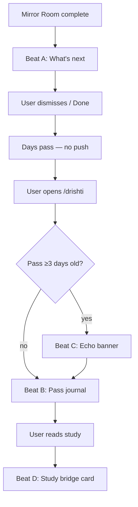

# Drishti Return Loop — Design Spec

**Date:** 2026-06-21  
**Status:** Approved (brainstorming)  
**Builds on:** [Drishti Mirror Closing design spec](./2026-06-21-drishti-mirror-closing-design.md) (Phase A shipped)  
**References:** [Drishti UX Revamp design spec](./2026-06-21-drishti-ux-revamp-design.md) (Phase 2–4 roadmap); Mirror Closing Phase B–C (LLM mirror, gap retry, echo/history — see §5)

---

## 1. Context & problem

### What works

Mirror Closing Phase A ships the **Mirror Room** — before/after, gap honor, letter + rule-based mirror, insight confirmation, demoted receipt. Learners who finish a pass report real reframing: *"I saw my problem differently."*

### What is missing

After a good pass, Drishti has no structured reason to **come back**. The Mirror Room ends with Copy / New pass / Done — useful actions, but no bridge to the next visit. Passes persist in localStorage but are invisible until the user starts another pass.

The Mirror Closing spec deferred **Phase C (Echo & history)** to a follow-on design. This spec defines that follow-on: the **Return Loop**.

### Constraints

| Constraint | Decision |
|------------|----------|
| Storage | **localStorage only** — same `chaitra_drishti_pass` key; no backend, no account sync |
| Notifications | **No push, email, or timers** — echo appears only when user opens `/drishti` on a subsequent visit |
| Scope | Return Loop v1 — distributed touchpoints, not a new route or dashboard |

---

## 2. Design decisions from user Q&A

These decisions were locked during collaborative brainstorming. They govern all Return Loop work.

| Question | Options considered | Choice |
|----------|-------------------|--------|
| **What brings you back after a good pass?** | A insight echo · B study connections · C new phenomenon · D pass history · E mix | **A + D + B** — insight echo, pass history as journal, study connections |
| **Where should the loop start?** | A hub-first · B closure-first · C both · D study-first | **C both** — light post-closure nudge + full hub experience on return |
| **When should the insight echo show?** | A next visit + ≥3 days · B session-based · C explicit opt-in · D always on hub | **A next visit only** — pass ≥3 days old, no push/timers |

### Come-back loop narrative

**Remember → revisit → connect:**

1. **Remember** — echo banner surfaces your own insight when you return after time away
2. **Revisit** — hub pass journal lets you browse and reopen past Mirror Rooms
3. **Connect** — study bridge cards link your pass to canonical case studies while reading

---

## 3. Approach chosen

Three layout options were evaluated:

| Approach | Description | Pros | Cons | Verdict |
|----------|-------------|------|------|---------|
| **1. Hub-only Return Loop** | Post-closure one-line "What's next"; hub shows recent passes + echo + study match | Simple, one place to build | Study connections only on hub, not while reading | Rejected |
| **2. Distributed touchpoints** | Post-closure "What's next"; hub pass journal + echo banner; study pages show bridge card when relevant | Matches A+D+B mix; studies connect in context | Three surfaces, shared data layer | **Chosen** |
| **3. Pass-centric dashboard** | New `/drishti/journal` route as main return experience | Room for rich history | Extra route; hub feels empty | Rejected |

**Recommendation:** **#2 — Distributed touchpoints.** Light closure nudge + hub as home base + study bridges when relevant.



---

## 4. Return Loop beats

**Goal:** After a good pass, Drishti gives you reasons to come back — revisit your insight, browse history, connect to studies.

### Beat A — Post-closure "What's next" (light)

After Mirror Room **Done** area, below Copy / New pass / Done — **not a modal**.

```
┌─────────────────────────────────────────┐
│ What's next                             │
│ • Revisit this pass anytime (History)   │
│ • Compare: Sleep also explores flows →  │
│ • Start fresh on something new          │
└─────────────────────────────────────────┘
```

| Element | Behavior |
|---------|----------|
| **History** | Scroll/focus hub recent passes section (or expand inline if user is on hub) |
| **Related study** | Rule-based: match strongest non-gap lens → first matching study from `pass-excerpts.json`; max **one** link (avoid choice overload) |
| **New pass** | Existing "New pass" flow |
| **Echo** | **Not shown here** — reserved for return visit (Beat C) |

**Copy when no insight yet:** *"Revisit anytime in Your passes"* instead of echo-style copy.

### Beat B — Hub pass journal

On `/drishti`, below hero CTA:

**"Your passes"** — last **5 complete** passes from localStorage.

| Card field | Content |
|------------|---------|
| Phenomenon | title + date (`completedAt`) |
| Insight snippet | first line of `insight` or `nowSentence` |
| Actions | **Reopen** (Mirror Room read-only or editable insight) · **Continue** (if draft) |

**Sorting:** Cards sorted by `completedAt` desc; **drafts pinned top** with "Continue" badge.

**Empty state:** *"Complete a pass to see it here."*

**Reopen behavior:** Read-only Mirror Room — insight/`nowSentence` editable; lens notes read-only.

**Mobile:** Horizontal scroll or stacked cards.

### Beat C — Echo banner (≥3 days)

On hub load only — **next visit**, not same session closure.

**Eligibility:**

1. Find most recent **complete** pass where `daysSince(completedAt) >= 3`
2. And `echoDismissed !== true`
3. Show **one banner at a time** (most recent eligible pass)

**Banner copy:** *"Three days ago you looked at **{phenomenon}** — '{insight snippet}' — still true?"*

| Action | Behavior |
|--------|----------|
| **Yes** | Set `echoAnswer: 'yes'`; dismiss banner; subtle confirmation toast |
| **Changed** | Open Mirror Room overlay at before/after beat; fields editable; saving sets `echoAnswer: 'changed'` |
| **Dismiss** | Set `echoDismissed: true` on that pass |

**Visual:** Amber accent, dismissible. No push/email in v1.

### Beat D — Study bridge (when reading)

On study pages (`/drishti/studies/[slug]`), if user has a complete pass where:

- `preferredStudy` matches current study, **OR**
- any lens note overlaps study theme (simple keyword match against `LENS_SIGNAL_BUCKETS` from `drishti-mirror.ts`)

Show slim card:

*"You wrote about flows on **{phenomenon}** — see how {Study Title} handles What Flows"*

**Actions:** Opens study section at that lens + optional "Apply Drishti" pre-filled at that lens.

**Placement:**

- **v1 interim:** Above accordions
- **Phase 2:** Below study hero (when study heroes ship)

**Copy template:** *"You looked at {phenomenon} through {lens} — compare with this study"*

---

## 5. Schema, phasing & Phase 2 pairing

### Schema extension (localStorage)

Add to existing `DrishtiPassState` in `website/src/lib/drishti-pass.ts`:

```typescript
interface DrishtiPassState {
  // existing fields (passId, phenomenon, lenses, insight, nowSentence, letter, …)
  completedAt?: string;           // ISO 8601 — set when status → complete
  echoDismissed?: boolean;        // user dismissed echo banner for this pass
  echoAnswer?: "yes" | "changed"; // optional, for history display
  relatedStudySlug?: StudySlug;   // computed on finalize, cached
}
```

| Field | When set | Notes |
|-------|----------|-------|
| `completedAt` | On finalize (`status → "complete"`) | Light or deep pass |
| `echoDismissed` | User clicks Dismiss on echo banner | Per-pass; prevents re-show |
| `echoAnswer` | User clicks Yes or saves after Changed | Optional; shown in journal card metadata |
| `relatedStudySlug` | On finalize | Rule-based: strongest non-gap lens → first matching study from `pass-excerpts.json` |

**Echo gate:** Hub-only on next visit if `daysSince(completedAt) >= 3`. No backend, no push.

**Migration:** Existing complete passes without `completedAt` → backfill from `updatedAt` on first read (best-effort).

### Phasing

| Phase | Ship | Out of scope |
|-------|------|--------------|
| **Return Loop v1** | Post-closure "What's next", hub pass journal (5 recent), echo banner (≥3 days), study bridge card | Push/email, full journal search, LLM study matching, `/drishti/journal` route |
| **Phase 2 (parallel)** | Study phenomenon heroes, At a Glance lens links, focus mode++ | Depends on Return Loop for pass ↔ study wiring |
| **Later (Phase 3–4)** | Gap retry mini-step, lens-centric browse, micro-labs | Per UX revamp roadmap |

**v1 order:** Return Loop first (1–2 weeks) → then study heroes (visual immersion builds on same bridge data).

### Pairing with Phase 2 study heroes

| Feature | Answers |
|---------|---------|
| **Return Loop** | *"Why come back?"* — history, echo, study link |
| **Study heroes** | *"Why read this study?"* — phenomenon + diagram above accordions |

**Shared glue:**

- `relatedStudySlug` — computed at finalize, used by post-closure "Compare: …" and study bridge card
- `preferredStudy` — set when pass started from a study page
- Lens section deep-links — bridge card opens study at matching lens

Post-closure "Compare: Sleep…" uses the **same mapping** as the study bridge card.

### Relationship to Mirror Closing Phase B–C

| Mirror Closing phase | Return Loop relationship |
|---------------------|-------------------------|
| **Phase B** — LLM mirror, tension detection, gap retry | Independent; can ship in parallel or after Return Loop v1 |
| **Phase C** — 72-hour echo, pass history | **Superseded/refined** by this spec: 3-day gate (not 72h), next-visit-only (not push), distributed touchpoints (not hub-only history) |

---

## 6. UX details, edge cases & success signals

### Post-closure "What's next"

- Appears below Copy / New pass / Done — not a modal
- Max one related study link (avoid choice overload)
- If no insight yet: *"Revisit anytime in Your passes"* instead of echo-style copy
- If no matching study: omit study line; keep History + New pass

### Hub pass journal

- Cards sorted by `completedAt` desc; drafts pinned top with "Continue" badge
- **Reopen** → read-only Mirror Room (insight/`nowSentence` editable; lens notes read-only)
- Mobile: horizontal scroll or stacked cards
- Insight snippet fallback chain: `insight` → `nowSentence` → *"Completed {date}"*

### Echo banner

- One banner at a time (most recent eligible pass)
- Amber accent (`--drishti-accent`), dismissible
- **Changed** → opens Mirror Room overlay at before/after; saving sets `echoAnswer: 'changed'`
- **Yes** → `echoAnswer: 'yes'`, dismiss, subtle confirmation toast
- Same-session return (user completes pass and immediately navigates to hub): **no echo** — requires a subsequent visit

### Study bridge card

- Only if pass exists + (lens overlap **or** `preferredStudy` match)
- Placed below study hero (Phase 2) or above accordions (v1 interim)
- Copy: *"You looked at {phenomenon} through {lens} — compare with this study"*
- If multiple passes match: show most recent complete pass only

### Edge cases

| Case | Behavior |
|------|----------|
| No complete passes | Journal empty state; no echo; no study bridge |
| Pass < 3 days old | No echo; still appears in journal |
| Pass ≥ 3 days, `echoDismissed: true` | No echo; still in journal |
| Storage full | Journal reads what exists; echo uses latest in memory |
| User clears localStorage | Clean slate — expected |
| Multiple eligible echo passes | Show most recent only |
| Pass with no insight or nowSentence | Echo uses phenomenon title only; journal shows date |
| Draft exists alongside completes | Draft pinned top with "Continue" badge |

### Success signals

| Signal | How we know | Target |
|--------|-------------|--------|
| **Journal reopen** | User clicks Reopen on a pass card | Primary retention signal |
| **Echo interaction** | User clicks Yes or Changed within 7 days of eligibility | Insight persistence check |
| **Study bridge click-through** | User clicks bridge card → study lens section | Transfer signal |
| **Post-closure navigation** | User clicks History or related study from What's next | Closure → return bridge |
| **Second pass within 30 days** | Existing UX revamp signal; Return Loop should lift this | Secondary |

### Accessibility

| Requirement | Implementation |
|-------------|----------------|
| Echo banner | `role="region"` + `aria-labelledby`; actions keyboard-reachable |
| Pass journal | Cards as list items; Reopen/Continue as named buttons |
| Study bridge | Card announced as complementary content; not blocking reading flow |
| Reduced motion | No animated entrance on echo; toast uses opacity only |

---

## 7. Technical shape

### New / updated modules

| File | Change |
|------|--------|
| `website/src/lib/drishti-pass.ts` | Schema fields; `completedAt` on finalize; `computeRelatedStudy()` helper |
| `website/src/lib/drishti-return.ts` | **New** — echo eligibility, journal sort, study bridge match, `daysSince()` |
| `website/src/lib/drishti-return.test.mjs` | **New** — echo gate, journal sort, bridge match tests |
| `website/src/components/drishti/DrishtiPassSummary.tsx` | Beat A: "What's next" section below actions |
| `website/src/components/drishti/DrishtiPassJournal.tsx` | **New** — hub pass journal cards |
| `website/src/components/drishti/DrishtiEchoBanner.tsx` | **New** — echo banner with Yes/Changed/Dismiss |
| `website/src/components/drishti/DrishtiStudyBridge.tsx` | **New** — study bridge card |
| `website/src/pages/drishti/index.astro` | Wire journal + echo banner |
| `website/src/pages/drishti/studies/[slug].astro` | Wire study bridge card |
| `website/src/styles/drishti.css` | Journal cards, echo banner, bridge card, what's-next block |

### `computeRelatedStudy()` algorithm

1. Run `detectGaps(pass)` → gap set
2. Score non-gap lenses using `LENS_SIGNAL_BUCKETS` (same as mirror generation)
3. Pick top lens by score; tie-break by lens order
4. Look up `pass-excerpts.json[lens][study]` — return first study slug with excerpt
5. Cache result in `pass.relatedStudySlug` on finalize

### `studyBridgeMatch(pass, studySlug)` algorithm

1. If `pass.preferredStudy === studySlug` → match
2. Else: for each non-gap lens, check if study has excerpt for that lens in `pass-excerpts.json`
3. If lens note hits ≥1 keyword from `LENS_SIGNAL_BUCKETS[lens]` → match with that lens
4. Return best match (preferredStudy wins; else highest-scoring lens)

---

## 8. Self-review checklist (completed)

| Check | Result |
|-------|--------|
| Placeholder scan (TBD / TODO) | None — v1 deliverables concrete; push/LLM matching explicitly deferred |
| Consistency with Mirror Closing spec | Builds on Phase A Mirror Room; extends Phase C echo/history with user-approved refinements |
| Consistency with UX revamp spec | Uses same storage key, lens order, `pass-excerpts.json`; Phase 2 heroes paired not blocked |
| User Q&A decisions captured | A+D+B drivers, C both entry, A echo timing — all in §2 |
| Approach documented | Distributed touchpoints (#2) chosen with rationale table |
| All four beats specified | A post-closure, B journal, C echo, D study bridge — §4 |
| Schema fields defined | `completedAt`, `echoDismissed`, `echoAnswer`, `relatedStudySlug` — §5 |
| Phasing clear | Return Loop v1 vs Phase 2 parallel vs later — §5 |
| No backend / no push | localStorage only; echo hub-only on next visit — §1, §5 |
| Edge cases table complete | §6 |
| Success signals defined | §6 |
| Implementability | TypeScript interfaces, algorithms, file list, test scope — §7 |
| Accessibility | Echo, journal, bridge covered — §6 |

---

*Approved through collaborative brainstorming session, 2026-06-21.*
