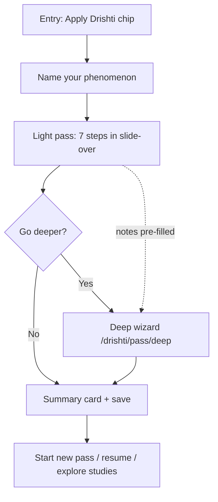
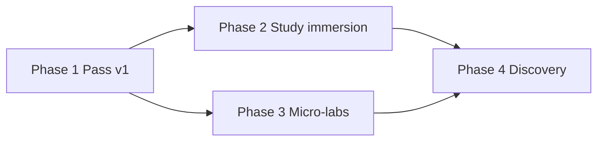

# Drishti UX Revamp — Design Spec

**Date:** 2026-06-21  
**Status:** Approved (brainstorming)

---

## 1. Goals & success criteria

### Primary goal

A learner applies Drishti to a **personal phenomenon** (something they care about — a team, habit, body system, project) and leaves with a **specific insight**: *"I saw my problem differently."* Success is experiential, not informational. They did not merely read about the seven lenses; they used them on their own material and noticed a reframing.

### Secondary goal

**Retention through varied examples → reusable mental checklist.** After several passes (across case studies and personal phenomena), the seven questions become a portable checklist the learner can invoke without the site. Varied canonical examples (Sleep, Office, Blood Circulation) reinforce pattern recognition without replacing personal application.

### Target audience

**Systems-minded Chaitra learners** — people already comfortable with mechanisms, queues, feedback, and probability who want a perception layer before diving into curriculum topics. They value scannable structure, concrete metaphors, and bridges to `/topics/*`, not abstract philosophy.

### Success signals (Phase 1)

| Signal | How we know |
|--------|-------------|
| Completion | User finishes light pass or deep wizard at least once |
| Insight | User writes a non-empty "what shifted" note on summary |
| Return | User starts a second pass (new phenomenon or resume) within 30 days |
| Transfer | User clicks a curriculum bridge or study example from within the pass |

---

## 2. Design decisions from user Q&A

These decisions were locked during collaborative brainstorming. They govern all phases; Phase 1 implements only the subset marked **v1**.

| Topic | Decision |
|-------|----------|
| **Progressive unlock** | Light pass first (fast, low commitment). **"Go deeper"** opens a guided wizard on a dedicated route; notes from the light pass are **pre-filled** so the user never re-types work already done. **v1** |
| **Examples strategy** | **Hybrid D + A:** (D) micro-examples inline in hints — one sentence each, phenomenon-agnostic; (A) expandable **"See how Sleep / Office / Blood Circulation…"** blocks after each lens step, pulling curated excerpts from existing studies. **v1** |
| **Entry** | Soft-launch **persistent "Apply Drishti" chip** on every Drishti page (hub, lens, study, framework). Hub (`/drishti`) remains the **main front door** for discovery; chip is the always-available action. **v1** |
| **Scope** | Full four-phase vision documented here; **v1 = Phase 1 only**. No Phase 2–4 UI ships in v1. |
| **Architecture** | **Hybrid:** slide-over panel for light pass (stays in context); **`/drishti/pass/deep`** full-page guided wizard for deep mode. State shared via localStorage + optional URL resume param. **v1** |

---

## 3. Core experience — The Drishti Pass

The Drishti Pass is the flagship experiential flow: seven lenses applied to **one phenomenon the user names**, producing a summary card they can revisit.

### 3.1 Flow overview



**Prose walkthrough**

1. User clicks **Apply Drishti** from any Drishti page.
2. Slide-over opens. Step 0: name the phenomenon (required, max 120 chars) + optional one-line context.
3. Steps 1–7: one lens each — show question, hook, hint with micro-example, single textarea (light note), expandable study excerpt.
4. After step 7: inline **"Go deeper"** CTA or **"Finish"**.
5. **Finish** → summary card (phenomenon, seven light notes, optional "what shifted" prompt) → persisted to localStorage; user may copy or dismiss.
6. **Go deeper** → navigate to `/drishti/pass/deep` with same `passId`; wizard shows seven expanded steps with light notes pre-filled, room for elaboration, optional per-lens prompts, same study excerpts.
7. Deep completion → same summary card, flagged `depth: "deep"`.

### 3.2 Light pass (slide-over)

| Step | UI | Content |
|------|-----|---------|
| 0 | Phenomenon | Title input, optional context |
| 1–7 | Lens step | Lens glyph + question + hook; hint (from `pass-hints.json`); textarea ~280 chars; "See how …" accordion (study excerpt) |
| 8 | Completion | Progress ring 7/7; Finish + Go deeper |

**Behavior**

- Slide-over: right-side panel, ~420px desktop; full-screen sheet on mobile.
- Focus trap while open; Escape closes with "Save draft?" if any notes exist.
- Step indicator: dots or "3 of 7" — always show lens order matching site-wide convention.
- Auto-save draft to localStorage on blur and step change (debounced 500ms).
- Back/Next navigation; cannot skip phenomenon name.

### 3.3 Deep wizard route

**Route:** `/drishti/pass/deep` (query: `?passId=<uuid>`)

| Section | Behavior |
|---------|----------|
| Header | Phenomenon title (editable); link back to originating page |
| Stepper | Vertical stepper, seven lenses; completed steps show checkmark |
| Per lens | Light note (read-only, collapsible); deep textarea (~800 chars); optional guided prompts (2–3 bullets from hints file); study excerpt accordion |
| Finish | Summary card; same storage as light pass |

If `passId` missing or unknown → redirect to `/drishti` with toast "Start a pass from Apply Drishti."

If user opens deep without light pass notes → still allowed (empty light fields); phenomenon name required.

### 3.4 State / localStorage schema

**Storage key:** `chaitra_drishti_pass`

**Shape:** JSON array of pass objects (newest first, cap 20 passes).

```typescript
interface DrishtiPassState {
  passId: string;                    // uuid v4
  phenomenon: string;                // required
  context?: string;                  // optional one-liner
  createdAt: string;                 // ISO 8601
  updatedAt: string;
  depth: "light" | "deep";
  status: "draft" | "complete";
  currentStep: number;               // 0–7 light; 0–7 deep wizard
  lenses: Record<LensSlug, LensPassNotes>;
  insight?: string;                  // "what shifted" on summary
  sourceUrl?: string;                // page where pass started
}

type LensSlug =
  | "what-exists"
  | "what-changes"
  | "what-flows"
  | "what-learns"
  | "what-persists"
  | "what-emerges"
  | "what-will-happen";

interface LensPassNotes {
  light?: string;
  deep?: string;
  excerptStudy?: "sleep" | "blood-circulation" | "the-office-as-a-computer";
  excerptExpanded?: boolean;         // UI preference only, optional
}
```

**Migration:** On first read, if key absent, initialize `[]`. Invalid JSON → reset to `[]` and log once in dev.

**Active draft:** Most recent `status: "draft"` pass; chip shows subtle dot indicator when draft exists.

### 3.5 Entry points

| Location | Chip behavior |
|----------|---------------|
| `/drishti` (hub) | Opens slide-over; `sourceUrl` = hub |
| `/drishti/lenses/[lens]` | Opens slide-over; optional: scroll to that lens step if resuming |
| `/drishti/studies/[slug]` | Opens slide-over; pre-select study for excerpt accordions when relevant |
| `/drishti/framework` | Opens slide-over |
| Non-Drishti pages | **Out of scope v1** — chip not shown |

### 3.6 Content sources

| Asset | Source | Used in |
|-------|--------|---------|
| Lens order, questions, hooks, glyphs | `website/src/data/drishti.json` + `DRISHTI_LENSES` | All steps |
| Light hints + deep prompts | **New** `website/src/data/drishti/pass-hints.json` | Hints, wizard prompts |
| Study excerpts | **New** `website/src/data/drishti/pass-excerpts.json` — curated paragraphs per lens × study | "See how …" accordions |
| Full study bodies | `website/src/content/drishti/studies/*` | Phase 2 immersion only; excerpts in v1 |

---

## 4. Phase roadmap

### Phase 1 — The Pass (v1)

**Goal:** Ship experiential apply flow; prove "I saw my problem differently."

**Deliverables**

- `ApplyDrishtiChip` in `DrishtiLayout` (all Drishti pages)
- `DrishtiPassSlideOver` — light pass steps 0–7
- `/drishti/pass/deep` — deep wizard page
- `DrishtiPassSummary` — completion card + localStorage persistence
- `pass-hints.json`, `pass-excerpts.json` (7 lenses × 3 studies for excerpts)
- `lib/drishti-pass.ts` — load/save/migrate state
- Styles in `drishti.css` — chip, slide-over, wizard, summary
- Basic analytics hooks (data attributes for future instrumentation; no external SDK required v1)

**Explicitly out of scope (Phase 1)**

- Study page heroes redesign, focus mode++
- Per-lens micro-labs (beyond existing Bayesian lab on lens page)
- Homepage Drishti teaser changes beyond existing
- Lens-centric browse / discovery hub rework
- Chip on non-Drishti pages
- Account sync / cloud save
- Sharing passes via URL

### Phase 2 — Study immersion

**Goal:** Case studies feel like guided tours, not accordion dumps.

**Deliverables**

- Study heroes with phenomenon metaphor visual (CSS/SVG, no custom illustration pipeline required)
- **At a Glance** promoted above fold; animated or tabbed reveal
- Focus mode++: dim non-active lens section; keyboard lens jump
- Inline "Try this lens on your phenomenon" → opens Pass pre-filled with study as excerpt context
- Richer study body content (authoring pass on `drishti/studies/*`)

### Phase 3 — Per-lens micro-labs

**Goal:** Each lens page includes one interactive "feel the question" lab.

| Lens | Micro-lab concept |
|------|-------------------|
| What Exists | Entity vs pattern sorter — drag items into buckets |
| What Changes | Stationarity slider — time series toggles drift |
| What Flows | Bottleneck simulator — throttle nodes, watch queue |
| What Learns | Feedback loop sketcher — add reinforcing/balancing edges |
| What Persists | Invariant hunt — highlight what survives parameter changes |
| What Emerges | Rule-of-life grid — Conway-lite with emergence metrics |
| What Will Happen | Bayesian updater (**exists** — generalize `BayesianForecastLab`) |

Labs are optional sections on lens pages; Pass flow links to relevant lab from hint footer.

### Phase 4 — Transfer & discovery

**Goal:** Drishti visible across Chaitra; browse by lens not only by study.

**Deliverables**

- Lens-centric index: `/drishti/lenses` grid with "studies using this lens"
- Homepage block: recent pass resume + featured study rotation
- Curriculum topic pages: "See through Drishti" bridge when `topicIndex` maps
- Search/filter studies by tag (body, org, compute, etc.)

### Dependency map



Phase 2 and 3 can proceed in parallel after Phase 1. Phase 4 benefits from both.

### Testing / dial-back strategy (chip placement)

1. **Ship:** Chip fixed bottom-right on Drishti pages (above content, below modals).
2. **Measure (manual v1):** Session feedback — does chip feel intrusive on study read path?
3. **Dial-back options if noisy:** (a) collapse to icon-only after first dismiss; (b) hide on scroll down, show on scroll up; (c) hub + study pages only, remove from lens pages.
4. **Never dial back:** Hub entry and Pass flow itself — core value prop.

---

## 5. UI & visual language

### Phase 1 components (v1)

| Component | Visual intent |
|-----------|---------------|
| **Apply Drishti chip** | Pill button, Drishti accent (`--drishti-accent`), glyph ◎, label "Apply Drishti"; draft dot when incomplete pass exists |
| **Slide-over** | White/dark surface, subtle border-left shadow, lens glyph watermark per step |
| **Deep wizard** | Full page, centered column max 640px, vertical stepper with lens colors |
| **Summary card** | Compact card: phenomenon title, seven one-line notes, insight quote, actions Copy / New pass / Done |

### Tone

- Direct, mechanism-first — match existing Drishti copy ("Same order every time").
- Second person sparingly; prefer imperatives: "Name the phenomenon", "What moves here?"
- No gamification scores in v1; optional streak deferred to Phase 3 labs.

### Accessibility

- WCAG 2.1 AA contrast on chip and slide-over
- Focus trap in slide-over; return focus to chip on close
- Step announcements via `aria-live="polite"` on step change
- All lens steps keyboard-navigable; textareas labeled with lens question
- Reduced motion: disable step transitions when `prefers-reduced-motion`

### ADHD-friendly patterns

- One primary action per step (Next / Finish)
- Progress always visible (step X of 7)
- Draft auto-save — no anxiety about losing work
- Expandable study excerpts default **collapsed** — avoid wall of text
- "Go deeper" is optional, never blocking completion

### Phase 2+ visual hooks (spec only)

- Study hero gradients keyed by study slug
- Lens-colored section borders in focus mode++
- Micro-lab shells reuse existing `LabShell` component pattern

---

## 6. Technical shape

### Routes

| Route | Type | Phase |
|-------|------|-------|
| `/drishti/pass/deep` | Astro page + React wizard island | 1 |
| Slide-over | No route — React island in `DrishtiLayout` | 1 |

### Components (new / modified)

| Component | Path | Phase |
|-----------|------|-------|
| `ApplyDrishtiChip` | `components/drishti/ApplyDrishtiChip.tsx` | 1 |
| `DrishtiPassSlideOver` | `components/drishti/DrishtiPassSlideOver.tsx` | 1 |
| `DrishtiPassStep` | `components/drishti/DrishtiPassStep.tsx` | 1 |
| `StudyExcerptAccordion` | `components/drishti/StudyExcerptAccordion.tsx` | 1 |
| `DrishtiPassSummary` | `components/drishti/DrishtiPassSummary.tsx` | 1 |
| `DrishtiDeepWizard` | `components/drishti/DrishtiDeepWizard.tsx` | 1 |
| `DrishtiLayout` | Add chip + slide-over host | 1 |
| `lib/drishti-pass.ts` | State CRUD, uuid, cap, migrate | 1 |

### Data files

| File | Contents |
|------|----------|
| `website/src/data/drishti/pass-hints.json` | Per lens: `microExample`, `deepPrompts[]` |
| `website/src/data/drishti/pass-excerpts.json` | Per lens × study: `title`, `excerpt` (≤ 400 chars) |

Example hint entry:

```json
{
  "what-flows": {
    "microExample": "In a standup, attention flows to whoever speaks loudest — the bottleneck is airtime, not ideas.",
    "deepPrompts": [
      "What enters and leaves this system?",
      "Where does work queue up?",
      "What would you throttle first?"
    ]
  }
}
```

### Integration points

- `DrishtiLayout.astro` — mount chip + slide-over with `client:load`
- `DRISHTI_LENSES` from `lib/drishti-lenses.ts` — single source for step order
- Deep wizard link from slide-over uses `passId` query param
- Study pages: pass `study.slug` to slide-over for default excerpt study

### Error handling

| Case | Behavior |
|------|----------|
| localStorage full | Toast warning; allow in-memory session only |
| localStorage disabled | Pass works for session; warn on summary |
| Invalid passId on deep route | Redirect `/drishti` + message |
| Missing excerpt data | Hide "See how …" for that lens/study pair |

### Testing scope (Phase 1)

- Unit: `lib/drishti-pass.ts` — save, load, cap at 20, migrate
- Component: step navigation, pre-fill deep from light notes
- E2E (optional v1): hub → chip → complete light pass → summary persisted
- Manual: mobile slide-over, keyboard nav, reduced motion

---

## 7. Current state & gaps

Brief inventory of the existing Drishti site (as of 2026-06-21):

| Area | Current state | Gap |
|------|---------------|-----|
| Hub | Lens grid + study cards | No apply flow; read-only |
| Studies | Accordion lens sections (`Details`), thin MD bodies, At a Glance + TL;DR | No immersion; no CTA to apply to self |
| Lenses | MDX content + curriculum bridge | Six lenses read-only; one interactive lab |
| Micro-labs | `BayesianForecastLab` on What Will Happen only | Six lenses lack labs (Phase 3) |
| Focus mode | Toggle dims chrome via `drishti-focus-mode` class | No per-section focus (Phase 2) |
| Navigation | Consistent lens order, sidebar/rail | No pass state, no chip |
| Data | `drishti.json`, synced studies/lenses | No pass hints or excerpts |
| Homepage | `DrishtiTeaser` exists | Not wired to Pass resume (Phase 4) |

The Pass (Phase 1) addresses the largest gap: **no experiential apply path**.

---

## 8. Self-review checklist (completed)

| Check | Result |
|-------|--------|
| Placeholder scan (TBD / TODO) | None — all sections specify concrete behavior or defer explicitly to Phase 2–4 |
| Consistency with existing Drishti | Lens order, slugs, and copy patterns match `drishti.json` and `DRISHTI_LENSES` |
| Phase 1 scope bounded | Deliverables and out-of-scope list are explicit; v1 shippable without Phase 2–4 |
| Ambiguity resolved | Hybrid D+A examples, hybrid slide-over + deep route, localStorage schema defined |
| Implementability | Components, routes, data files, and TypeScript interfaces specified; no external deps required |

---

*Approved through collaborative brainstorming session, 2026-06-21.*
