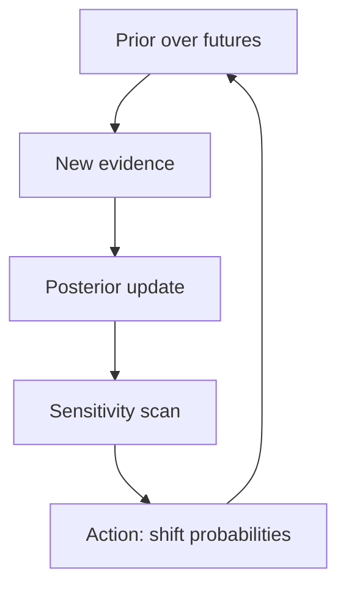

# The Drishti Framework

## TL;DR

- **Seven questions, any phenomenon** — same order every time for predictable thinking.
- **Perception before mechanisms** — see the system; then reach for curriculum tools.
- **Case studies apply all lenses on one page** — cross-check answers across sections.

## The universal template

Drishti is a **reality navigation layer**. You do not need new vocabulary for each domain — you need the same seven questions asked in the same order.

| Step | Lens | Question |
|------|------|----------|
| 1 | What Exists? | What is this, really? |
| 2 | What Changes? | What is stationary vs non-stationary? |
| 3 | What Flows? | What moves? Where are bottlenecks? |
| 4 | What Learns? | What updates, remembers, optimizes? |
| 5 | What Persists? | What survives change? |
| 6 | What Emerges? | How do simple rules → complexity? |
| 7 | What Will Happen? | Which futures are becoming likely? |

**Takeaway: Order matters early in analysis.**

You cannot discuss flow until you name what exists. You should not forecast before you know what persists and what learns. The sequence prevents **premature math**.

## How to run a Drishti pass (15 minutes)

1. **One-sentence phenomenon** — no jargon.
2. **Three-bullet TL;DR** — force compression.
3. **Seven lens sections** — bold takeaway + short prose each.
4. **At a glance panel** — flows / optimizes / persists / likely future.
5. **Curriculum bridge** — link 2–4 Chaitra topics that formalize the hardest lens.
6. **One action** — what you will observe or change this week.

## Forecasting walkthrough

The seventh lens deserves extra structure. Use this loop:

### 1. State the distribution

Write 2–4 named futures with rough probabilities. Avoid single-story planning.

### 2. Identify momentum

What is accelerating? Debt, adoption, fatigue, regulation, infection rate — **velocity** narrows which branches stay open.

### 3. Map constraints

From **what persists**: invariants cap some futures. A heart cannot output unlimited flow; a team cannot ship faster than review bandwidth.

### 4. Gather evidence

Each piece of evidence performs a **Bayesian update**:

\[
P(H \mid E) = \frac{P(E \mid H) \cdot P(H)}{P(E)}
\]

Start with base rates (priors). Likelihoods come from domain knowledge or data.

### 5. Sensitivity check

For each factor \(f_i\), ask: if I mis-estimate \(f_i\) by 10%, does my top future flip? High-sensitivity factors need measurement budget.

### 6. Act to shift mass

Choose interventions that **improve expected outcomes across branches**, not only the favorite storyline.

## Relationship to Chaitra curriculum

| Drishti | Curriculum |
|---------|------------|
| How to look | How it works |
| Questions | Mechanisms |
| Case studies | Topics + labs |
| `/drishti/*` | `/topics/*` |

Drishti **points to** curriculum; it does not duplicate labs. When a lens needs math, follow the bridge link.

## ADHD-friendly design

This framework is authored and rendered for **low cognitive load**:

- TL;DR always first
- Predictable section order
- Progressive disclosure on case studies
- Focus mode on the website hides secondary chrome
- Max 2–3 sentences per paragraph in source content

See [AUTHORING.md](../AUTHORING.md) for contributor rules.

## Start here

1. Read the seven [lens guides](/drishti/lenses/what-exists).
2. Pick a [case study](/drishti/studies/the-office-as-a-computer) and read only TL;DR + one lens.
3. Apply the template to something in your own life today.

Perception is a skill. Drishti is deliberate practice.
