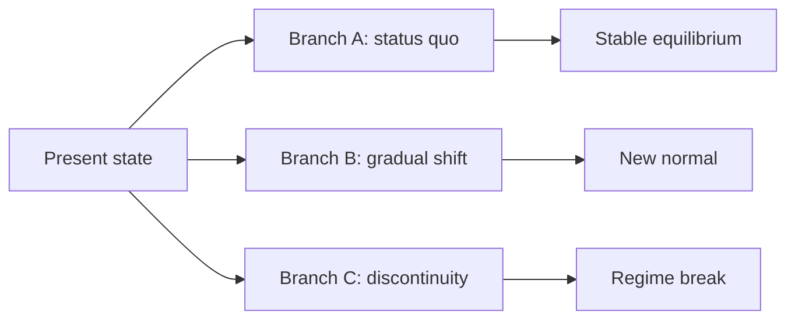

# What Will Happen?

## TL;DR

- **Futures are probability distributions**, not single storylines — hold multiple branches.
- **Update beliefs with evidence**: prior + likelihood → posterior (Bayes).
- **Shift probabilities, don't chase certainty** — builders move mass between futures.

## How to use this lens

1. **Name 2–4 plausible futures** — not exhaustive, but meaningfully different.
2. **Assign rough prior probabilities** — must sum to 100%; admit uncertainty explicitly.
3. **List leading indicators** — signals that arrive *before* the outcome you care about.
4. **Gather evidence** — each observation should move probability mass, not confirm a pet story.
5. **Run sensitivity** — which factor, if wrong, would flip your top outcome?
6. **Decide an action** that improves expected value across branches, not just the favorite future.

## Core concepts

**Takeaway: Prediction is state estimation under noise.**

You never observe the full system — only samples. **Event prediction systems** treat history as training data and the present as partially observed state. The goal is calibrated uncertainty, not drama.

**Takeaway: Trajectory = state + momentum + constraints.**

Where you are matters; so does velocity (trend) and what cannot change quickly (invariants from **what persists**). Sleep debt accumulates; technical debt compounds; reputation lags reality.

**Takeaway: Feedback loops create exponentials.**

Positive feedback accelerates winners; negative feedback stabilizes. Small early advantages can **snowball** — or damp out. Identify loop sign before extrapolating linearly.

**Takeaway: Factor weighting and sensitivity.**

Ask: if factor A moves 10%, how much does outcome probability move? Factors with high sensitivity deserve better measurement. Ignore noisy factors even if they are loud on social media.

### Leading vs lagging

| Type | Example | Use |
|------|---------|-----|
| Leading | Application rate, error budget burn | Act early |
| Lagging | Quarterly revenue, diagnosis | Confirm |
| Coincident | CPU utilization now | Monitor |

## Bayesian walkthrough

**Prior:** 20% chance the deploy causes a Sev-1 incident (from historical base rate).

**Evidence:** Canary error rate 3× baseline (likelihood higher if incident than if healthy).

**Posterior:** Incident probability rises — perhaps to 45%. Not certain — still more likely safe than not. Decision: roll back or widen canary based on **expected cost**, not binary fear.

This is the same math as [Bayesian Inference Systems](/topics/bayesian-inference-systems) — different story, identical update rule.

## Branching futures

## Mini-examples

- **Sleep:** prior says "I'll be fine on 5 hours"; evidence (slow reaction time) increases crash-risk posterior.
- **Office:** prior on remote-first; evidence (return-to-office mandates, tool shifts) moves probability mass between hybrid futures.
- **Blood:** prior on hypertension risk; evidence (sustained readings, family history) updates screening intensity.

## Curriculum bridge

Formal forecasting tools in Chaitra:

- [Event Prediction Systems](/topics/event-prediction-systems) — learned models over time series
- [Bayesian Inference Systems](/topics/bayesian-inference-systems) — belief updates with evidence
- [Monte Carlo Systems](/topics/monte-carlo-systems) — simulate many branches, aggregate outcomes

## Try it now

Pick a decision this week. Write three futures with priors. What **one observation** would most change your top probability?

## Going deeper

**Takeaway: Builder mindset.**

You are not a passive forecaster — actions **reshape** the distribution. Shipping features, sleeping eight hours, and fixing bottlenecks move probability mass. The question becomes: which lever has best expected return?

**Takeaway: Overconfidence is the default failure mode.**

 Narrow priors feel good and lose money. Calibrated uncertainty — wide when data is thin — survives contact with reality.

**Takeaway: Tail risks dominate some decisions.**

Expected value ignores ruin. When downside is catastrophic, **minimax** or **risk bounds** override mean optimization. Sleep deprivation and ignoring error budgets share this shape.

The interactive lab on this page lets you **slide prior and evidence** to watch posterior move — build intuition before trusting gut.

## Forecasting snapshot template

Use on case studies under this lens:

| Field | Prompt |
|-------|--------|
| State | Where is the system now? |
| Momentum | Which direction is velocity pointing? |
| Branches | Name 2–3 futures with rough % |
| Leading indicators | What would you watch weekly? |

Futures are for **steering**, not prophecy. Update early, update often.
