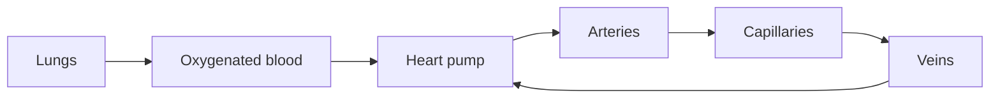

# Blood Circulation

## TL;DR

- Blood is a **delivery network** for oxygen, nutrients, and signals.
- The heart **schedules** work; capillaries are the **last-mile bottleneck**.
- Blood pressure **emerges** from flow, resistance, and volume — none alone is "BP."

## The Phenomenon

Circulation is a closed-loop hydraulic system: heart pumps, vessels route, capillaries exchange, veins return. The system matches **oxygen delivery to tissue demand** in real time.

## What Exists?

**Takeaway: Blood is object; circulation is pattern.**

Blood cells are replaceable components. Vessel topology is **persistent structure**. "Blood pressure" as a scalar measurement is an **agreed summary statistic**, not a thing you can isolate in a dish.

## What Changes?

**Takeaway: Demand swings faster than structure.**

Exercise spikes muscle perfusion need within seconds. Vessel plaque changes over **years**. Heart rate variability fluctuates beat-to-beat. Models must pick timescale — acute response vs chronic remodeling.

## What Flows?

**Takeaway: Queueing happens at capillaries.**

Cardiac output is system throughput. Capillary beds are **parallel servers** with finite exchange surface. Local ischemia is **queue timeout** for oxygen delivery. Valves and regional vasoconstriction **route** flow like load balancers.

## What Learns?

**Takeaway: Baroreflex and fitness adapt over different horizons.**

Baroreceptors tune heart rate in seconds — fast feedback. Endurance training **remodels** stroke volume over weeks. Chronic hypertension can reflect **mis-learned** vascular tone setpoints.

## What Persists?

**Takeaway: Closed loop topology and blood type invariant.**

Individual cells turnover; circuit topology persists. ABO type persists for life. Starling's law constraints persist as **physical invariants** on pump behavior.

## What Emerges?

**Takeaway: Blood pressure emerges from coupled variables.**

Neither flow nor resistance alone determines pressure — **emergent scalar** from interaction. Systemic inflammation emerges from local immune cell signaling without a central "inflammation coordinator."

## What Will Happen?

**Takeaway: Continuous monitoring enables prediction, not just diagnosis.**

Prior: BP measured at clinic quarterly (lagging, white-coat noise). Evidence: PPG wearables, AFib detection on watches. **Posterior** favors early arrhythmia and hypertensive crisis warnings.

Branches: (A) preventive alerts mainstream 30%, (B) clinic-only persists 35%, (C) regulated clinical wearables dominate 35%. Leading indicators: resting HR trend, nocturnal BP dipping loss, HRV collapse.

**Forecasting snapshot:** State = current cardiovascular reserve; momentum = aging population + wearable adoption; sensitivity highest on **sustained resistance** (exercise, sodium, stress).
