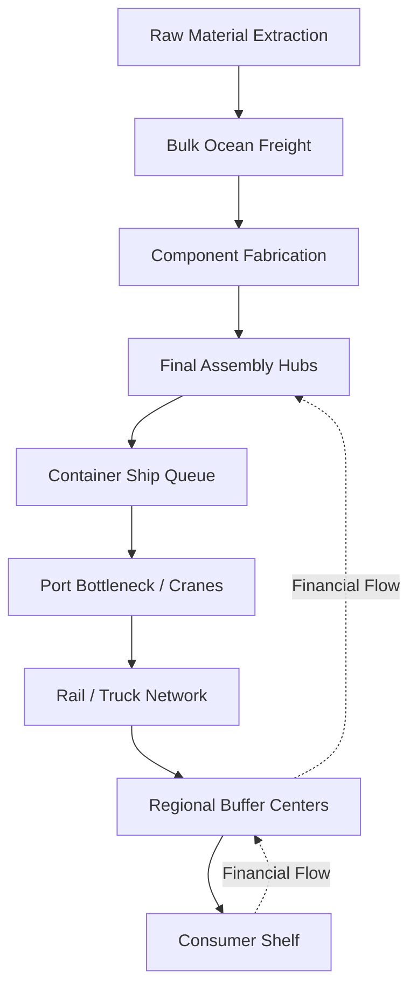

# Global Supply Chains

## TL;DR

- Supply chains are massive queueing networks where physical buffers mask deep latency.
- Just-in-time manufacturing removes these buffers, increasing fragility to local shocks.
- The bullwhip effect causes small demand shifts to mathematically amplify upstream.

## The Phenomenon

A global supply chain is a physical routing protocol that moves atoms across the planet. To a consumer clicking "Buy Now," it appears as an instantly coherent, almost magical system. In reality, it is a deeply fragmented, loosely coupled network of independent actors optimizing for their own local queues, connected by massive ships, trains, and API calls.

For decades, the guiding philosophy was "Just-in-Time" (JIT) manufacturing, pioneered by Toyota. JIT viewed inventory as a strict liability—trapped capital sitting idle on a warehouse floor. By leaning on predictive software and cheap global shipping, companies stripped massive amounts of buffer stock out of the system, running incredibly lean.

However, a queueing network without buffers cannot absorb variance. When global shocks occur—like a pandemic or a massive ship blocking a canal—the lack of slack causes immediate, catastrophic cascades. The network is currently undergoing a massive refactor, attempting to balance the low costs of globalization with the survival imperative of regional resilience.

## What Exists?

**Takeaway: The global economy exists as an interconnected series of queues and physical buffers.**

Containers sitting at a port, warehouses holding seasonal goods, and ships waiting in canals are all physical buffers in a massive asynchronous network. The illusion of instant availability at retail shelves is maintained by staggering massive amounts of hidden inventory across these distributed nodes.

This reality was fundamentally shaped by the invention of the standardized shipping container in 1956. Before the container, break-bulk shipping required thousands of longshoremen to manually load varied cargo, acting as a massive human bottleneck. Standardization allowed matter to be routed almost like IP packets.

What truly exists is not a seamless flow, but a highly fragmented chain of custody. A single smartphone might consist of components crossing dozens of national borders, resting in dozens of discrete queues, before final assembly.

## What Changes?

**Takeaway: Information travels instantly; matter travels slowly, creating permanent lag.**

The primary non-stationary element is consumer demand, which can shift globally in a matter of days via viral social media trends. The physical response—mining ore, forging steel, assembling components, and shipping containers—often takes months to execute.

This deep misalignment between the speed of information and the speed of matter creates permanent systemic lag. When demand spikes abruptly, the network cannot physically respond in real-time, leading to immediate localized stockouts and frantic re-ordering algorithms.

Furthermore, political tariffs and extreme weather events inject sudden volatility into routing paths. A sudden lockdown in a major manufacturing hub instantly changes the available bandwidth of the entire global network, forcing immediate, chaotic rerouting.

## What Flows?

**Takeaway: Flow depends entirely on clearing bottleneck geographic queues.**

Physical goods flow through a constrained graph where specific nodes—like the Suez Canal, the Port of Long Beach, or specialized semiconductor fabs—act as strict rate limiters. When the arrival rate of ships exceeds the service rate of port cranes, the queue grows exponentially.

If a single critical bottleneck jams, the entire downstream network starves. Because ships and trains cannot dynamically scale their speed past physical drag limits, throughput is entirely a function of queue management at these massive transition nodes.

Capital flows in the exact opposite direction of physical goods. As a sub-assembly moves downstream toward the consumer, payments flow upstream to the suppliers, creating tightly coupled financial dependencies tied directly to physical delivery.

## What Learns?

**Takeaway: The network optimizes locally, often missing the global picture entirely.**

Procurement algorithms learn to order based on historical lead times and immediate vendor pricing, optimizing strictly for the lowest local cost. This hyper-local learning creates the "bullwhip effect," a mathematical certainty in unbuffered networks.

When retail demand spikes by 5%, the retailer orders 10% more to be safe. The distributor sees the 10% spike and orders 20% more from the manufacturer. By the time the signal reaches the raw material supplier, a minor consumer trend has amplified into a massive, structurally false demand shock.

During the COVID-19 pandemic, these independent algorithms essentially synchronized their panic. They all learned simultaneously that lead times were extending, triggering massive automated over-ordering that effectively DDoS'd the physical shipping network.

## What Persists?

**Takeaway: Physical latency and geographic choke points are hard, immovable constraints.**

No matter how advanced predictive software becomes, a massive cargo ship cannot cross the Pacific Ocean faster than the laws of physical drag and fuel economics allow. This baseline latency is a permanent invariant of global trade.

Furthermore, geographic bottlenecks persist across centuries. The Strait of Malacca, the Suez Canal, and the Panama Canal dictate the routing topology of the planet. These narrow physical corridors cannot be easily bypassed with software.

Finally, the fundamental thermodynamic cost of moving heavy atoms persists. While information theoretically trends toward zero marginal cost, shipping a ton of steel will always require a baseline expenditure of physical energy.

## What Emerges?

**Takeaway: Extreme fragility is an emergent property of extreme capital efficiency.**

Decades of optimizing for "just-in-time" delivery removed all buffer stock from the system to free up trapped capital. The emergent result of this local optimization is a highly brittle, deeply coupled global network.

Without physical buffers to absorb shocks, a minor disruption—a factory fire, a ship stuck sideways in a canal, a localized lockdown—cascades immediately. It ripples through the dependencies, shutting down automotive assembly lines on the other side of the planet within weeks.

This reveals that efficiency and resilience are often diametrically opposed. By squeezing every ounce of slack out of the queueing network, modern supply chains accidentally emerged as systems incapable of surviving variance.

## What Will Happen?

**Takeaway: The network shifts from a single optimal tree to redundant, parallel graphs.**

Prior: single-source dependencies optimized for the absolute lowest cost, heavily reliant on a few massive manufacturing hubs. Evidence: companies are explicitly "friend-shoring" and paying significant premiums to build redundant factories in Mexico and Southeast Asia. **Posterior** points to a world where supply chains accept higher baseline operating costs in exchange for physical insurance against catastrophic latency spikes.

Branches: (A) Regionalization creates isolated but highly robust supply loops 45%, (B) Heavy automation in Western countries masks the labor cost of local manufacturing 35%, (C) Return to extreme globalization once the memory of recent supply shocks fades 20%.

**Forecasting snapshot:** State = current aggregate inventory buffer levels; momentum = domestic manufacturing infrastructure investment; watch the spread between single-source and multi-source procurement contracts.
