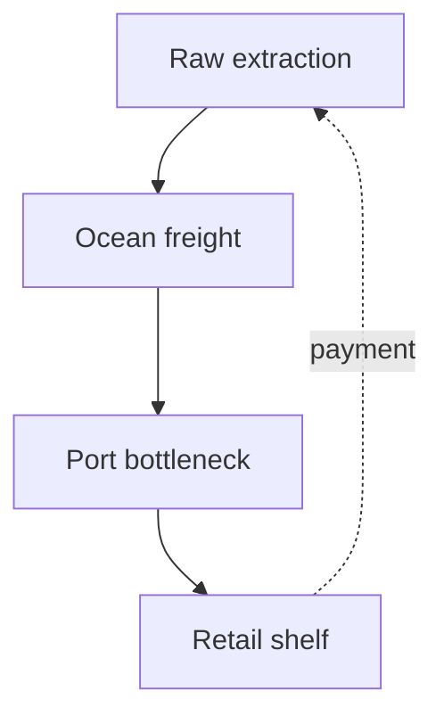

# Global Supply Chains

## TL;DR

- A container ship is a moving warehouse — lean inventory removed the shock absorbers.
- Canals and ports are rate limiters; one jam starves everything downstream.
- Watch port dwell time, not press releases, to see if resilience is real.

## The Phenomenon

Click "Buy Now" and atoms appear at your door. Behind that illusion: containers, cranes, canals, and thousands of independent queues. Just-in-time manufacturing treated inventory as trapped capital — until shocks proved buffers were insurance.

## What Exists?

**A container ship is a moving warehouse with no undo button.**

Physical buffers — containers at port, seasonal warehouse stock — maintain the illusion of instant availability. Standardized shipping containers (1956) turned break-bulk labor into routable units.

## What Changes?

**Demand jitters; boats do not.**

Tariffs, seasons, and canal blockages shift faster than factory retooling. Lean systems amplify variance because safety stock was stripped out.

## What Flows?

**Goods downstream; invoices upstream.**

Suez, Long Beach, and specialized fabs are strict rate limiters. Capital flows opposite to goods, coupling finance to physical delivery.

## What Learns?

**Forecasting learns slower than Twitter panics.**

The bullwhip effect: small retail shifts amplify upstream into oversized factory orders.

## What Persists?

**Ocean latency does not negotiate.**

Geography and hull physics persist regardless of ERP dashboards.

## What Emerges?

**Local optimizations become global fragility.**

Per-supplier inventory minimization emergently produced system-wide brittleness.

## What Will Happen?

**Branches: reshore, reroute, or relive 2021.**

Leading indicators: port dwell time, warehouse sqft per SKU, days-inventory trend.

## Try it now

Pick one object on your desk — count how many countries the label mentions.
