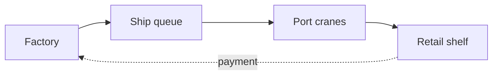

**Goods downstream; invoices upstream.**

```mermaid
flowchart LR
  Factory --> Ship[Ship queue]
  Ship --> Port[Port cranes]
  Port --> Shelf[Retail shelf]
  Shelf -.->|payment| Factory
```

Suez, Long Beach, and chip fabs are rate limiters. [Queueing theory](/topics/queueing-theory) explains why one jam starves everything behind it.
