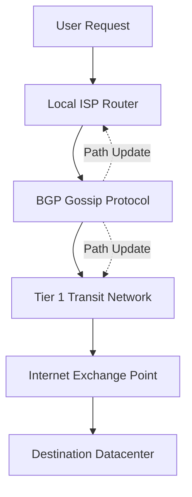

# Internet Routing

## TL;DR

- The Internet has no center; routing is a continuous, decentralized gossip protocol.
- Routers only know their immediate neighbors, building global paths through local trust.
- BGP (Border Gateway Protocol) relies entirely on trust, making it highly vulnerable.

## The Phenomenon

The Internet is not a cloud; it is a physical graph of thousands of competing networks (Autonomous Systems) that agree to pass messages to one another. There is no central map, no CEO of the internet, and no master routing table.

Instead, routers constantly gossip about what IP addresses they can reach, collectively weaving a global routing table in real-time. This mechanism relies entirely on the Border Gateway Protocol (BGP). BGP is a protocol built on absolute trust; it assumes every network is telling the truth about where traffic should go.

This decentralized architecture is incredibly resilient to physical damage, automatically routing around cut cables and blown transformers. However, its reliance on unverified gossip makes it incredibly fragile to human error. A single typo by an engineer in a small ISP can accidentally hijack traffic for the entire globe, plunging the system into chaos.

## What Exists?

**Takeaway: The Internet is a collection of physical fiber cables and fragile trust agreements.**

Physical routers, subsea fiber optic cables, and massive warehouses called Internet Exchange Points (IXPs) are the tangible reality of the internet. The "cloud" does not exist; it is simply someone else's computer connected by these physical, underground wires.

What also exists are Autonomous Systems (AS)—independent networks operated by ISPs, universities, and tech giants. The Internet is simply the voluntary agreement between these independent AS entities to pass messages to one another.

There is no central registry or map of the Internet. The topology exists only as a distributed, constantly shifting state held in the RAM of hundreds of thousands of border routers worldwide.

## What Changes?

**Takeaway: The topology graph is highly volatile and constantly routing around physical damage.**

Subsea cables get cut by anchors and shark bites, routers lose power during storms, and new networks come online daily. The physical graph of the internet is deeply non-stationary.

To handle this, the routing topology is constantly shifting. When a link dies, Border Gateway Protocol (BGP) updates propagate globally in seconds, mathematically routing traffic around the damage. The internet treats physical failure as a normal operating condition.

Bandwidth availability also changes drastically based on human behavior. A massive streaming event or a viral software update can saturate transcontinental links, forcing routers to dynamically buffer or drop packets to maintain network stability.

## What Flows?

**Takeaway: Packets are independent streams flowing via the path of least resistance.**

Data is not sent as a continuous stream; it is chopped into tiny IP packets that flow independently across the graph. Two packets from the same email might take entirely different physical routes around the globe before being reassembled at the destination.

If a bottleneck forms at a specific router, its physical memory queue fills up. Once full, the router begins indiscriminately dropping packets. This is not a bug; it is the fundamental flow control mechanism of the internet.

The sender's protocol (TCP) detects these dropped packets and mathematically slows down its transmission rate. This creates a decentralized, dynamic rate-limiting system that prevents the global network from collapsing under its own weight.

## What Learns?

**Takeaway: Routers learn the shortest path through continuous peer gossip.**

Routers do not possess a static map. They learn the current state of the network by gossiping with their direct physical neighbors via BGP. A router simply announces, "I can reach these IP addresses."

If a neighbor receives an announcement for a shorter path to a destination, the router updates its internal forwarding table. It then gossips this new, better path to its other neighbors, allowing knowledge to spread virally across the globe.

However, routers cannot verify the truth of this gossip. They learn purely based on trust. If a router accidentally (or maliciously) announces that it is the best path to YouTube, the entire global network will learn this false path and send all traffic into a black hole.

## What Persists?

**Takeaway: The fundamental TCP/IP and BGP protocols remain stubbornly unchanged.**

Despite being designed in the 1970s and 80s for a vastly different scale, the core protocols persist. The simplicity of IP—just send the packet to the next hop and forget about it—has allowed the network to scale exponentially without redesign.

This persistence is both a miracle and a curse. Because every device on Earth speaks IPv4 and BGP, upgrading these foundational protocols is nearly impossible. They represent an entrenched invariant that the modern world is locked into.

The physical need for deep-sea fiber optics also persists. Despite the rise of satellites, the vast majority of global data still moves as pulses of light through thin glass cables resting on the ocean floor, constrained by the speed of light in glass.

## What Emerges?

**Takeaway: Global connectivity emerges from local, greedy peering decisions.**

No single entity controls or pays for the Internet. Global reachability emerges purely from local economic incentives: ISPs connect to each other (peer) at IXPs to save transit costs and improve speeds for their local customers.

However, because BGP lacks inherent security, terrifying systemic vulnerabilities emerge. In 1997, a misconfigured router at a small Florida ISP (AS7007) accidentally announced that it had the best path to the entire internet, crashing global routing for hours.

This demonstrates that massive systemic risk is an emergent property of decentralized trust. The internet survives only because the thousands of independent network operators generally agree to play by the rules, not because the protocol enforces them.

## What Will Happen?

**Takeaway: The internet centralizes into massive proprietary backbones.**

Prior: a highly distributed mesh of thousands of equal ISPs passing traffic across the public internet. Evidence: Google, Meta, and Amazon now own the majority of new subsea cables, routing their massive data flows over private fiber rather than relying on public BGP. **Posterior** points to a bifurcated internet where hyperscalers bypass traditional routing to optimize their own closed-loop traffic.

Branches: (A) Hyperscalers dominate physical layer transit, effectively privatizing the internet backbone 55%, (B) State-level firewalls splinter the internet into heavily monitored regional splinternets 30%, (C) Decentralized mesh networks and LEO satellites (e.g., Starlink) democratize access at the edge 15%.

**Forecasting snapshot:** State = percentage of global traffic traveling on private backbones; momentum = hyperscaler investment in proprietary subsea cables; watch for BGP hijacking incidents driven by state actors.
