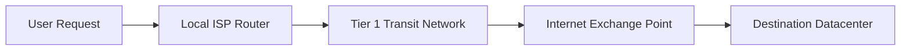

# Internet Routing

## TL;DR

- The Internet has no center; routing is a continuous, decentralized gossip protocol.
- Routers only know their immediate neighbors, building global paths through local agreements.
- BGP (Border Gateway Protocol) relies entirely on trust, making it highly vulnerable to human error.

## The Phenomenon

The Internet is not a cloud; it is a physical graph of thousands of competing networks (Autonomous Systems) that agree to pass messages to one another. There is no central map. Instead, routers constantly gossip about what IPs they can reach, collectively weaving a global routing table in real-time.

## What Exists?

**Takeaway: The Internet is a collection of physical fiber cables and trust agreements.**

Physical routers, subsea fiber optic cables, and massive warehouses called Internet Exchange Points (IXPs) are the tangible reality of the internet. The "cloud" does not exist; it is simply someone else's computer connected by these physical, underground wires.

## What Changes?

**Takeaway: The topology graph is highly volatile.**

Subsea cables get cut by anchors, routers lose power, and new networks come online daily. The routing topology is non-stationary, constantly shifting as BGP (Border Gateway Protocol) updates propagate globally to route around damage and outages.

## What Flows?

**Takeaway: Packets are independent streams flowing via the path of least resistance.**

Data is broken down into tiny packets that flow independently. If a bottleneck forms at a specific router, the queue fills up, and packets are indiscriminately dropped. The sender's protocol (TCP) detects these drops and slows down, dynamically rate-limiting the flow to match network capacity.

## What Learns?

**Takeaway: Routers learn the shortest path through continuous peer gossip.**

Routers do not possess a static map. They learn the current state of the network by gossiping with their direct physical neighbors via BGP. If a neighbor announces a shorter path to a destination, the router updates its internal forwarding table and gossips this new, better path to its other neighbors.

## What Persists?

**Takeaway: The fundamental TCP/IP and BGP protocols remain stubbornly unchanged.**

Despite being designed in the 1970s and 80s for a vastly different scale, the core protocols persist. The simplicity of IP (just send the packet to the next hop) has allowed the network to scale exponentially, making the protocol itself an invariant too entrenched to replace.

## What Emerges?

**Takeaway: Global connectivity emerges from local, greedy peering decisions.**

No single entity controls the Internet. Global reachability emerges purely from local economic incentives: ISPs connect to each other (peer) to save transit costs. However, because BGP lacks inherent security, a typo by a single engineer in one country can accidentally hijack traffic for the entire globe.

## What Will Happen?

**Takeaway: The internet centralizes into massive proprietary backbones.**

Prior: a highly distributed mesh of thousands of equal ISPs. Evidence: Google, Meta, and Amazon now own the majority of new subsea cables, routing traffic over their private fiber rather than the public internet. **Posterior** points to a bifurcated internet where hyperscalers bypass traditional BGP to optimize their own closed-loop traffic.

Branches: (A) Hyperscalers dominate physical layer transit 55%, (B) State-level firewalls splinter the internet into regional splinternets 30%, (C) Decentralized mesh networks (e.g., Starlink) democratize access 15%.

**Forecasting snapshot:** State = percentage of traffic on private backbones; momentum = hyperscaler investment in subsea cables; watch for BGP hijacking incidents driven by state actors.
