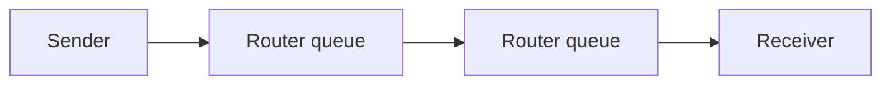

**Packets flow independently; full queues drop without mercy.**

Two email packets may cross different continents. [Gossip protocols](/topics/gossip-protocols): when a queue fills, routers drop packets — TCP backs off, a decentralized rate limiter.
