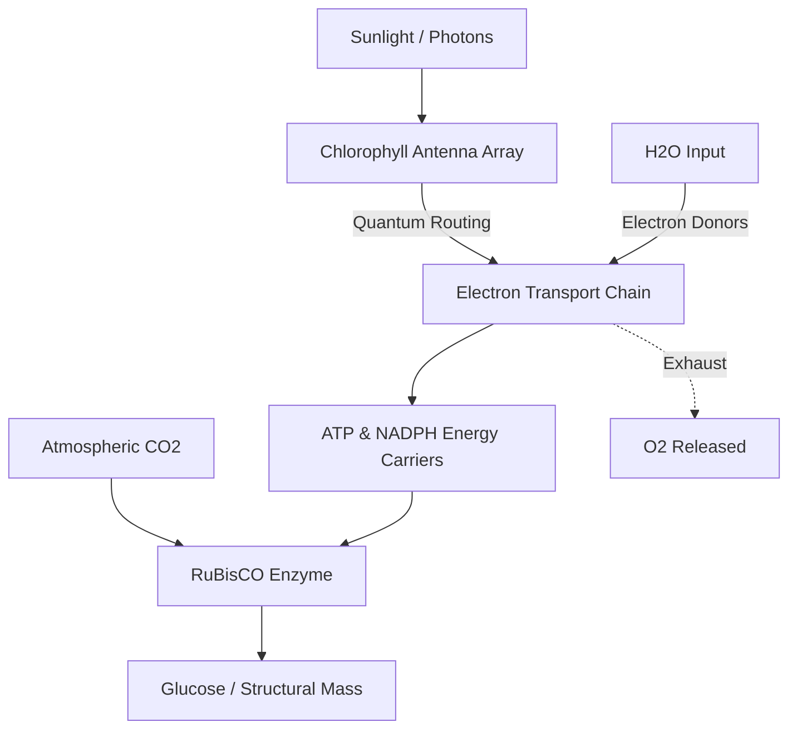

# Photosynthesis

## TL;DR

- Photosynthesis is an extremely parallelized, solar-powered energy conversion pipeline.
- It trades thermodynamic efficiency for massive, low-cost scale across the Earth's surface.
- The system acts as an atmospheric buffer, absorbing excess carbon through distributed nodes.

## The Phenomenon

Photosynthesis is a planetary-scale distributed system that converts chaotic electromagnetic radiation (sunlight) into stable, structured chemical energy (sugar). It is the foundational infrastructure that powers almost all biological life, operating entirely through massive parallelization rather than individual high-efficiency nodes.

From an engineering perspective, it is a solar-powered carbon-capture factory. It takes low-energy inputs (water and CO2) and uses the energy from a photon to violently force them together into high-energy glucose molecules. This process literally builds the physical mass of a tree out of thin air.

Despite its ubiquity, it is shockingly inefficient, usually capturing less than 2% of available solar energy. However, because the "hardware" (leaves) is self-replicating and incredibly cheap to build, it easily outcompetes high-efficiency, high-cost artificial systems across a planetary scale.

## What Exists?

**Takeaway: A vast array of microscopic solar panels.**

What physically exists is an unfathomably large, distributed array of chloroplasts embedded in leaves, algae, and cyanobacteria. The global biosphere is essentially a massive, loosely coupled energy harvesting network that blankets the planet's surface.

Within these chloroplasts exist thylakoid membranes, incredibly dense stacks of molecular machinery. These act as biological antennas, physically positioned to intercept high-energy photons traveling from the sun.

Also existing is RuBisCO, arguably the most abundant and simultaneously most inefficient enzyme on Earth. It physically grabs carbon dioxide molecules out of the air to build sugars, acting as the fundamental carbon gateway for the entire planetary food web.

## What Changes?

**Takeaway: Solar inputs are cyclical and highly volatile.**

The energy input to this system is entirely non-stationary. It oscillates daily with the rotation of the Earth and seasonally with its orbit. The system must constantly ramp up and shut down production in response to cloud cover, shade, and the hard cutoff of nightfall.

To handle this, plants change their physical state. Stomata (microscopic pores on the leaf) open and close dynamically. They must open to let CO2 in, but doing so lets water escape. This creates a constant, agonizing daily oscillation between starvation and dehydration.

Over longer timescales, the composition of the atmosphere changes. As human activity pumps massive amounts of CO2 into the air, the "arrival rate" of carbon increases, forcing the distributed plant network to adapt to an unprecedented spike in raw material.

## What Flows?

**Takeaway: The conversion pipeline routes electrons to build chemical bonds.**

Photons strike the antenna array, exciting electrons. These excited electrons flow through a strict, rate-limited biochemical pipeline known as the electron transport chain. Remarkably, this flow utilizes quantum coherence, allowing the energy to simultaneously test multiple paths to find the most efficient route to the reaction center.

This electron flow is physically bottlenecked by the availability of matter. The system must literally tear apart water molecules (H2O) to harvest fresh electrons, a violently energetic process that happens to release oxygen as a toxic byproduct.

Simultaneously, carbon dioxide flows into the leaf from the atmosphere, meeting the stored energy to form glucose. If either the water supply from the roots or the CO2 supply from the air slows down, the entire energy assembly line grinds to a halt.

## What Learns?

**Takeaway: The system optimizes for surface area and survival over evolutionary time.**

Individual leaves do not "learn," but the system adapts over evolutionary timeframes. Plants have learned to optimize their physical structure—branching patterns, leaf angles, and stomata behavior—to maximize photon capture while minimizing water loss, balancing a complex resource tradeoff.

In hot, dry environments, the system "learned" a major architectural upgrade: C4 photosynthesis. Because the baseline RuBisCO enzyme accidentally grabs oxygen instead of CO2 when it gets hot (a massive efficiency bug), C4 plants evolved a spatial workaround.

They learned to physically separate the carbon-capture phase from the sugar-building phase into different cells. This evolutionary patch costs more energy upfront but prevents the oxygen-grabbing bug, allowing grasses and corn to dominate arid landscapes.

## What Persists?

**Takeaway: The core biochemical engine has remained unchanged for billions of years.**

Despite the incredible diversity of plant life—from tiny mosses to massive redwoods—the underlying mechanism (chlorophyll-based energy capture) is a strict invariant. It was solved once billions of years ago by cyanobacteria and has persisted as the biological standard ever since.

The low thermodynamic efficiency of the system also persists. Most plants capture less than 2% of the total solar energy that hits them. Evolution optimized for "good enough to reproduce and spread" rather than "maximum possible energy extraction."

The dependency on RuBisCO persists, despite its flaws. Because it is so deeply integrated into the basal architecture of life, evolution cannot easily swap it out for a better enzyme without breaking the entire downstream biological supply chain.

## What Emerges?

**Takeaway: The planetary atmosphere is an emergent property of this network.**

The oxygen-rich atmosphere we breathe is the emergent exhaust product of trillions of these tiny biological factories running for eons. The Great Oxidation Event, where early photosynthesis flooded the atmosphere with toxic oxygen, nearly wiped out all early anaerobic life.

Furthermore, this distributed network acts as a planetary buffer. It currently absorbs roughly a quarter of human-generated carbon emissions, drawing it out of the air and locking it into wood and soil, significantly slowing the rate of climate change.

The entire global economy is an emergent property of photosynthesis. Every calorie of food we eat and every joule of fossil fuel we burn is simply ancient, condensed sunlight, captured millions of years ago by this exact biological algorithm.

## What Will Happen?

**Takeaway: We will attempt to explicitly refactor the baseline biological code.**

Prior: we accepted the low thermodynamic efficiency of natural photosynthesis because land was cheap. Evidence: genetic engineers are now bypassing evolutionary constraints to create "C4 rice" and organisms that can perform artificial photosynthesis in vats. **Posterior** points to a future where we deploy synthetic biological arrays to aggressively scale food production and carbon drawdown.

Branches: (A) Genetic modification successfully increases staple crop yields by 20% to feed growing populations 45%, (B) Engineered algae scales up in bioreactors to become a primary, carbon-negative biofuel 35%, (C) The natural biological buffer collapses globally under extreme heat and drought stress 20%.

**Forecasting snapshot:** State = current atmospheric CO2 ppm; momentum = venture investment in synthetic biology startups; watch the regulatory landscape around deploying genetically modified, highly efficient carbon-fixing organisms in the wild.
