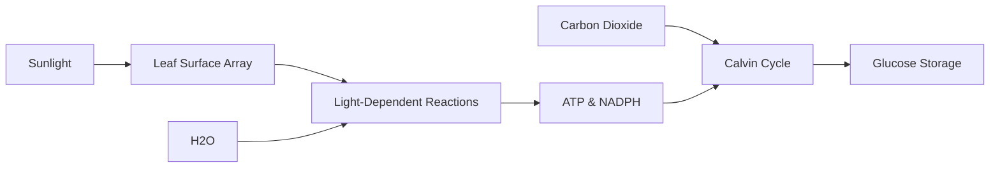

# Photosynthesis

## TL;DR

- Photosynthesis is an extremely parallelized, solar-powered energy conversion pipeline.
- It trades thermodynamic efficiency for massive, low-cost scale across the Earth's surface.
- The system acts as an atmospheric buffer, absorbing excess carbon through distributed nodes.

## The Phenomenon

Photosynthesis is a planetary-scale distributed system that converts chaotic electromagnetic radiation (sunlight) into stable, structured chemical energy (sugar). It is the foundational infrastructure that powers almost all biological life, operating entirely through massive parallelization rather than individual high-efficiency nodes.

## What Exists?

**Takeaway: A vast array of microscopic solar panels.**

What physically exists is an unfathomably large, distributed array of chloroplasts embedded in leaves, algae, and cyanobacteria. The global biosphere is essentially a massive, loosely coupled energy harvesting network that blankets the planet's surface.

## What Changes?

**Takeaway: Solar inputs are cyclical and highly volatile.**

The energy input to this system is entirely non-stationary. It oscillates daily with the rotation of the Earth and seasonally with its orbit. The system must constantly ramp up and shut down production in response to cloud cover, shade, and the hard cutoff of nightfall.

## What Flows?

**Takeaway: The conversion pipeline routes electrons to build chemical bonds.**

Photons strike the array, exciting electrons which then flow through a strict, rate-limited biochemical pipeline (the electron transport chain). This flow is often bottlenecked by the availability of physical matter—specifically, water from the roots and CO2 from the air.

## What Learns?

**Takeaway: The system optimizes for surface area and survival over time.**

Individual leaves do not "learn," but the system adapts over evolutionary timeframes. Plants have learned to optimize their physical structure—branching patterns, leaf angles, and stomata behavior—to maximize photon capture while minimizing water loss, balancing a complex resource tradeoff.

## What Persists?

**Takeaway: The core biochemical engine has remained unchanged for billions of years.**

Despite the incredible diversity of plant life—from tiny mosses to massive redwoods—the underlying mechanism (chlorophyll-based energy capture) is a strict invariant. It was solved once billions of years ago by cyanobacteria and has persisted as the biological standard ever since.

## What Emerges?

**Takeaway: The planetary atmosphere is an emergent property of this network.**

The oxygen-rich atmosphere we breathe is the emergent exhaust product of trillions of these tiny biological factories running for eons. Furthermore, this distributed network acts as a planetary buffer, currently absorbing roughly a quarter of human-generated carbon emissions, slowing climate change.

## What Will Happen?

**Takeaway: We will attempt to refactor the baseline biological code.**

Prior: we accepted the low thermodynamic efficiency of natural photosynthesis (often < 2%). Evidence: genetic engineers are bypassing evolutionary constraints to create "C4 rice" and organisms that can perform artificial photosynthesis. **Posterior** points to a future where we deploy synthetic biological arrays to aggressively scale carbon drawdown.

Branches: (A) Genetic modification successfully increases crop yields by 20% to feed growing populations 45%, (B) Engineered algae scales up to become a primary biofuel 35%, (C) The natural biological buffer collapses under heat and drought stress 20%.

**Forecasting snapshot:** State = current atmospheric CO2 ppm; momentum = investment in synthetic biology startups; watch the regulatory landscape around deploying genetically modified, highly efficient carbon-fixing organisms.
