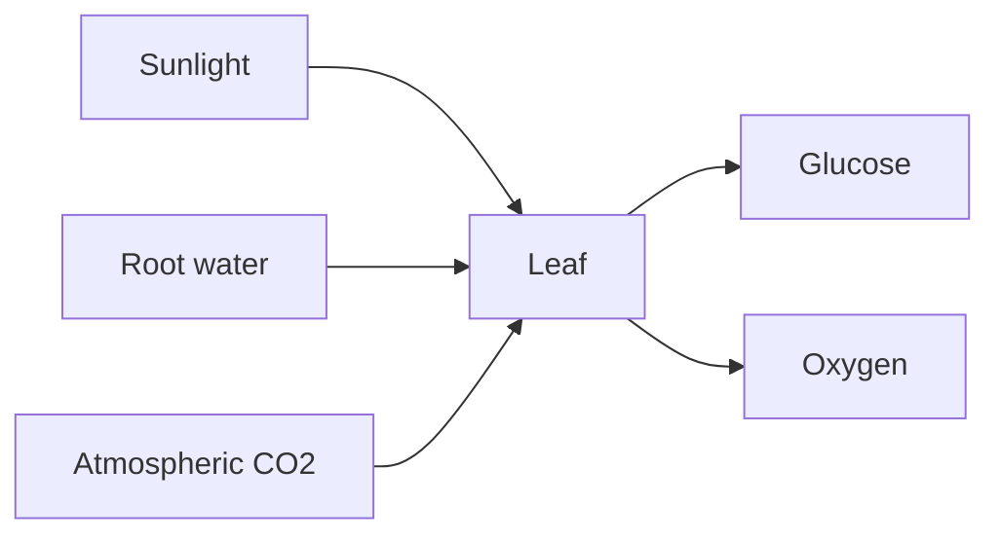

# Photosynthesis

## TL;DR

- A leaf is a solar panel you can pick — chloroplasts do the conversion.
- Water from roots, not sunshine, is usually the bottleneck.
- Track growing-season water tables to forecast crop stress, not hype cycles.

## The Phenomenon

Every calorie you eat was sunlight captured by a chloroplast. The biosphere is a distributed energy harvester — leaves, algae, and cyanobacteria as nodes on a planetary surface.

## What Exists?

**A leaf is a solar panel you can hold up to the sun.**

Chloroplasts and thylakoid membranes are physical machinery. Glucose is stored chemical work.

## What Changes?

**Seasons and drought move faster than leaf repair.**

Stomata open and close with water stress. A dry week changes capture rate immediately.

## What Flows?

**Photons in; sugar and oxygen out.**

Root water delivery is the common bottleneck — not photon supply.

## What Learns?

**Evolution is the feedback loop — no sprint retros.**

Rubisco is abundant, slow, and universal. Crop science tunes parameters across breeding cycles.

## What Persists?

**Chloroplast chemistry is billions of years old.**

Light reactions and the Calvin cycle persist across all green plants.

## What Emerges?

**Trillions of leaves buffer the atmosphere.**

Local capture emergently affects CO₂ levels and rainfall — no leaf sees the global ledger.

## What Will Happen?

**Branches: engineered yield, crop stress, or plateau.**

Leading indicators: field trial tonnage, stomata closure under heat, multi-year yield trends.

## Try it now

Hold a leaf to the light — the green is the antenna, not the fuel.
