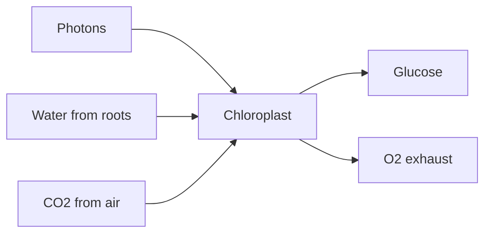

**Photons in; sugar and oxygen out.**

```mermaid
flowchart LR
  Sun[Photons] --> Leaf[Chloroplast]
  H2O[Water from roots] --> Leaf
  CO2[CO2 from air] --> Leaf
  Leaf --> Sugar[Glucose]
  Leaf --> O2[O2 exhaust]
```

Water delivery from roots is the usual bottleneck — not lack of sunlight.
