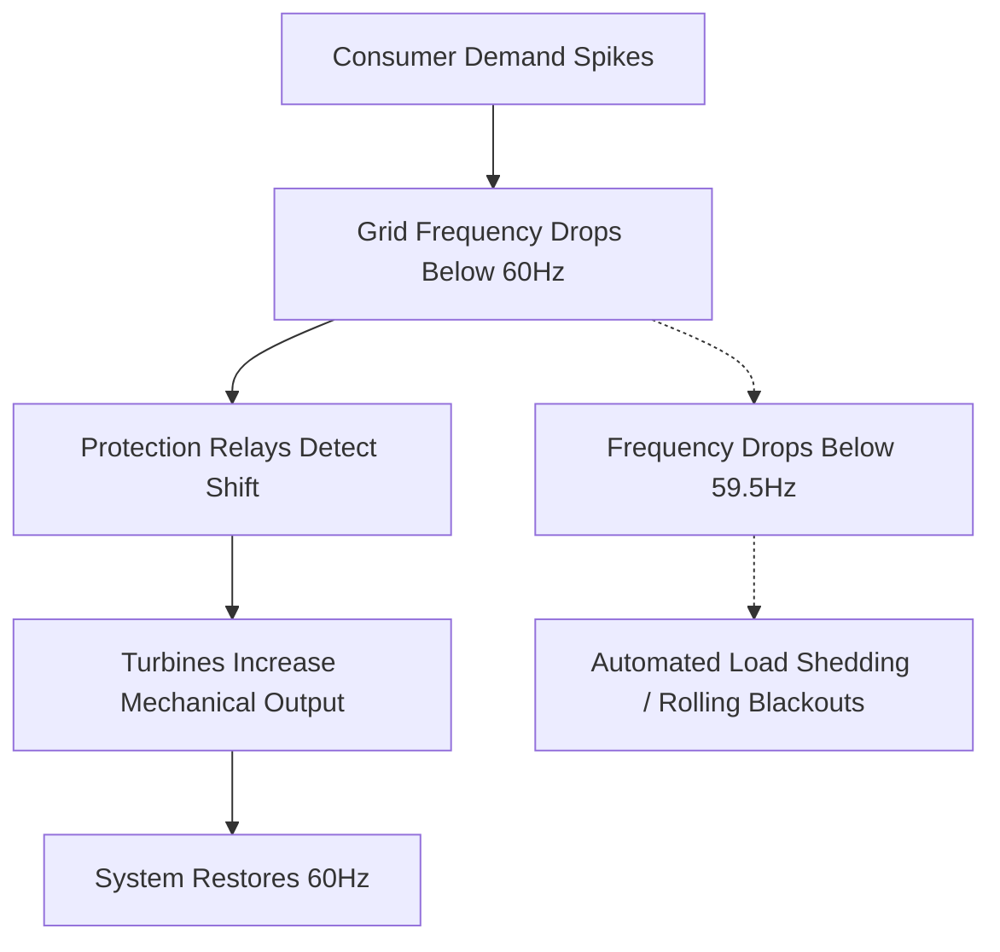

# Power Grids

## TL;DR

- Power grids are extreme distributed systems operating without a central battery buffer.
- Generation must exactly match demand at every second to maintain a stable 60Hz or 50Hz frequency.
- Cascading failures occur when rate limits are exceeded, demonstrating non-linear vulnerability.

## The Phenomenon

The power grid is the largest interconnected machine ever built by humanity, functioning as a real-time supply chain with zero inventory. Because traditional grids cannot store AC power natively, every action—like flipping a light switch—requires an instantaneous, proportional reaction at a power plant miles away.

Operating a grid is an act of high-stakes synchronization. The entire massive architecture, stretching across continents, must pulse together at an exact frequency. It relies on the immense physical inertia of spinning steel turbines to absorb sudden shocks, buffering the fragile system against collapse.

When the grid fails, it does not fail gracefully. Because nodes are tightly coupled to maximize efficiency, a local fault can instantly cascade across the entire graph. What begins as a single overheated wire can emerge within minutes as a regional blackout impacting millions.

## What Exists?

**Takeaway: Power grids are giant synchronized flywheels, not batteries.**

The grid is fundamentally an interconnected set of massive spinning magnets operating in exact lockstep. What truly exists is the real-time balance of kinetic energy, rather than stored electricity waiting in a tank. Every light bulb turned on must immediately be matched by slightly more steam pushing a turbine miles away.

This architectural requirement stems from the "War of the Currents" in the 1880s, where alternating current (AC) won over direct current (DC) because its voltage could be easily stepped up for long-distance travel. The tradeoff for this spatial scale was the complete loss of temporal buffering.

Because the grid cannot store its own product natively, it exists in a state of perpetual, knife-edge equilibrium. The physical reality of the network is less like a reservoir of water and more like a massive, high-speed juggling act connecting millions of homes to roaring boilers.

## What Changes?

**Takeaway: The fundamental challenge is shifting from predicting demand to compensating for weather.**

Historically, base load was a stationary, predictable constant provided by massive coal and nuclear plants. System operators treated supply as an absolute certainty, focusing entirely on forecasting human behavior. They used historical data to predict exactly when factories would spin up or millions of people would turn on their televisions.

Now, the rapid integration of solar and wind introduces violent, unpredictable fluctuations on the supply side. A sudden cloud cover over a large solar farm can remove hundreds of megawatts in seconds. A drop in wind speed can stall thousands of turbines simultaneously.

This transition transforms the grid from a deterministic machine into a highly stochastic environment. Control rooms that once relied on rigid, day-ahead schedules must now employ real-time probabilistic models to constantly spin up natural gas "peaker" plants to fill the sudden weather-induced gaps.

## What Flows?

**Takeaway: Energy flows as an electromagnetic wave, ruthlessly seeking the path of least resistance.**

Electrons do not flow through the grid like water through a pipe; energy propagates as an electromagnetic wave guided by the wires. This flow is dictated strictly by Kirchhoff's circuit laws, meaning operators cannot easily route power down a specific line. The power simply distributes itself across the entire network topology based on resistance.

Bottlenecks manifest as thermal limits on physical transmission lines. Pushing too much power through a line causes the metal to heat, expand, and physically sag. If a sagging line touches a tree, it creates a short circuit to the ground.

When that line trips offline, the massive wave of energy instantly reroutes to neighboring, already-stressed lines. This immediate redistribution of flow is what turns a single localized fault into a cascading regional overload in a matter of seconds.

## What Learns?

**Takeaway: Optimization happens at the edges through local defense and market pricing.**

There is no single central intelligence running the grid. Instead, learning and optimization occur via distributed safety mechanisms and economic signals. Local protection relays (massive circuit breakers) learn when to defensively trip offline to isolate a fault, ruthlessly prioritizing self-preservation over the health of the larger system.

At a macroscopic level, day-ahead and real-time energy markets act as a continuous learning algorithm for generation allocation. Pricing signals spike dynamically as reserve margins drop, creating massive financial incentives for fast-acting generators to come online.

These markets essentially train independent power producers to anticipate shortages and penalize those who fail to deliver. The system "learns" to maintain balance not through centralized control, but through distributed actors reacting to the immediate cost of instability.

## What Persists?

**Takeaway: The strict physics of 60 Hz AC frequency remains the ultimate, unforgiving invariant.**

No matter the energy source—coal, solar, or nuclear—the entire interconnected grid must persist at exactly 60 Hz (in North America) or 50 Hz (in Europe). This frequency is the heartbeat of the network, reflecting the precise physical rotation speed of the massive turbines.

If generation exceeds demand, the entire interconnected network literally spins faster, pushing the frequency up. If demand exceeds generation, the drag slows the turbines down. This physical invariant dictates every engineering and economic decision made in the system.

Dropping even a fraction of a hertz (e.g., to 59.5 Hz) triggers automated panic responses across the network. To protect physical equipment from vibrational destruction, massive swaths of the grid will automatically shut down, choosing localized blackouts over permanent mechanical damage.

## What Emerges?

**Takeaway: Catastrophic, cascading blackouts are an unavoidable property of tight coupling.**

Because energy flows cannot be strictly corralled and buffers do not exist, extreme fragility emerges from the network's deep efficiency. A single downed tree branch in Ohio in 2003 caused a localized fault that neighboring lines absorbed. Those lines overheated and tripped.

Within minutes, this local event triggered a cascade of automated safety shutdowns, emerging as a massive blackout that plunged 50 million people across the Northeast into darkness. The complexity and tight coupling of the graph guarantee that rare, systemic failures will periodically emerge from trivial, everyday triggers.

This demonstrates that resilience in the grid is non-linear. The system can handle thousands of small errors daily, but a specific combination of load, weather, and a single failed relay can collapse the entire architecture faster than human operators can react.

## What Will Happen?

**Takeaway: The grid transitions from analog monolithic generators to decentralized, software-defined power.**

Prior: grid stability relied on the massive physical inertia of spinning steel turbines to absorb sudden shocks. Evidence: the rapid deployment of rooftop solar, home battery walls, and EV bidirectional charging is decentralizing supply away from these massive kinetic buffers. **Posterior** points to virtual power plants, where millions of edge devices are orchestrated by software in real-time to simulate a traditional generator.

Branches: (A) Utility companies successfully integrate distributed energy resources via dynamic pricing 40%, (B) Grid defection creates fragmented, highly resilient community microgrids 35%, (C) Slow adaptation and regulatory capture lead to rolling blackouts during extreme weather 25%.

**Forecasting snapshot:** State = current mix of variable renewable energy; momentum = utility-scale battery storage deployment; watch local regulatory changes allowing peer-to-peer energy trading among neighbors.
