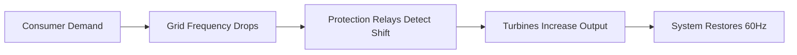

# Power Grids

## TL;DR

- Power grids are extreme distributed systems operating without a central battery buffer.
- Generation must exactly match demand at every second to maintain a stable 60Hz or 50Hz frequency.
- Cascading failures occur when rate limits are exceeded, demonstrating non-linear vulnerability.

## The Phenomenon

The power grid is the largest machine ever built by humanity, functioning as a real-time supply chain with zero inventory. Because traditional grids cannot store AC power, every action—like flipping a switch—requires an instantaneous, proportional reaction at a power plant miles away.

## What Exists?

**Takeaway: Power grids are not giant batteries; they are giant synchronized flywheels.**

The grid is fundamentally an interconnected set of spinning magnets operating in lockstep. What truly exists is the real-time balance of kinetic energy, rather than stored electricity waiting in a tank. Every light bulb turned on must immediately be matched by slightly more steam pushing a turbine miles away.

## What Changes?

**Takeaway: Demand shifts predictably by hour, but generation is becoming stochastic.**

Base load used to be a stationary constant provided by coal and nuclear plants. Now, solar and wind introduce rapid, unpredictable fluctuations in supply that change by the minute with cloud cover and wind gusts. The fundamental challenge has shifted from predicting human behavior to compensating for weather volatility.

## What Flows?

**Takeaway: Electrons do not flow like water; energy flows as an electromagnetic wave.**

Energy flows through the transmission network dictated strictly by Kirchhoff's laws, choosing the path of least resistance across the entire graph. Bottlenecks manifest as thermal limits on specific transmission lines. If a line gets too hot and sags into a tree, the flow instantly redistributes, risking cascading overloads.

## What Learns?

**Takeaway: The grid learns through localized protection relays and market pricing signals.**

Protection systems (circuit breakers) learn when to defensively trip offline to isolate faults, prioritizing self-preservation over the larger system. Economically, day-ahead and real-time markets learn the cost of generation, incentivizing peaker plants to come online only when demand spikes. There is no single central brain; optimization happens at the edges.

## What Persists?

**Takeaway: The physics of alternating current (AC) frequency remains the ultimate invariant.**

No matter the energy source, the entire interconnected grid must persist at exactly 60 Hz (in North America) or 50 Hz (in Europe). If generation exceeds demand, the frequency spins up; if demand exceeds generation, it drags down. This strict physical invariant dictates every engineering decision made in the system.

## What Emerges?

**Takeaway: Catastrophic blackouts are an emergent property of tightly coupled networks.**

A single downed tree line can cause neighboring lines to take on the redistributed load, overheating them in seconds. This local event triggers a cascade of automated safety shutdowns, emerging as a massive regional blackout. Complexity and tight coupling guarantee that rare, systemic failures will periodically emerge from trivial triggers.

## What Will Happen?

**Takeaway: The grid transitions from analog generators to software-defined power.**

Prior: massive centralized turbines provided stable inertia. Evidence: rooftop solar, home battery walls, and EV bidirectional charging are decentralizing supply. **Posterior** points to virtual power plants where millions of edge devices are orchestrated in real-time to simulate a traditional generator.

Branches: (A) Utility companies successfully integrate distributed energy resources 40%, (B) Grid defection creates fragmented, resilient microgrids 35%, (C) Slow adaptation leads to rolling blackouts during extreme weather 25%.

**Forecasting snapshot:** State = current mix of renewables; momentum = battery storage deployment; watch local regulatory changes allowing peer-to-peer energy trading.