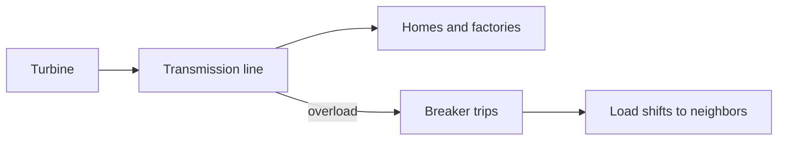

**Energy rides the wires as waves — heat is the queue timeout.**

Operators cannot pick a single path — Kirchhoff distributes flow by resistance. Overloaded lines sag; a tree touch trips the breaker.

Energy instantly reroutes to already-stressed neighbors. [Rate limiting](/topics/rate-limiting) by heat, not software.
