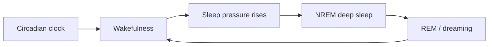

# Sleep

## TL;DR

- Sleep is **regulated feedback**, not a single on/off switch.
- The brain **clears waste, consolidates memory, and resets learning capacity** overnight.
- Sleep debt is a **queue** — you cannot delete it, only drain it over time.

## The Phenomenon

Sleep is a recurring brain state that **restores metabolic, cognitive, and immunological function**. It is controlled by two coupled processes: circadian rhythm and homeostatic sleep pressure.

## What Exists?

**Takeaway: Sleep is a pattern across networks, not one organ.**

No "sleep gland." Sleep exists as **coordinated neural activity states** (N1–N3, REM) measured by EEG. The phenomenon is real — performance collapses without it — but it is **distributed**.

## What Changes?

**Takeaway: Two timescales — hours and years.**

Circadian phase rotates daily. Sleep pressure accumulates across hours awake. Baseline need **drifts with age**, illness, and training load. Treating sleep as stationary across a month misplans recovery.

## What Flows?

**Takeaway: Clearance and consolidation are nightly batch jobs.**

Glymphatic clearance moves metabolic waste. Memory traces **flow from hippocampus to cortex** during consolidation. Glucose and hormone flows cycle with stage. Bottleneck: **time in deep sleep** when schedule compresses sleep window.

## What Learns?

**Takeaway: Sleep is when learning becomes durable.**

Synaptic homeostasis **downscales noise** while strengthening important patterns. Skipping sleep is like training a model without a validation pass — you overfit yesterday's noise.

Baroreceptors are not learning here, but **sleep timing learns** from habit and light cues (Zeitgebers).

## What Persists?

**Takeaway: Architecture persists; debt persists until paid.**

Sleep stages and circadian entrainment persist as **invariants** night to night. Sleep debt **persists across days** — you cannot nap away a week of deficit in one morning.

## What Emerges?

**Takeaway: Conscious experience emerges from micro-dynamics.**

Dream narrative and unified consciousness **emerge** from billions of local neural events. No single neuron "dreams." Global cognitive function emerges from local silence and replay.

## What Will Happen?

**Takeaway: Wearables shift sleep from lagging to leading indicator.**

Prior: you notice impairment after bad nights (lagging). Evidence: rings and watches track HRV, latency, WASO. **Posterior** shifts toward personalized chronotherapy and earlier intervention.

Branches: (A) clinical integration of consumer sleep data 35%, (B) status-quo self-report 40%, (C) regulated medical device path 25%. Leading indicators: nightly latency trend, weekend catch-up sleep hours.

**Forecasting snapshot:** State = current sleep debt queue depth; momentum = wearable adoption; act on **consistent earlier bedtime** before cognitive lagging metrics confirm damage.
