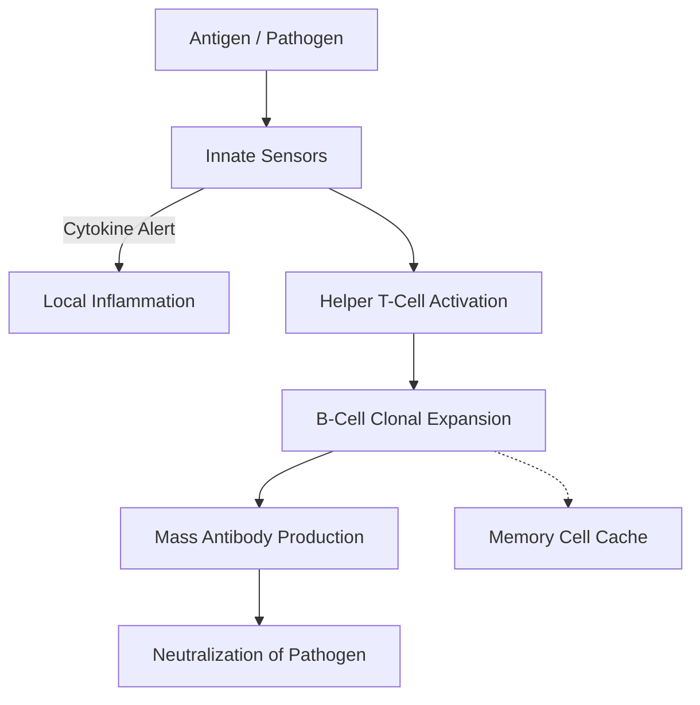

# The Immune System

## TL;DR

- The immune system is a distributed spam filter probabilistically identifying self from non-self.
- It uses randomly generated, combinatorial keys to match unknown zero-day attacks.
- Memory cells persist as a cached database of past signatures for rapid secondary responses.

## The Phenomenon

The human immune system is a highly scalable, multi-agent defense network operating entirely without a central brain. It constantly scans massive volumes of biological data to identify and neutralize hostile actors (pathogens) while explicitly avoiding false positives (autoimmunity) that would destroy the host.

To defend against an infinite array of mutating threats, the system relies on randomness. It continuously generates millions of unique immune cells with randomized receptors. When a random receptor successfully locks onto a foreign invader, the system aggressively clones that specific cell, turning a lucky guess into a targeted army.

This architecture perfectly mirrors machine learning classifiers and spam detection algorithms. It must balance the false-negative rate (letting a virus slip by) against the false-positive rate (attacking its own joints or pancreas), making life-or-death probabilistic decisions purely through local chemical interactions.

## What Exists?

**Takeaway: A distributed network of independent, specialized agents.**

There is no central immune "control room" or brain. What exists are billions of independent agents—macrophages, T-cells, B-cells—circulating through the blood and lymphatic systems. These physical cells operate strictly on local chemical interfaces, completely blind to the larger organism.

They interact by physically bumping into other cells and reading the molecular signatures (antigens) displayed on their surfaces. The entire system is built on this physical, lock-and-key recognition at the microscopic level.

Also existing are the physical highways they travel. The lymphatic system acts as a parallel drainage and transport network, ferrying fluid and captured antigens to localized lymph nodes, which function as microscopic police stations where immune cells congregate to share intelligence.

## What Changes?

**Takeaway: The threat landscape is highly non-stationary and explicitly adversarial.**

Pathogens mutate constantly, creating a perpetual zero-day environment. A virus changes its surface proteins to evade detection, forcing the immune system to continuously update its recognition models. This evolutionary arms race means the definition of "malicious" shifts continuously.

The host's environment also changes drastically. Moving to a new continent exposes the system to entirely novel pollen, bacteria, and dietary proteins. The immune system must rapidly adjust its tolerance thresholds to avoid attacking harmless environmental noise.

Internally, the immune system changes as we age. The thymus gland, where T-cells are trained, slowly shrinks and turns to fat after puberty, permanently reducing the system's ability to generate novel responses to new threats later in life.

## What Flows?

**Takeaway: Information flows via chemical broadcast signals called cytokines.**

When a local sensor (like a macrophage) detects damage or foreign debris, it doesn't send an electrical signal; it releases cytokines. These chemical signals flow through the local tissue and bloodstream, acting as a broadcast alert to recruit reinforcements to the site.

The flow of these signals dictates the intensity and location of the inflammatory response. The higher the concentration of cytokines, the more aggressive the immune response becomes, dilating blood vessels to allow more agents to flow into the infected tissue.

Antibodies also flow massively through the bloodstream. Once a B-cell finds a match for a pathogen, it begins pumping out thousands of antibodies per second. These Y-shaped proteins flow through the body, binding to pathogens and neutralizing them or tagging them for destruction.

## What Learns?

**Takeaway: Adaptive immunity is a biological machine learning algorithm.**

The innate immune system acts as a hardcoded heuristic filter, recognizing broad patterns of damage. But the adaptive system (T-cells and B-cells) actively learns. Through a process called V(D)J recombination, the body genetically scrambles DNA to generate millions of random, unique receptors.

This massive random diversity is then tested against the current antigen environment. When a randomly generated B-cell or T-cell successfully binds to a pathogen, that specific cell is triggered to rapidly clone itself. It scales up the successful model, effectively training a highly specific classifier.

Crucially, the system also learns what *not* to attack. In the thymus, developing T-cells are tested against the body's own proteins. If a T-cell strongly binds to "self," it is chemically forced to commit suicide, preventing autoimmunity before the cell is ever deployed.

## What Persists?

**Takeaway: The biological "cache" of memory cells persists for decades.**

Once an infection is cleared, the massive army of cloned immune cells is no longer needed and dies off. However, a small population of memory B-cells and T-cells persists in the bone marrow and lymph nodes, sometimes for the entire life of the host.

This immunological memory acts as a cached database of known malicious signatures. If the exact same pathogen enters the body years later, the system skips the slow, days-long learning phase and immediately executes a massive, pre-optimized response.

The genetic blueprint for generating diversity also persists. The core mechanisms of V(D)J recombination have been conserved across millions of years of vertebrate evolution, proving to be the most robust architecture for surviving a hostile, mutating environment.

## What Emerges?

**Takeaway: Systemic inflammation and autoimmunity emerge from threshold failures.**

When local signaling loops fail to downregulate after a threat is neutralized, the result is an emergent cytokine storm. This is a runaway positive feedback loop where immune cells continuously recruit more immune cells, eventually destroying the host's own organs in a blind panic.

Similarly, when the probabilistic filtering fails to correctly classify "self" versus "non-self," autoimmune diseases emerge. Diseases like Type 1 Diabetes or Multiple Sclerosis are not external infections, but emergent system failures where the defense network turns against its own infrastructure.

Conversely, herd immunity is a positive emergent property at the population level. When enough individual nodes (humans) in a network possess immunological memory, the pathogen can no longer find a viable path through the graph, protecting even the vulnerable, un-immunized nodes.

## What Will Happen?

**Takeaway: We are shifting from reactive training to programmable immune responses.**

Prior: we relied on dead or weakened viruses (traditional vaccines) to slowly and safely train the system's memory cache. Evidence: mRNA vaccines now directly program our own cells to manufacture specific target antigens, bypassing the initial infection vector entirely. **Posterior** points to customized, engineered T-cells acting as programmable nanobots deployed to hunt highly specific signatures.

Branches: (A) Precision immunotherapy (like CAR-T) becomes the standard cure for most cancers 50%, (B) Rising autoimmune disorders emerge due to environmental novelties and microplastics confusing the innate system 30%, (C) Engineered super-pathogens outpace our ability to program new defenses 20%.

**Forecasting snapshot:** State = current deployment of mRNA technology; momentum = FDA approvals for personalized CAR-T therapies; watch the development cost curve for manufacturing patient-specific immune cells.
