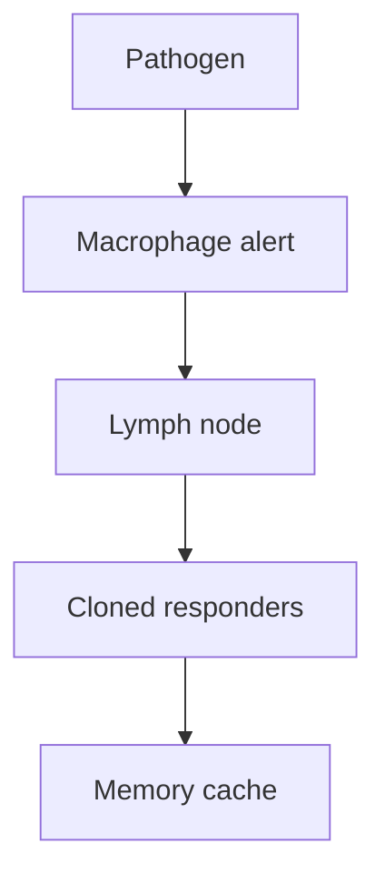

# The Immune System

## TL;DR

- No central command — macrophages, T-cells, and B-cells bump and read molecular tags.
- Autoimmune disease is friendly fire when self/non-self classification fails.
- Watch flare frequency and recovery time, not supplement marketing.

## The Phenomenon

You are a walking sensor network with no control room. Billions of cells patrol by collision, reading molecular signatures and deciding in milliseconds whether to attack, tolerate, or remember.

## What Exists?

**No immune control room — just cells bumping and reading tags.**

Lymph nodes concentrate review. The lymphatic system ferries antigens to these stations.

## What Changes?

**Pathogens mutate; your thymus shrinks; new continents rewrite the threat list.**

Zero-day biology is the default. Aging and migration continuously shift the threat surface.

## What Flows?

**Damage signals broadcast as cytokines — concentration sets the panic level.**

Antibodies flow as tagged neutralizers. Inflammation is a recruitment gradient.

## What Learns?

**Adaptive immunity shuffles DNA, tests random receptors, clones winners.**

Thymic selection kills self-reactive T-cells before deployment — negative training data baked in.

## What Persists?

**Memory cells are a decades-long cache of old fights.**

V(D)J recombination machinery is an evolutionary invariant across vertebrates.

## What Emerges?

**Cytokine storms and autoimmunity emerge when stop signals fail.**

Herd immunity is the positive emergent property at population scale.

## What Will Happen?

**Branches: programmable immunity, rising autoimmunity, or arms-race pathogens.**

mRNA and CAR-T change the training pipeline. Leading indicators: therapy cost curves, autoimmune diagnosis trends.

## Try it

Notice where a cut reddens first — that's the local chemical alarm.
