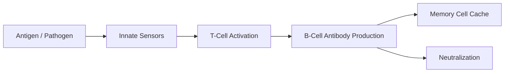

# The Immune System

## TL;DR

- The immune system is a distributed spam filter that must probabilistically identify self from non-self.
- It uses randomly generated, combinatorial keys (antibodies) to match unknown zero-day attacks.
- Memory cells persist as a cached database of past signatures, enabling rapid secondary responses.

## The Phenomenon

The human immune system is a highly scalable, multi-agent defense network operating without a central brain. It constantly scans massive volumes of biological data to identify and neutralize hostile actors (pathogens) while explicitly avoiding false positives (autoimmunity) that would destroy the host.

## What Exists?

**Takeaway: A distributed network of independent, specialized agents.**

There is no central immune "control room." What exists are billions of independent agents—macrophages, T-cells, B-cells—circulating through the blood and lymphatic systems. These physical cells operate strictly on local chemical interfaces, responding to molecular signatures on the surfaces of other cells.

## What Changes?

**Takeaway: The threat landscape is highly non-stationary and adversarial.**

Pathogens mutate constantly, creating a perpetual zero-day environment. A virus changes its surface proteins to evade detection, forcing the immune system to continuously update its recognition models. This evolutionary arms race means the definition of "malicious" shifts continuously over time.

## What Flows?

**Takeaway: Information flows via chemical signals called cytokines.**

When a local sensor (like a macrophage) detects damage, it releases cytokines. These chemical signals flow through the local tissue and bloodstream, acting as a broadcast alert to recruit reinforcements. The flow of these signals dictates the intensity and location of the inflammatory response.

## What Learns?

**Takeaway: Adaptive immunity is a biological machine learning algorithm.**

The innate system acts as a hardcoded heuristic filter. The adaptive system (T-cells and B-cells) learns. Through clonal selection, it generates massive random diversity, tests those variations against an antigen, and rapidly scales up the specific cells that successfully bind to the target, effectively training a highly specific classifier.

## What Persists?

**Takeaway: The biological "cache" of memory cells persists for decades.**

Once an infection is cleared, a small population of memory B-cells and T-cells persists in the body. This immunological memory acts as a cached database of known malicious signatures. If the same pathogen enters again, the system skips the slow learning phase and immediately executes a massive, pre-optimized response.

## What Emerges?

**Takeaway: Systemic inflammation and autoimmunity emerge from threshold failures.**

When local signaling loops fail to downregulate, the result is an emergent cytokine storm—a runaway feedback loop that damages the host. Similarly, when the probabilistic filtering fails to correctly classify "self" versus "non-self," autoimmune diseases emerge, turning the defense network against its own infrastructure.

## What Will Happen?

**Takeaway: We are shifting from reactive to programmable immune responses.**

Prior: we relied on dead or weakened viruses to slowly train the system. Evidence: mRNA vaccines directly program cells to produce specific antigens, bypassing the initial infection. **Posterior** points to customized, engineered T-cells (like CAR-T) acting as programmable nanobots deployed to hunt specific cancer signatures.

Branches: (A) Precision immunotherapy becomes standard for cancer 50%, (B) Rising autoimmune disorders due to environmental novelties 30%, (C) Engineered super-pathogens outpace programmable defenses 20%.

**Forecasting snapshot:** State = current deployment of mRNA technology; momentum = FDA approvals for CAR-T therapies; watch the development cost curve for personalized immunotherapies.
