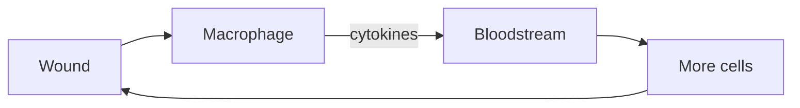

**Damage signals broadcast as cytokines — concentration sets the panic level.**

A macrophage releases cytokines; more cells follow the gradient. B-cells that match a pathogen pump out antibodies — Y-shaped tags flowing until the invader is coated or cleared.
