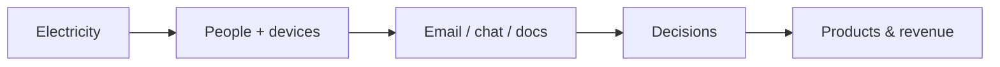

# The Office as a Computer

## TL;DR

- The office is an **energy→information conversion machine**.
- Employees, email, and docs form a **distributed computer** without a central clock.
- Most structure is **shared agreement**, not physical matter.

## The Phenomenon

An office converts electricity, human calories, and capital into **decisions encoded as messages, code, and money**. The building is optional; the communication graph is not.

## What Exists?

**Takeaway: The office is mostly agreements wearing furniture.**

Legal entity, employment contracts, and account permissions exist because **everyone behaves as if they do**. Physical desks exist, but "the sprint" exists only in shared calendars and belief.

Information nodes — inboxes, wikis, ticket queues — are **real entities** for planning even though you cannot weigh them. Roles (PM, engineer, lawyer) are **interfaces** between humans and tasks.

## What Changes?

**Takeaway: Multiple clocks run at once.**

Slack messages change by the second. Headcount and strategy shift quarterly. Market context can **regime-shift** the whole company overnight. Models that assume fixed arrival rates fail — **non-stationarity is default**.

Tooling generations replace every few years; culture lags or leads that change unpredictably.

## What Flows?

**Takeaway: Attention is the scarce carrier.**

Electricity is cheap compared to **manager attention** and **engineer focus**. Requests enter queues (triage, code review, legal review). Bottlenecks are often **human service rates**, not CPU.

Information can **leak** (side channels, gossip) or **loop** (reply-all storms) without producing decisions.

## What Learns?

**Takeaway: Organizations learn through retros, metrics, and hiring.**

Postmortems update process. Dashboards reweight what teams optimize. ML on logs learns customer patterns. **Credit assignment** is hard — successes and failures get narratively assigned to heroes and villains regardless of causality.

Exploration (experiments, new markets) trades off against exploitation (core product margin).

## What Persists?

**Takeaway: Mission and contracts survive employee turnover.**

The company ID persists through People Ops changes. API major versions persist for clients. Culture persists as **habits** — harder to copy than code, slower to change than strategy.

## What Emerges?

**Takeaway: Culture is emergent gossip at scale.**

No single policy defines "how we really work." Local interactions — who gets promoted, what gets rewarded in standup — produce **global patterns** like blamelessness or fear. Multi-agent dynamics without a clear reward function.

## What Will Happen?

**Takeaway: AI coworkers shift the communication graph.**

Prior futures: fully remote, fully office, hybrid equilibrium. Evidence: agent tooling adoption, real-estate downsizing, async doc culture. **Leading indicators**: time-to-first-response on bots vs humans, headcount per revenue dollar.

Rough branches: (A) agents as tier-1 coworkers 40%, (B) hybrid plateau 45%, (C) return-to-office mandate wins 15% — update as your org's evidence arrives.

**Forecasting snapshot:** State = current async/sync mix; momentum = rising agent delegation; watch hiring mix and office lease length as leading signals.
