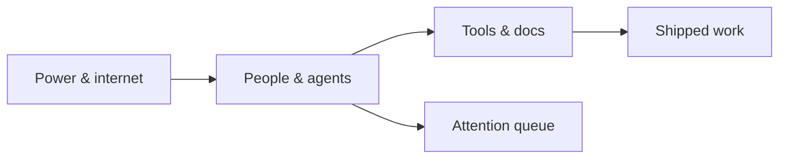

**Electricity in; decisions and shipped code out.**

Bottlenecks: meeting load, review queues, unclear ownership. [Queueing Theory](/topics/queueing-theory) applies directly — every standup is a scheduler.
