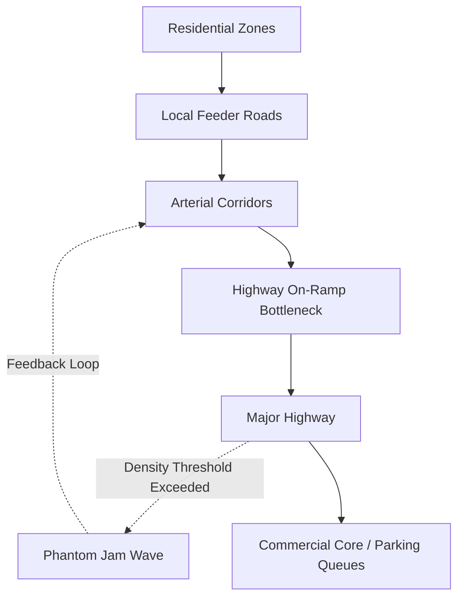

# Urban Traffic Networks

## TL;DR

- Traffic behaves like a fluid until a critical density, where it undergoes a sudden phase transition into a solid jam.
- Adding more roads often increases congestion due to induced demand (Braess's Paradox).
- Throughput is determined entirely by the clearing rate of bottleneck intersections, not by highway speed limits.

## The Phenomenon

An urban traffic network is a macroscopic queueing system where independent agents (drivers) make decentralized routing decisions. Despite everyone attempting to optimize their own travel time, the aggregate behavior produces complex, often counter-intuitive network effects like phantom traffic jams and gridlock.

Because vehicles take up significant physical space, they cannot be buffered in a memory cache like internet data. When the network reaches capacity, the vehicles themselves become the queue, backing up onto active travel lanes and blocking upstream nodes. This creates cascading failures where a jam on an off-ramp paralyzes miles of highway.

For decades, urban planners attempted to solve congestion by adding more lanes. However, due to the phenomenon of "induced demand," expanding capacity simply encourages more people to drive, quickly filling the new lanes until the system returns to its original, congested equilibrium.

## What Exists?

**Takeaway: The network is a physical graph constrained by finite urban space.**

Roadways, intersections, and traffic lights exist as the rigid, physical infrastructure of the network graph. Vehicles exist as independent data packets navigating this graph. However, unlike IP packets in a router, vehicles take up immense physical space and cannot be easily buffered or dropped.

The "traffic jam" is an interesting ontological entity; it is not a physical object, but a density state that propagates backward through the network as a wave. You cannot point to a traffic jam, only to the cars temporarily trapped within its boundaries.

What also exists are the deeply entrenched zoning laws that mandate spatial separation between where humans sleep and where they work. This artificial separation is the fundamental driver of the massive daily migrations that strain the network graph to its breaking point.

## What Changes?

**Takeaway: Arrival rates are highly non-stationary, driven by strict cultural clocks.**

Traffic density changes predictably based on the rigid 9-to-5 work schedule and school hours. A highway that operates efficiently at 2 PM can experience a catastrophic drop in throughput at 5 PM as the volume of entering vehicles exceeds the network's maximum clearing capacity.

This non-stationarity extends to weather and localized events. A brief rain shower causes drivers to increase their following distance, instantly reducing the theoretical capacity of the entire road segment. A major sporting event acts as a sudden, massive injection of packets into a highly localized area.

As cities grow, the definition of "rush hour" changes. It slowly expands from a one-hour window into a grueling three-hour plateau of peak density, as drivers attempt to shift their commutes earlier or later to avoid the inevitable crush.

## What Flows?

**Takeaway: Flow is determined by the slowest node, not the fastest edge.**

Vehicles flow through the network until they reach an intersection or merge point. These nodes act as strict rate limiters. If the arrival rate at an on-ramp exceeds the rate at which cars can merge, a localized queue rapidly forms.

Once this queue spills back into upstream intersections, gridlock occurs. At this point, the network effectively locks up, as cars cannot enter an intersection because the exit is blocked. The flow rate drops to zero, despite the physical road remaining perfectly intact.

Highway speed limits are largely irrelevant to total network flow during peak hours. The true determinant of throughput is the clearing rate of the most constrained intersections—the literal bottlenecks where multi-lane highways compress into city streets.

## What Learns?

**Takeaway: Drivers learn routes; algorithms learn signal timing.**

Human drivers learn to avoid historically congested routes, continuously rebalancing the network via their navigation apps. This creates a highly dynamic environment where opening a new shortcut almost immediately attracts enough traffic to render it useless.

Traffic management systems learn to dynamically adjust signal phases at intersections based on inductive loop sensors embedded in the asphalt. These systems attempt to clear the longest queues in real-time, essentially acting as an adaptive load balancer for physical matter.

However, these learning systems often operate at cross purposes. Google Maps might route a thousand cars through a quiet residential neighborhood to save three minutes, forcing the municipal signal algorithms to scramble to accommodate a sudden, massive flow on an unoptimized edge.

## What Persists?

**Takeaway: Maximum theoretical throughput is an invariant physical limit.**

A single lane of highway can only physically process about 2,000 to 2,400 cars per hour. This invariant persists regardless of speed limits, driver skill, or the size of the vehicles. It is a strict mathematical limit dictated by human reaction times and required braking distances.

When density forces drivers to reduce their following distance below a safe threshold, the system inevitably collapses from free flow into stop-and-go congestion. This phase transition is as persistent and predictable as the freezing point of water.

The physical layout of the city grid itself persists across centuries. While lanes can be repainted and signals upgraded, the fundamental geometry of streets laid out in the 19th century continues to dictate the flow of 21st-century traffic.

## What Emerges?

**Takeaway: Self-interested routing degrades overall network efficiency.**

When every driver uses a routing app to find the fastest personal path, traffic spills from highways onto residential streets not designed for high volume. This creates a tragedy of the commons, where individual optimization leads to systemic degradation.

This dynamic yields Braess's Paradox, a counter-intuitive mathematical phenomenon. Adding a new, seemingly efficient road can actually increase total commute times for everyone, because it alters the Nash equilibrium of the entire routing network, drawing vehicles into a new bottleneck.

Furthermore, "phantom traffic jams" emerge without any physical cause. A single driver tapping their brakes causes the car behind them to brake slightly harder. This reaction amplifies backward through the dense line of cars, creating a standing wave of stopped traffic that can persist for hours long after the initial driver has left the area.

## What Will Happen?

**Takeaway: Tolls shift from static fees to algorithmic load balancers.**

Prior: static infrastructure expansion (adding lanes) consistently failed to solve congestion due to the iron law of induced demand. Evidence: cities like London and Singapore are implementing dynamic congestion pricing to explicitly throttle demand. **Posterior** points to road networks being managed exactly like cloud infrastructure, where surge pricing aggressively shapes user behavior to prevent network saturation.

Branches: (A) Autonomous vehicle platooning safely decreases following distance, increasing lane density by 40%, (B) Aggressive congestion pricing successfully reduces total urban vehicle miles 35%, (C) Continued sprawl and political resistance to tolling lead to worse gridlock 25%.

**Forecasting snapshot:** State = current peak network utilization percentage; momentum = adoption of congestion pricing zones globally; watch local legislation regarding variable rate tolling and vehicle-miles-traveled (VMT) taxes.
