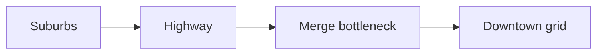

# Urban Traffic Networks

## TL;DR

- A traffic jam is a wave — you can't point to it, only cars trapped inside it.
- Throughput is set by the slowest intersection, not the fastest highway.
- Watch bottleneck clearing rate and induced-demand studies, not lane-count headlines.

## The Phenomenon

Morning commute is a daily migration forced by zoning: sleep here, work there. Cars are packets that cannot be dropped when the queue fills — only sit, brake, and propagate waves backward.

## What Exists?

**A jam is a density wave, not an object you can tow away.**

Intersections are rate limiters. Zoning laws create the demand spike.

## What Changes?

**Rush hour is a clock-driven spike; rain and games are surprise injections.**

Non-stationary arrivals from culture, weather, and events.

## What Flows?

**Flow dies at the slowest intersection, not the fastest lane.**

Gridlock is exit-blocked intersections — zero throughput on intact pavement.

## What Learns?

**Drivers learn shortcuts; signals learn timing — often fighting each other.**

Navigation apps and municipal signal systems optimize different objectives.

## What Persists?

**One lane clears about 2,000 cars per hour — physics, not policy.**

Phase transition from free flow to stop-and-go is as predictable as freezing water.

## What Emerges?

**Personal routing apps create commons tragedies and phantom jams.**

Braess's Paradox and standing shockwaves without physical obstacles.

## What Will Happen?

**Branches: platooning, priced roads, or worse gridlock.**

Congestion pricing treats roads like load-balanced infrastructure. Leading indicators: clearing rate, VMT in tolled zones.

## Try it

Time one rush-hour light cycle — that's your real throughput cap.
