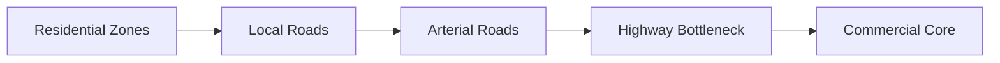

# Urban Traffic Networks

## TL;DR

- Traffic behaves like a fluid until a critical density, where it undergoes a sudden phase transition into a solid jam.
- Adding more roads often increases congestion due to induced demand (Braess's Paradox).
- Throughput is determined entirely by the clearing rate of bottleneck intersections, not by highway speed limits.

## The Phenomenon

An urban traffic network is a macroscopic queueing system where independent agents (drivers) make decentralized routing decisions. Despite everyone attempting to optimize their own travel time, the aggregate behavior produces complex, often counter-intuitive network effects like phantom traffic jams.

## What Exists?

**Takeaway: The network is a physical graph constrained by finite space.**

Roadways, intersections, and traffic lights exist as the rigid, physical infrastructure of the network graph. Vehicles exist as independent data packets navigating this graph. The "traffic jam" is not a physical object, but a density state that propagates backward through the network as a wave.

## What Changes?

**Takeaway: Arrival rates are highly non-stationary, driven by strict cultural clocks.**

Traffic density changes predictably based on the rigid 9-to-5 work schedule and school hours. A highway that operates efficiently at 2 PM can experience a catastrophic drop in throughput at 5 PM as the volume of entering vehicles exceeds the network's maximum clearing capacity.

## What Flows?

**Takeaway: Flow is determined by the slowest node, not the fastest edge.**

Vehicles flow through the network until they reach an intersection or merge point. These nodes act as strict rate limiters. If the arrival rate at an on-ramp exceeds the rate at which cars can merge, a queue forms. Once the queue spills back into upstream intersections, gridlock occurs.

## What Learns?

**Takeaway: Drivers learn routes; algorithms learn signal timing.**

Human drivers learn to avoid historically congested routes, continuously rebalancing the network via their navigation apps. Traffic management systems learn to dynamically adjust signal phases at intersections based on inductive loop sensors, attempting to clear the longest queues in real-time.

## What Persists?

**Takeaway: Maximum theoretical throughput is an invariant physical limit.**

A single lane of highway can only physically process about 2,000 to 2,400 cars per hour. This invariant persists regardless of speed limits or driver skill. When density forces drivers to reduce their following distance below a safe threshold, the system inevitably collapses from free flow into stop-and-go congestion.

## What Emerges?

**Takeaway: Self-interested routing degrades overall network efficiency.**

When every driver uses a routing app to find the fastest path, traffic spills from highways onto residential streets not designed for high volume. This creates Braess's Paradox: adding a new, seemingly efficient road can actually increase total commute times for everyone because it alters the equilibrium of the entire network.

## What Will Happen?

**Takeaway: Tolls shift from static fees to algorithmic load balancers.**

Prior: static infrastructure expansion (adding lanes) failed to solve congestion due to induced demand. Evidence: cities are implementing congestion pricing and dynamically priced toll lanes to throttle demand. **Posterior** points to road networks being managed like cloud infrastructure, where pricing aggressively shapes user behavior to prevent network saturation.

Branches: (A) Autonomous vehicle platooning increases lane density 40%, (B) Aggressive congestion pricing reduces total urban vehicle miles 35%, (C) Continued sprawl leads to worse gridlock 25%.

**Forecasting snapshot:** State = current peak network utilization; momentum = adoption of congestion pricing zones; watch local legislation regarding variable rate tolling.
