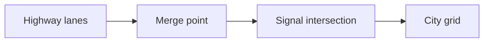

**Flow dies at the slowest intersection, not the fastest lane.**

On-ramps exceed merge rate and queues spill backward. Gridlock: cars block intersections because exits are full — flow hits zero on intact asphalt. [Queueing theory](/topics/queueing-theory): speed limits barely matter at peak; clearing rate at bottlenecks does.
