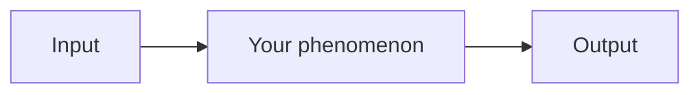

**Replace with a hook about what moves.**

```mermaid
flowchart LR
  In[Input] --> System[Your phenomenon]
  System --> Out[Output]
```

Name the bottleneck. Link one `/topics/` slug if a mechanism exists.
