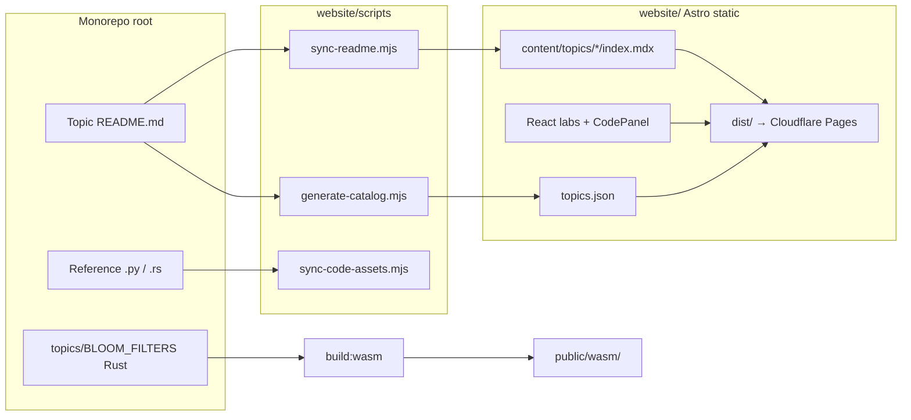

# Chaitra website

Public learning site for [**Chaitra**](https://github.com/07AMIT10/chaitra) — an open curriculum on **scalable probabilistic systems**: sketches, randomized structures, distributed coordination, and the tradeoffs behind “probably correct, much faster.”

**Live site:** [chaitra.pages.dev](https://chaitra.pages.dev) (Cloudflare Pages)

This folder (`website/`) is the **Astro app** that turns repo topic READMEs, reference code, and interactive labs into static pages. The rest of the repository lives under [`topics/`](../topics/) (`BLOOM_FILTERS/`, `HYPERLOGLOG/`, etc.) — the **source curriculum**; the website is how people read and play with it.

---

## What we are trying to do

Most systems at scale do not compute exact answers for every question. They use **probability** on purpose: Bloom filters, HyperLogLog, gossip, rate limiters, sketches, approximate caches, ML routing, and more.

Chaitra exists to make that mindset learnable in one place:

| Goal | How the site supports it |
|------|---------------------------|
| **Build intuition** | Long-form **Story** per topic (math, diagrams, systems context) synced from each folder’s `README.md` |
| **See mechanisms work** | **Labs** — sliders, simulations, bit grids, play/pause — so parameters are not abstract |
| **Touch real code** | **Code** workbench — edit Python in the browser (Pyodide), read Rust reference source, run a WASM demo where wired |
| **Go deeper in the repo** | Every topic links to **GitHub** for full implementations, tests, and local `cargo` / `python` runs |

We are not trying to replace textbooks or papers. We are building a **guided path**: narrative → interaction → code → repository, with a shared catalog and learning path on the homepage.

The parent repo’s [README](../README.md) describes the *subject* (what probabilistic systems are). This document describes the *website* (how we publish and extend it).

---

## How a topic page is structured

Each topic with a site page (for example [/topics/bloom-filters](https://chaitra.pages.dev/topics/bloom-filters)) is assembled from `src/content/topics/<slug>/`:

```
topics/bloom-filters/
  index.mdx        → layout slots (hero, lab, imports)
  readme-body.md   → Story (synced from topics/BLOOM_FILTERS/README.md)
  code.mdx         → optional Code panel (Python / Rust / GitHub tabs)
```

On the page you will see:

1. **Story** — Markdown + KaTeX math + Mermaid diagrams (client-rendered).
2. **Lab** — React island (`client:visible`) when the topic has an interactive lab component.
3. **Code** — Code workbench when `code.mdx` exists (see below).
4. **GitHub** — Link to the topic folder in the monorepo.

The left **“On this page”** nav jumps between these sections.

### Code workbench (Python & Rust)

The **Code** section is a vertical **Source → Run → Output** layout:

- **Python** — CodeMirror editor; **Run** loads [Pyodide](https://pyodide.org/) from jsDelivr and executes your edits (stdlib only).
- **Rust** — Read-only highlighted source (synced from the repo). **Run WASM demo** only on topics that ship a prebuilt binary (today: **Bloom filters**). Output appears **after** you run — not on tab open. Other Rust topics explain how to run locally with `cargo`.
- **GitHub** — Links to `bloom_filter.py`, `bloom_filter.rs`, and the topic folder.

Snippet files live in `src/assets/code/*.py.txt` and `*.rs.txt`, updated with `npm run sync:code` from repo sources.

### Catalog status (what “ready” means)

`npm run catalog` scans repo folders that contain `README.md` and sets status in `src/data/topics.json`:

| Status | Meaning on the site |
|--------|---------------------|
| **golden** | Flagship topic — full lab + high polish |
| **live** | Interactive lab on the topic page |
| **preview** | Site page exists (often a small viz or placeholder lab) |
| **readme-only** | Narrative on-site; catalog links to `/topics/<slug>` (not only GitHub) |
| **coded** | Repo has code assets; site page may still be minimal |

Filter pills on [/catalog](https://chaitra.pages.dev/catalog) group these for learners.

---

## How the site is built (architecture)



- **Framework:** [Astro 5](https://astro.build/) static output, [React 19](https://react.dev/) for interactive islands.
- **Content:** MDX topic shells + synced `readme-body.md` (do not hand-edit Story without syncing from repo README, or run `sync:readme` after edits).
- **Catalog:** Generated JSON drives homepage stats, catalog search, and learning path.
- **Labs:** Per-topic components under `src/components/` (e.g. `BloomFilterLab.tsx`).
- **Code:** `CodePanel` + `code-workbench/` (CodeMirror 6, Pyodide, optional WASM).
- **Deploy:** Static `dist/` to Cloudflare Pages; CSP and WASM MIME rules in `public/_headers`.

---

## Repository layout (contributors)

| Path | Role |
|------|------|
| `../topics/BLOOM_FILTERS/`, `../topics/HYPERLOGLOG/`, … | Canonical topic README + reference implementations |
| `website/src/content/topics/<slug>/` | Site-specific MDX and synced narrative |
| `website/src/components/` | Labs, catalog, code workbench, layout |
| `website/src/data/topics.json` | Generated catalog (run `npm run catalog`) |
| `website/src/assets/code/` | Python/Rust snippets for the Code tab |
| `website/public/wasm/bloom_filter/` | Committed WASM artifacts for Bloom demo |
| `website/wasm/bloom_filter/` | Rust crate source for `npm run build:wasm` |

**Typical flow when improving a topic**

1. Edit `topics/TOPIC_NAME/README.md` (and `.py` / `.rs` if any).
2. From `website/`: `npm run sync:readme` and/or `npm run sync:code`.
3. If the topic has a lab or new `index.mdx` / `code.mdx`, edit under `src/content/topics/`.
4. `npm run catalog` then `npm run build` (and `npm run build:wasm` if Bloom WASM changed).
5. Open PR; Cloudflare preview deploys the branch.

---

## Local development

```bash
cd website
npm ci
npm run dev
```

Useful URLs:

- Home: http://localhost:4321/
- Catalog: http://localhost:4321/catalog
- Bloom filters (lab + code): http://localhost:4321/topics/bloom-filters

---

## Build commands

| Command | When to run |
|---------|-------------|
| `npm run catalog` | After adding/renaming topic folders or changing lab/code MDX (updates `topics.json`) |
| `npm run sync:readme` | After editing any `../topics/TOPIC/README.md` |
| `npm run sync:code` | After editing reference `.rs` used in Code tabs |
| `npm run build:wasm` | After changing `topics/BLOOM_FILTERS/` or `wasm/bloom_filter/` (needs [wasm-pack](https://rustwasm.github.io/wasm-pack/)) |
| `npm run build` | Produce `dist/` for deploy or `astro preview` |

Full local build (matches most CI):

```bash
npm ci && npm run catalog && npm run sync:readme && npm run build
```

With WASM rebuild (optional locally; CI uses committed `public/wasm/`):

```bash
npm run build:wasm && npm run build
```

### Math and diagrams

- **Math:** `remark-math` + `rehype-katex` (KaTeX CSS in `BaseLayout`).
- **Mermaid:** ` ```mermaid ` fences in READMEs are transformed for client render in Story.

### Tests

```bash
npm run test:catalog
npm run test:math
npx tsx --test src/lib/format-stdout.test.mjs
```

---

## Deploy and operations

Production hosting is **Cloudflare Pages** on the `website` root directory.

**Detailed checklist (dashboard, Wrangler, CSP, WASM MIME pitfalls):** [DEPLOY-CLOUDFLARE.md](./DEPLOY-CLOUDFLARE.md)

Quick reference:

| Setting | Value |
|---------|--------|
| Root directory | `website` |
| Build command | `npm ci && npm run catalog && npm run build` |
| Output directory | `dist` |
| Node | 20 |

Committed WASM under `public/wasm/bloom_filter/` avoids needing Rust on the Pages build image. Rebuild locally with `npm run build:wasm` when the Bloom Rust code changes, then commit and push.

**CSP:** Pyodide and WASM require `cdn.jsdelivr.net` and `wasm-unsafe-eval` in `public/_headers`. Apply `Content-Type: application/wasm` only to `*.wasm` files — not all of `/wasm/*` (that breaks the `.js` glue).

---

## CI

GitHub Actions: [`.github/workflows/website-ci.yml`](../.github/workflows/website-ci.yml)

On pushes touching `website/**` or `topics/**`: install, `npm run catalog`, `npm run build`.

---

## Accessibility

Topic pages use skip links, landmarks, and shared focus styles (`src/styles/tokens.css`). After UI changes, audit Bloom filters with Lighthouse (accessibility ≥ 90). See commands in git history or run:

```bash
npm run build && npx --yes serve dist -l 4321
# lighthouse http://localhost:4321/topics/bloom-filters/ --only-categories=accessibility
```

---

## Where to learn more

- **Curriculum scope:** [../README.md](../README.md)
- **Deploy:** [DEPLOY-CLOUDFLARE.md](./DEPLOY-CLOUDFLARE.md)
- **Issues / contributions:** [github.com/07AMIT10/chaitra](https://github.com/07AMIT10/chaitra)
