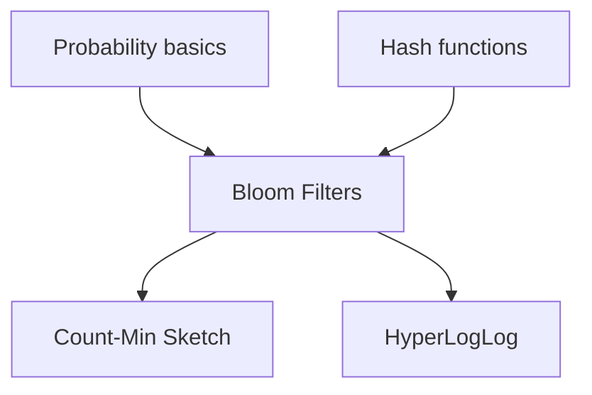
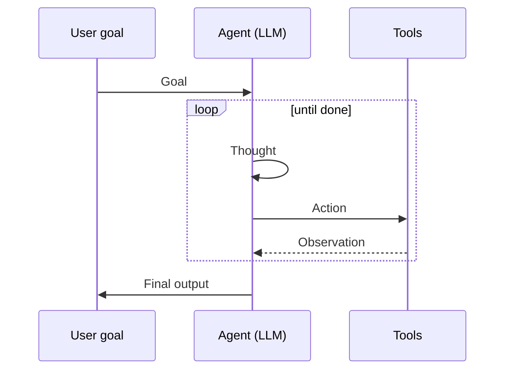

# Chaitra website — content rendering UX audit

**Date:** 2026-05-30  
**Scope:** `/chaitra/website/` topic narrative pipeline (`readme-body.md` → MDX → static HTML)  
**Evidence:** `astro.config.mjs`, `scripts/sync-readme.mjs`, `src/content.config.ts`, built `dist/topics/{bloom-filters,transformer-attention}/index.html`

---

## Executive summary

Topic pages copy repo READMEs verbatim into MDX with **default Astro markdown only** (GFM + Shiki). There is **no math, Mermaid, diagram, or callout pipeline**. Layout adds a page `<h1>` and MDX adds a lead `<h2>` before the README’s own `<h1>`, producing duplicate titles. README “diagrams” (` ```mermaid ` / ` ```ascii `) become Shiki-highlighted `<pre>` blocks. LaTeX (`$…$`, `$$…$$`) is emitted as plain text inside `<p>` tags.

---

## 1. Pipeline inventory

### 1.1 `astro.config.mjs`

```js
integrations: [mdx(), react()],
output: "static",
```

- **No** `markdown.remarkPlugins` / `markdown.rehypePlugins`
- **No** KaTeX, Mermaid, or custom MDX component map
- Shiki theming uses Astro defaults (`github-dark` in build output)

### 1.2 `src/content.config.ts`

- Single `topics` collection via `glob({ pattern: "**/index.mdx" })`
- Schema: `{ title: string }` only — no content UX flags

### 1.3 MDX topic shell (`index.mdx`)

Pattern (labs):

```mdx
---
title: Bloom Filters
---
import ReadmeBody from "./readme-body.md";
## The probabilistic bouncer
<ReadmeBody />
<h2 id="lab">Lab</h2>
<LabComponent client:visible />
```

- `readme-body.md` is a **default import** of a `.md` file inside MDX (processed as markdown, not raw HTML).
- Narrative-only topics use `## Overview` instead of a thematic lead heading.

### 1.4 `scripts/sync-readme.mjs`

| Step | Behavior |
|------|----------|
| Source | `../<FOLDER>/README.md` per `topics.json` |
| Dest | `src/content/topics/<slug>/readme-body.md` |
| Transform | **Only** ` ```ascii ` → ` ```text ` (renames fence language) |
| Not done | Strip `#` title, rewrite Mermaid, math, callouts, heading levels |

### 1.5 `scripts/generate-topic-mdx.mjs`

- Regenerates `index.mdx` with fixed `## {lab.heading}` or `## Overview` + `<ReadmeBody />`
- Does not coordinate with README `#` title → duplicate heading risk is structural

### 1.6 Layout (`TopicLayout.astro` + `[slug].astro`)

- **Always** renders `<h1 class="topic__title">{topic.title}</h1>` from `topics.json`
- Narrative slot = full MDX output (includes readme `#` H1)
- `max-width: 72ch` on article; **no** `.prose` / typography plugin for narrative markdown

---

## 2. Built HTML evidence

### 2.1 Bloom filters (`dist/topics/bloom-filters/index.html`)

Observed heading stack:

1. `<h1 id="topic-page-title">Bloom Filters</h1>` — layout
2. `<h2 id="the-probabilistic-bouncer">The probabilistic bouncer</h2>` — MDX lead
3. `<h1 id="bloom-filters-the-probabilistic-bouncer">Bloom Filters: The Probabilistic Bouncer</h1>` — README

Mermaid prerequisites block:

```html
<pre class="astro-code github-dark" data-language="mermaid"><code>
  <span>graph TD</span> ...
</pre>
```

Math in prose (not rendered):

```html
<li>A <strong>Bit Array</strong> of size $m$, initialized to all zeros.</li>
...
<p>$$
P \approx \left( 1 - e^{-kn/m} \right)^k
$$</p>
```

ASCII diagram (synced as `text`):

```html
<pre class="astro-code github-dark" data-language="text" style="... overflow-x: auto;">
```

### 2.2 Transformer attention (`dist/topics/transformer-attention/index.html`)

- Inline math: `$Q$`, `$K$`, `$V$` remain literal in `<p>` / `<li>`
- Display math `$$ … $$` wrapped in `<p>` with raw `$$` text
- ` ```text ` agent/attention ASCII diagrams → Shiki `<pre>`, same as bloom

### 2.3 Next-gen AI agents

- No `$$` in README; agent-loop “diagram” is ` ```text ` → monospace scroll block
- Confirms pattern for prose-heavy infra topics without LaTeX

---

## 3. Screenshot issues → root causes

| User-visible issue | Root cause | Where |
|--------------------|------------|--------|
| Raw `$m$`, `$$P \approx …$$` | No `remark-math` + `rehype-katex` (or equivalent) | `astro.config.mjs`; ~40+ READMEs use `$` / `$$` |
| Mermaid shows as `graph TD` code | Unknown fence `mermaid` → Shiki code block, no Mermaid renderer | Only bloom README uses mermaid today; no `@astrojs/mermaid` / client component |
| ASCII diagrams as plain code | `sync-readme` maps `ascii`→`text`; still a fenced code block | `sync-readme.mjs`; 30+ READMEs use ` ```ascii ` |
| Duplicate H1 | Layout H1 + MDX H2 + README `#` H1 | `TopicLayout.astro`, `index.mdx`, `readme-body.md` |
| Wall of text | Long README paste; no callout/admonition syntax in source; no narrative typography | README authoring + no MDX components |
| Long code horizontal scroll | Astro Shiki `<pre style="overflow-x: auto;">` default; no wrap/fold for `text` diagrams | Built-in markdown-remark / Shiki |

### Shiki status

**Configured and working** for real languages (`bash`, etc.) via `@astrojs/markdown-remark` → Shiki 3.x. Problem is **misclassification**: `mermaid` and `text` are highlighted as code, not rendered as diagrams.

### KaTeX / Mermaid status

| Capability | In `package.json`? | In `astro.config`? | In build output? |
|------------|-------------------|--------------------|------------------|
| KaTeX | No | No | `$…$` literal |
| Mermaid | No | No | Shiki `data-language="mermaid"` |
| Shiki | Transitive (Astro) | Default | Yes |

---

## 4. Prioritized fix list

### P0 — Matches broken screenshots (ship first)

| # | Fix | Effort |
|---|-----|--------|
| P0-1 | Add `remark-math` + `rehype-katex` (+ KaTeX CSS in `BaseLayout`) | Small |
| P0-2 | Render Mermaid: `@astrojs/mermaid` **or** `Mermaid` MDX component + remark plugin to lift ` ```mermaid ` fences | Small–medium |
| P0-3 | Deduplicate titles: in `sync-readme.mjs`, strip leading `# …` from README; bump remaining `##` → optional, or drop MDX lead `##` when readme has no H1 | Small |
| P0-4 | ASCII diagrams: remark plugin or sync step → `<Diagram>` (preserve monospace, `white-space: pre`, no Shiki tokens) | Medium |

### P1 — Readability / pedagogy

| # | Fix | Effort |
|---|-----|--------|
| P1-1 | MDX components: `Callout` (note/warn/prereq/lab-link) + document in README template | Medium |
| P1-2 | Narrative typography: `@tailwindcss/typography` `.prose` or dedicated `narrative.css` (heading rhythm, `max-width`, list spacing) | Small |
| P1-3 | Code blocks: `overflow-x: auto` for `bash`/`python`; `pre.diagram` with wrap for `text`/`ascii` | Small |
| P1-4 | Optional: collapse “Quickstart” / long shell blocks behind `<details>` via sync or component | Medium |

### P2 — Larger content model

| # | Fix | Effort |
|---|-----|--------|
| P2-1 | Split README into structured frontmatter (prereqs, story, math, lab) instead of one blob | Large |
| P2-2 | Topic-specific MDX partials for hero diagrams (agent loop, attention matrix) | Large |
| P2-3 | Auto-extract prerequisites Mermaid into `TopicLayout` `#prerequisites` slot | Medium |

---

## 5. Recommended stack

```text
markdown.remarkPlugins:
  remark-math          # $ and $$ parsing
  remark-gfm           # (already default)
  remark-mermaid       # optional: transform mermaid fences before rehype

markdown.rehypePlugins:
  rehype-katex         # math → .katex HTML

integrations:
  @astrojs/mdx
  @astrojs/mermaid     # OR mermaid + client:load component

MDX components (src/components/mdx/):
  Callout              # variant: note | warning | prereq | aha
  Diagram              # <pre class="diagram"> for ascii/text; no Shiki
  MathBlock            # optional display wrapper if remark-math edge cases
  Mermaid              # fallback if not using @astrojs/mermaid globally
```

**`astro.config.mjs` sketch:**

```js
import remarkMath from "remark-math";
import rehypeKatex from "rehype-katex";
import mermaid from "@astrojs/mermaid";

export default defineConfig({
  integrations: [mdx(), react(), mermaid()],
  markdown: {
    remarkPlugins: [remarkMath],
    rehypePlugins: [rehypeKatex],
  },
});
```

Register MDX components via `mdx()` integration `components` map or a shared `Content.astro` wrapper.

---

## 6. Quick wins vs refactors

### Quick wins (hours)

1. Wire remark-math + rehype-katex + CDN/local KaTeX CSS.
2. Strip first `# Title` line in `sync-readme.mjs`; remove redundant MDX `##` lead in `generate-topic-mdx.mjs`.
3. Add global CSS: `#narrative pre[data-language="text"] { white-space: pre-wrap; overflow-x: visible; background: var(--color-surface); }` (stops “infinite scroll” feel for diagrams).
4. Enable `@astrojs/mermaid` for the single bloom prerequisites graph (validates pipeline).

### Medium (days)

1. Remark plugin: ` ```mermaid ` → MDX `<Mermaid chart={...} />` or Astro Mermaid pass-through.
2. Remark plugin: ` ```ascii|text ` with heuristic (box-drawing, `^` markers) → `<Diagram>`.
3. `Callout` + migrate 2–3 golden READMEs (bloom, transformer-attention, next-gen-ai-agents).

### Refactors (weeks)

1. README template + lint (no top-level `#` in synced body; use frontmatter title).
2. Structured content collection fields (`prerequisites`, `equations`) instead of prose-only import.
3. Per-topic diagram components replacing ASCII in source repos.

---

## 7. Five “richer display” patterns (topic-tied)

### Pattern A — Prerequisites graph (Bloom filters)

**Today:** Shiki block with `graph TD` text.  
**Target:** Rendered Mermaid DAG in a bordered card above narrative.



**Implementation:** `@astrojs/mermaid` on synced fence, or extract to `TopicLayout` prerequisites slot.

---

### Pattern B — Display math (Transformer attention)

**Today:**

```html
<p>$$\text{Attention}(Q,K,V) = \text{softmax}\left(\frac{QK^T}{\sqrt{d_k}}\right)V$$</p>
```

**Target:** Centered KaTeX block with equation number / caption.

```mdx
<MathBlock>
  \text{Attention}(Q,K,V) = \text{softmax}\left(\frac{QK^T}{\sqrt{d_k}}\right)V
</MathBlock>
```

**Topic tie-in:** Same formula drives `AttentionLab` softmax grid — link callout: “Adjust weights in the lab below.”

---

### Pattern C — ASCII bit-strip diagram (Bloom filters)

**Today:** 20+ line Shiki `text` block with horizontal scroll.  
**Target:**

```mdx
<Diagram title="Insert Apple / Banana / query Cherry" monospace>
{`[ 0 | 0 | 1 | 0 | 0 | 1 | 0 | 1 | 0 | 0 ]
          ^             ^`}
</Diagram>
```

Optional: highlight collision indices via props (ties to lab bit grid).

---

### Pattern D — Agent ReAct loop (Next-gen AI agents)

**Today:** ` ```text ` wall in monospace.  
**Target:** Mermaid sequence or styled `<Diagram>` + `Callout variant="aha"`:

```mdx
<Callout variant="aha" title="ReAct loop">
  Thought → Action (tool JSON) → Observation → repeat until goal met.
</Callout>
```



---

### Pattern E — Multi-head attention (Transformer attention)

**Today:** ASCII sentence diagram + inline `$Q,K,V$` in prose.  
**Target:** Split display:

1. **Callout `prereq`:** “Vectors $Q,K,V$ — see inline definitions.”
2. **Diagram or small table:** heads $h_1 \ldots h_h$ as columns (even a simple HTML table beats 40 lines of ASCII).
3. **MathBlock** for $\mathrm{MultiHead}(Q,K,V) = \mathrm{Concat}(\ldots)W^O$.

Reduces cognitive load before the interactive `AttentionLab` section.

---

## 8. README / sync conventions (recommended)

After fixes, document in `website/docs/readme-sync-conventions.md`:

| Rule | Reason |
|------|--------|
| Repo README keeps `#` for GitHub; sync strips it for web | Avoid duplicate H1 |
| Use ` ```mermaid ` only for real graphs | Renderer hook |
| Use ` ```ascii ` (sync → Diagram) for bit/flow art | No fake syntax highlighting |
| Use `$$` for display math, `$` for inline | remark-math |
| Use `> **Note:**` or `:::note` if adopting callouts | Break up walls of text |

---

## 9. Verification checklist

After implementing P0:

- [ ] `bloom-filters`: prerequisites render as SVG/graph, not code
- [ ] `bloom-filters`: $P$, $m$, $k$ render as math; `$$` block centered
- [ ] `transformer-attention`: attention equation rendered; ASCII diagram readable without sideways scroll
- [ ] Page has **one** visible H1 (layout title or readme title, not both)
- [ ] `next-gen-ai-agents`: agent loop scannable (diagram or callout + shortened pre)
- [ ] `npm run build` clean; KaTeX CSS loaded; Mermaid SSR or client hydration documented

---

## 10. Related docs

- `website/docs/lab-archetypes.md` — assumes “Prose + Mermaid” for Tier none topics; **rendering not implemented yet**
- `docs/superpowers/specs/2026-05-28-all-topics-labs-strategy.md` — topic matrix and narrative expectations
