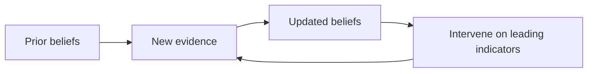

## The seven lenses

| Lens | Question |
|------|----------|
| What Exists | What is this, really? |
| What Changes | What is stationary vs non-stationary? |
| What Flows | What moves? Where are bottlenecks? |
| What Learns | What updates, remembers, optimizes? |
| What Persists | What survives change? |
| What Emerges | How do simple rules → complexity? |
| What Will Happen | Which futures are becoming likely? |

Walk them **in order** the first time. Later, jump to the lens that matches your confusion.

## Universal case study template

1. **TL;DR** — three bullets
2. **Phenomenon** — one-sentence definition
3. **Seven lens blocks** — collapsible sections, same order every time
4. **Curriculum bridge** — links to mechanism topics
5. **Forecasting snapshot** — optional under *What Will Happen*

## Forecasting walkthrough (Bayesian sketch)

**Start with a prior** — what you believed before today's evidence.

**Add likelihoods** — how probable is this evidence if each future were true?

**Compute posterior** — where probability mass moves after observing reality.

**Repeat** — forecasting is a loop, not a ceremony.

The [What Will Happen](/drishti/lenses/what-will-happen) lens page includes an interactive Bayesian updater lab.

## When to use Drishti vs curriculum

| You want… | Go to… |
|-----------|--------|
| See any phenomenon clearly | Drishti lenses + case studies |
| Learn the math and code | Curriculum topics + labs |
| Both | Start Drishti → follow bridge links |

## Try it now

Pick something bothering you today. Spend five minutes answering only **What Exists** and **What Flows**. Stop. Notice if the problem already looks different.