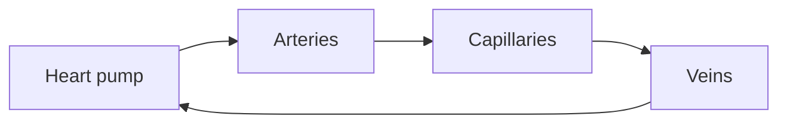

**The heart is a pump; arteries and capillaries are a network with queues.**

[Queueing theory](/topics/queueing-theory): narrow vessels raise residence time; clots are priority inversions that starve downstream organs.