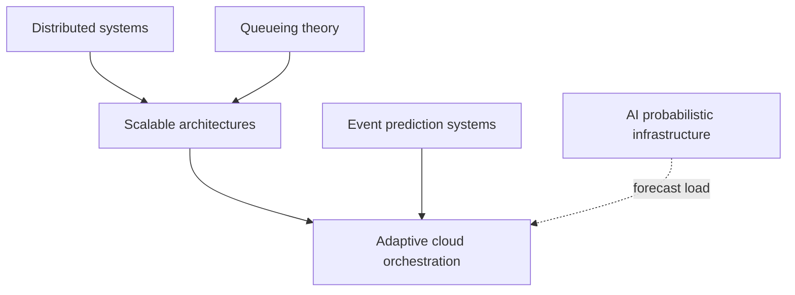
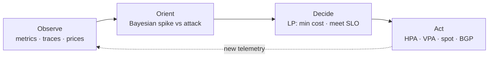
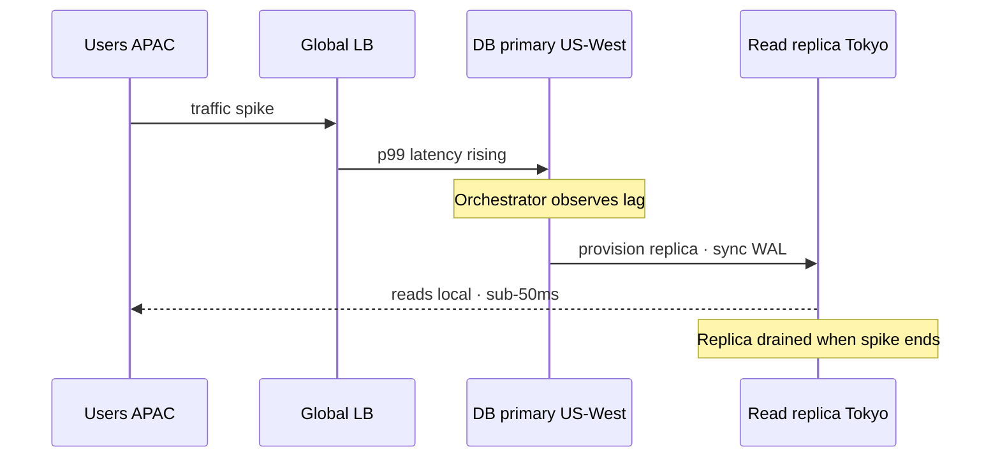

## Prerequisites



## When to use

- **Bursty or geo-skewed traffic** where static replica counts cannot keep p99 latency in bounds.
- **Multi-cloud or spot markets** when you want continuous cost–performance tradeoffs without manual runbooks.
- **Closed-loop SRE** that must observe metrics, orient with models, and act on infrastructure APIs in seconds.

## When not to use

- **Tiny, predictable workloads** on a single VM — basic cron + one autoscaler rule is enough.
- **Hard change-control** environments where every scale event needs human approval and audit tickets.
- **Unknown workload shape** with no telemetry history — models and optimizers need signal to be safe.

## How to read the diagrams

Start with the **OODA control loop** (how observe/orient/decide/act maps to Kubernetes and cloud APIs), then follow the **geo-adaptive sequence** for how read replicas and routing change under regional spikes. The ascii OODA sketch below is the same story in text form.

---

## Simple Fundamental Explanation
Imagine a standard cruise control on a car. You set it to 65 mph. It stays at 65 mph.
Now imagine an **Adaptive** cruise control. If a car cuts in front of you, it slows down. If the speed limit changes, it adjusts. It doesn't just execute a static command; it continuously *adapts* to a changing environment.

In cloud computing, a traditional orchestrator (like a basic Kubernetes deployment) is told: "Run exactly 5 copies of the database." If Black Friday hits and 5 databases aren't enough, the system crashes.
An **Adaptive Cloud Orchestrator** monitors latency, CPU, user locations, and cloud provider pricing in real-time. It automatically scales up to 50 databases, moves 20 of them to Europe because traffic is spiking there, and switches to cheaper AMD processors to save money—all probabilistically and without human intervention.

---

## Deep Dive: How It Works Under the Hood

Adaptive Orchestration sits one layer above the basic container scheduler. It relies on closed-loop control systems and probabilistic risk assessment.

### 1. Vertical vs Horizontal Adaptation
- **Horizontal Pod Autoscaling (HPA)**: Adding more clones of a container when CPU crosses a threshold (e.g., going from 5 to 50 servers).
- **Vertical Pod Autoscaling (VPA)**: Probabilistically analyzing a specific container and realizing it doesn't need 4GB of RAM, it only needs 2GB. The orchestrator live-migrates the container to a smaller instance to save money without changing the total number of servers.

### 2. Geo-Adaptive Routing
The orchestrator monitors the latency of users in real-time. If users in Tokyo are experiencing 200ms latency because the database is in California, the orchestrator proactively spawns a read-replica database in the Tokyo data center, syncs the data, and updates the BGP network routes. When the Tokyo traffic dies down, it destroys the replica to save money.

### Visual Diagram: The OODA Loop

### Diagram 1 — OODA loop on the control plane



### Diagram 2 — Geo-adaptive read replica under Tokyo spike



<!-- diagram -->
```diagram
The military OODA Loop (Observe, Orient, Decide, Act) applied to Cloud Orchestration.

[ Observe ]
Ingest 1,000,000 metrics/sec. (CPU, Latency, Spot Prices).

     |
     v
[ Orient (Probabilistic Modeling) ]
"CPU is at 80%. Is this a normal daily spike, or a DDoS attack?"
(Uses Bayesian Inference to decide it is a normal spike).

     |
     v
[ Decide ]
"I need 10 more servers. AWS US-East is charging $0.10. AWS US-West is charging $0.05."

     |
     v
[ Act ]
Issues API calls to AWS US-West to spawn 10 servers. Updates Load Balancer.
```

---

## Practical Example: Netflix's Titus

Netflix runs one of the most advanced adaptive orchestrators in the world, named Titus.

Titus manages millions of containers. It doesn't just look at CPU. It integrates deeply with AWS.
When Netflix needs to encode a new 4K movie into 50 different formats, Titus breaks the job into thousands of tiny pieces. It adaptively scans the entire global AWS spot market for the cheapest, most obscure servers available at that exact second. It claims them, runs the encode, and terminates them.

Because Titus is deeply adaptive, it can gracefully handle AWS suddenly terminating thousands of its spot instances simultaneously. It probabilistically ensures the video encode finishes on time, utilizing vast amounts of idle cloud capacity at a fraction of the normal cost.

---

## The Mathematics: Equations and In-Depth Analysis

### Mathematical Optimization (Linear Programming)
At its core, adaptive orchestration is a Constrained Optimization problem. The orchestrator must mathematically minimize Cost, subject to strict Performance constraints.

Let $x_i$ be the number of servers of type $i$ (e.g., $x_1$ = Small VM, $x_2$ = Large VM, $x_3$ = GPU VM).
Let $c_i$ be the hourly cost of server type $i$.
The objective is to minimize the total cost:

$$
\text{Minimize} \sum c_i x_i
$$

Subject to constraints:
1. **Capacity Constraint**: The total processing power must be greater than the probabilistically forecasted load $L$.

$$
\sum p_i x_i \ge L
$$

2. **Availability Constraint**: To survive a zone failure, no more than 50% of the servers can be in a single availability zone $Z_1$.

$$
\sum_{i \in Z_1} x_i \le 0.5 \sum x_i
$$

The adaptive orchestrator runs a Simplex or Interior Point algorithm on this matrix of equations every few seconds. Because cloud pricing and user load $L$ are constantly shifting, the mathematical "optimum" is a moving target. The system constantly chases this mathematical minimum, adapting the infrastructure shape in real-time.
