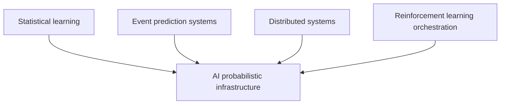
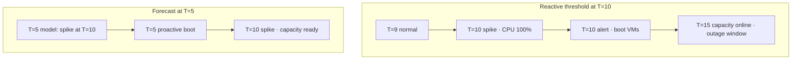
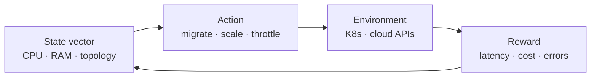

## Prerequisites



## When to use

- **Lead time dominates** (VM boot, cold containers) and reactive thresholds always arrive too late.
- **Non-linear cluster dynamics** where hand-written IF/ELSE rules cannot capture coupling between services.
- **Energy or cost surfaces** with many knobs (cooling, spot mix, placement) that benefit from learned policies.

## When not to use

- **Sparse or non-stationary telemetry** — forecasts and RL need history; fall back to PID/reactive rules.
- **Safety-critical single-shot actions** without human gates (bad model day can over-provision or drain pools).
- **Tiny clusters** where ML ops cost exceeds savings from predictive scaling.

## How to read the diagrams

Compare **reactive vs predictive timelines** first (why boot latency creates outage windows), then the **RL control loop** for how actions change cluster state and rewards. The ascii timeline below mirrors the same contrast.

---

## Simple Fundamental Explanation
Imagine driving a car.
- **Traditional Infrastructure**: The car has a cruise control button. You set it to 60 mph. If you start going up a steep hill, the car realizes its speed dropped to 55 mph, so it presses the gas pedal harder to get back to 60. It is *reactive*.
- **AI + Probabilistic Infrastructure**: The car has a self-driving AI. It looks at the GPS and the cameras. It calculates that there is a 90% probability of a steep hill 1 mile ahead, and an 80% probability of heavy traffic just over the crest. Before the car even reaches the hill, it automatically adjusts the transmission and smoothly decelerates, perfectly matching the upcoming conditions. It is *proactive and predictive*.

In modern cloud computing, infrastructure (like autoscaling, load balancing, and server provisioning) has historically been reactive (e.g., "If CPU > 80%, add 1 server").

**AI + Probabilistic Infrastructure** represents the bleeding edge of distributed systems. It uses Machine Learning models (like Time Series forecasting or Reinforcement Learning) to predict the future state of the system probabilistically, allowing the cloud to automatically scale, heal, and optimize itself *before* a problem ever occurs.

---

## Deep Dive: How It Works Under the Hood

### 1. Predictive Autoscaling
Traditional autoscalers use simple thresholds. Because booting up a new Virtual Machine or Container takes time (e.g., 2 to 5 minutes), a reactive autoscaler is always 5 minutes behind reality. If a massive traffic spike hits instantly, the system crashes before the new servers finish booting.

Probabilistic infrastructure feeds historical traffic metrics into Recurrent Neural Networks (RNNs) or ARIMA models.
The AI outputs a probabilistic forecast: "I am 95% confident that at 9:00 AM tomorrow, traffic will spike to 10,000 requests/sec."
The orchestrator reads this probability and proactively begins booting up servers at 8:55 AM. When 9:00 AM hits, the capacity is already there.

### 2. Reinforcement Learning (RL) Orchestration
Instead of human engineers writing complex rules for how to schedule tasks or route network packets, an RL agent is deployed into the cluster.
The agent takes actions (e.g., moving a database container from Server A to Server B).
It observes the reward (e.g., did latency go down? did cost go down?).
Over millions of probabilistic iterations, the AI learns a complex, highly non-linear strategy for managing the entire data center that drastically outperforms human-written logic.

### Visual Diagram: Predictive Scaling vs Reactive Scaling

### Diagram 1 — Reactive vs predictive capacity timeline



### Diagram 2 — RL orchestrator in the cluster MDP



<!-- diagram -->
```diagram
Traffic Spike at T=10. Server Boot Time = 5 minutes.

[ Reactive Autoscaling ]
T=09: Traffic normal.
T=10: MASSIVE SPIKE. CPU hits 100%. Users see Errors (503).
T=10: System detects high CPU. Issues command to boot new servers.
T=11: Servers booting... Users still crashing.
T=12: Servers booting...
...
T=15: Servers online. Traffic stabilizes. (5 minutes of downtime).

[ Probabilistic AI Autoscaling ]
T=05: AI forecasts 99% probability of massive spike at T=10 based on patterns.
T=05: System proactively begins booting servers.
T=10: Servers online.
T=10: MASSIVE SPIKE hits. Capacity is already perfectly matched.
Result: Zero downtime.
```

---

## Practical Example: Google's DeepMind Data Center Cooling

Google data centers use massive amounts of electricity to cool the tens of thousands of servers inside them.

Historically, cooling was managed by standard PID controllers reacting to temperature sensors.

Google applied DeepMind's AI to this infrastructure. The AI ingested billions of data points: outside weather forecasts, current server CPU loads, water pressure, and fan speeds.
Using a deep neural network, it probabilistically modeled the thermodynamics of the entire building.
Every 5 minutes, the AI calculates thousands of possible future scenarios, probabilistically evaluating which combination of fan speeds and water valves will result in the lowest energy usage while keeping the servers safely cool.

By shifting from reactive thermostats to probabilistic AI control, Google reduced the energy used for cooling their data centers by a staggering **40%**.

---

## The Mathematics: Equations and In-Depth Analysis

### 1. Time Series Forecasting (ARIMA / LSTMs)
To predict future load, systems often use ARIMA (AutoRegressive Integrated Moving Average) or LSTMs (Long Short-Term Memory neural networks).

In an AutoRegressive model, the future value $Y_t$ is a linear combination of past values, plus a probabilistic error term $\epsilon_t$ (white noise):

$$
Y_t = c + \phi_1 Y_{t-1} + \phi_2 Y_{t-2} + \dots + \phi_p Y_{t-p} + \epsilon_t
$$

The AI fits the parameters $\phi$ to historical data. It doesn't output a single deterministic number for tomorrow's traffic; it outputs a mean and a variance (a confidence interval). If the variance is too high (the prediction is highly uncertain), the orchestrator can fall back to standard reactive scaling.

### 2. Reinforcement Learning (Q-Learning)
In an RL-driven orchestrator, the system models the data center as a Markov Decision Process (MDP).
- **State ($S$)**: The current CPU load, memory usage, and network topology.
- **Action ($A$)**: Migrate VM, boot container, drop traffic.
- **Reward ($R$)**: $+1$ for low latency, $-5$ for server crash, $-1$ for high electricity cost.

The AI's goal is to learn the optimal Policy $\pi$ that maximizes the expected cumulative future reward. It does this by estimating the Q-value (Quality) of taking a specific action in a specific state using the Bellman Equation:

$$
Q^{new}(S_t, A_t) \leftarrow Q(S_t, A_t) + \alpha \left[ R_{t+1} + \gamma \max_a Q(S_{t+1}, a) - Q(S_t, A_t) \right]
$$

Where $\alpha$ is the learning rate and $\gamma$ is the discount factor (how much it cares about long-term vs short-term rewards).
In deep reinforcement learning, a massive neural network is used to approximate the $Q$ function, allowing the infrastructure to autonomously navigate state spaces (millions of possible server configurations) that are impossibly large for deterministic algorithms.
