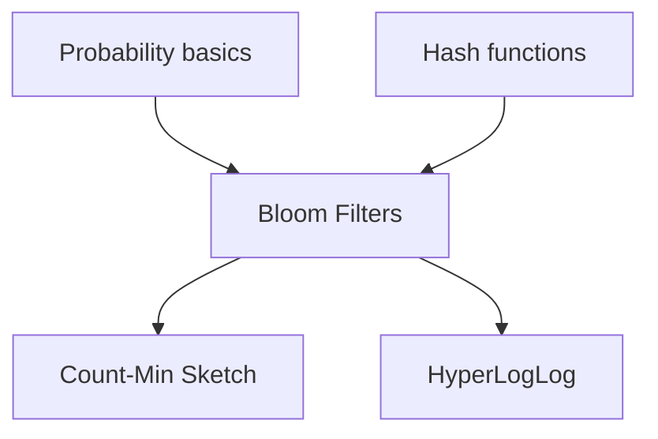

## Prerequisites



## Quickstart

```bash
cd BLOOM_FILTERS
python bloom_filter.py
# Optional: pytest test_bloom_parity.py -q
cargo test --manifest-path ../website/wasm/bloom_filter/Cargo.toml  # after WASM crate exists
```

## Simple Fundamental Explanation
Imagine you're running an exclusive club. You have a list of millions of VIP members. Checking the giant guestbook every time someone arrives takes too long. Instead, you use a clever system:

When someone becomes a VIP, you tell three different bouncers their name. Each bouncer has their own unique way of remembering names. They each make a checkmark on a giant chalkboard.
When someone tries to enter, you ask the three bouncers, "Is this person on your chalkboard?"
- If **any** bouncer says "No," you know for 100% certain the person is NOT a VIP.
- If **all** bouncers say "Yes," they are *probably* a VIP.

There's a tiny chance the bouncers confused them with other people whose checkmarks overlapped, but you'll never accidentally turn away a true VIP.

This is a **Bloom Filter**. It is a space-efficient probabilistic data structure that is used to test whether an element is a member of a set.
It gives you two possible answers:
1. **Definitely Not in the set** (No false negatives)
2. **Probably in the set** (Possible false positives)

---

## Deep Dive: How It Works Under the Hood

A Bloom Filter consists of two main parts:
1. A **Bit Array** of size $m$, initialized to all zeros.
2. A set of $k$ different **Hash Functions**. Each function maps an input value to one of the $m$ array positions with a uniform random distribution.

### Insertion
When you want to add an item to the Bloom Filter:
1. Feed the item to all $k$ hash functions.
2. Get $k$ array indices.
3. Set the bits at all these indices to `1`.

### Querying (Membership Test)
When you want to check if an item exists:
1. Feed the item to the same $k$ hash functions.
2. Check the bits at the resulting indices.
3. If **any** bit is `0`, the item is definitely not in the set.
4. If **all** bits are `1`, the item is probably in the set.

### Visual Diagram

<!-- diagram -->
```diagram
Initial State (m=10 bits, k=2 hash functions):
[ 0 | 0 | 0 | 0 | 0 | 0 | 0 | 0 | 0 | 0 ]

Insert "Apple":
Hash1("Apple") = 2
Hash2("Apple") = 7
[ 0 | 0 | 1 | 0 | 0 | 0 | 0 | 1 | 0 | 0 ]
          ^                   ^

Insert "Banana":
Hash1("Banana") = 5
Hash2("Banana") = 7  <-- Collision with Apple!
[ 0 | 0 | 1 | 0 | 0 | 1 | 0 | 1 | 0 | 0 ]
                      ^       ^

Check "Cherry" (Not inserted):
Hash1("Cherry") = 2
Hash2("Cherry") = 5
Even though bits 2 and 5 are both 1 (set by Apple and Banana),
the filter says "Probably Present" -> False Positive!

Check "Orange" (Not inserted):
Hash1("Orange") = 4
Hash2("Orange") = 7
Bit 4 is 0.
The filter says "Definitely Not Present" -> True Negative!
```

---

## Practical Example: Malicious URL Checker

Browsers like Google Chrome use Bloom Filters to check if a URL is malicious before loading it.

Storing every known malicious URL locally would take gigabytes of RAM. Instead, they download a tiny Bloom Filter (a few megabytes) representing all malicious URLs.

When you click a link:
1. Chrome checks the URL against the local Bloom Filter.
2. If it says "Definitely Not", the page loads instantly. (This happens 99.9% of the time).
3. If it says "Probably Yes", Chrome makes a slower network request to Google's servers to get the exact answer (resolving the false positive).

---

## The Mathematics: Equations and In-Depth Analysis

The core mathematical challenge of a Bloom Filter is minimizing the **False Positive Probability ($P$)**.

The probability of a false positive depends on three variables:
- $m$: Number of bits in the array
- $n$: Number of items inserted
- $k$: Number of hash functions used

### 1. Probability a bit is still 0
When inserting a single item, a specific hash function sets one bit. The probability it does **not** set a specific bit is:
$1 - \frac{1}{m}$

If we have $k$ hash functions, the probability that a specific bit is still 0 after one insertion is:
$\left(1 - \frac{1}{m}\right)^k$

After inserting $n$ items, the probability that a specific bit is still 0 is:
$\left(1 - \frac{1}{m}\right)^{kn}$

### 2. Probability a bit is 1
Therefore, the probability that a specific bit is 1 after $n$ insertions is:
$1 - \left(1 - \frac{1}{m}\right)^{kn}$

For large $m$, this can be approximated using the Taylor series expansion $e^{-x} \approx 1 - x$:
$1 - e^{-kn/m}$

### 3. False Positive Rate ($P$)
A false positive occurs if, when checking an item, all $k$ hashed bits happen to be 1. The probability of this is the probability that one bit is 1, raised to the power of $k$:

$$
P \approx \left( 1 - e^{-kn/m} \right)^k
$$

### Optimizing $k$
To minimize the false positive rate for a given $m$ and $n$, the optimal number of hash functions $k$ is:

$$
k = \frac{m}{n} \ln(2)
$$

This means that in an optimal Bloom Filter, roughly 50% of the bits are set to 1.

### Why It Scales
The space required $m$ scales linearly with $n$. If you want to maintain a 1% false positive rate ($P = 0.01$), you need roughly $m = 9.6n$ bits. This is less than 10 bits per item, regardless of the size of the item! Storing a billion 100-byte strings exactly takes 100GB. A Bloom filter with a 1% error rate takes about 1.2GB.

---

## Hash Functions under the Hood (Implementation Parity)

There is a subtle, high-performance optimization in how Bloom Filters are built in real-world environments compared to simple simulations:

1. **Independent Salted Hashing (Python & JS Sim):**
   In the Python code (`bloom_filter.py`), $k$ independent hash functions are simulated by appending a seed integer `i` to the input key string and hashing it with MD5:
   $$\text{Hash}_i(x) = \text{MD5}(x + \text{str}(i)) \pmod m$$
   While simple and easy to implement, executing MD5 $k$ times for every single stream event can become a computational bottleneck.

2. **Double Hashing (Rust Port):**
   In the Rust implementation (`bloom_filter.rs`), we utilize the **Kirsch-Mitzenmacher optimization** (Double Hashing). This technique shows that one can simulate an arbitrary number of independent hash functions using just two base hash values ($h_1$ and $h_2$) by combining them linearly:
   $$\text{Hash}_i(x) = (h_1(x) + i \times h_2(x)) \pmod m$$
   In our Rust code, $h_1$ and $h_2$ are generated using standard `DefaultHasher` (SipHash) with two different seeds. This requires only two hashing passes instead of $k$, vastly improving CPU throughput at scale.
   
> [!NOTE]
> Due to this optimization, a key inserted in Python or Javascript will set different bit indices than the same key in Rust. While both filters maintain identical mathematical false-positive rates, their individual bit arrays will differ.

---

## Benchmarks

| Scenario | m | n | k | Notes |
|----------|---|---|---|-------|
| Baseline | 1024 | 500 | 7 | 1% target FP |

Reproduce (Python): `pytest BLOOM_FILTERS/test_bloom_parity.py --benchmark-only` (after adding pytest-benchmark).

---

**Interactive version:** [Bloom filters (web)](https://chaitra.pages.dev/topics/bloom-filters) — update hostname after Cloudflare custom domain is set.
