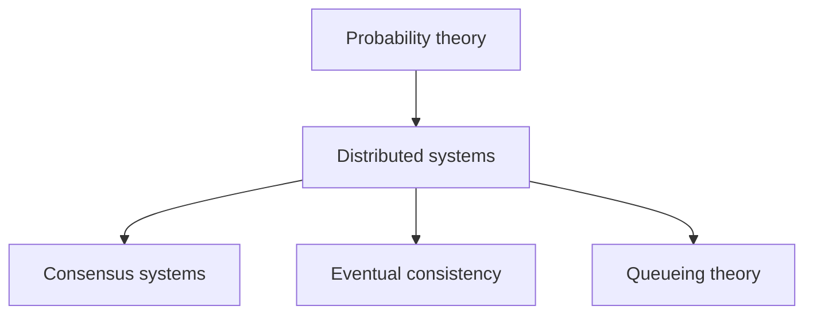
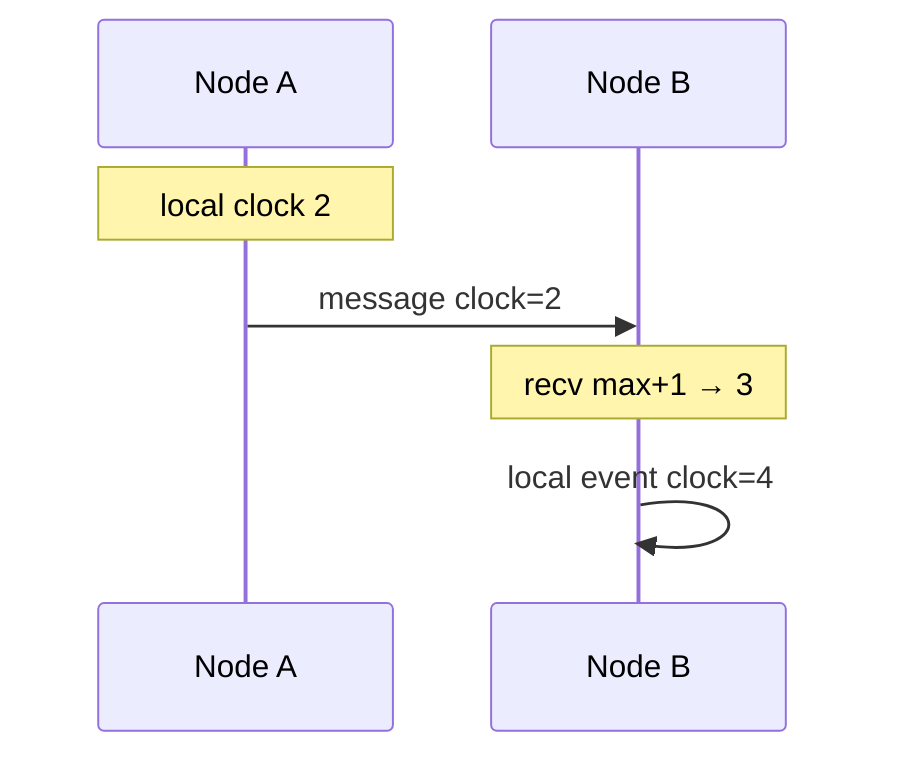
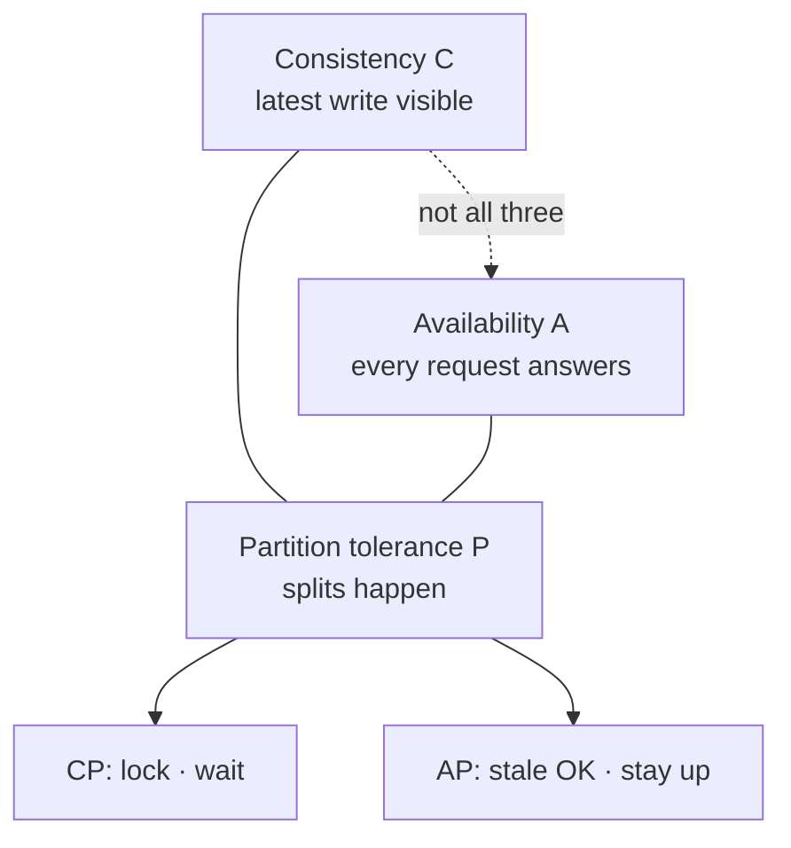
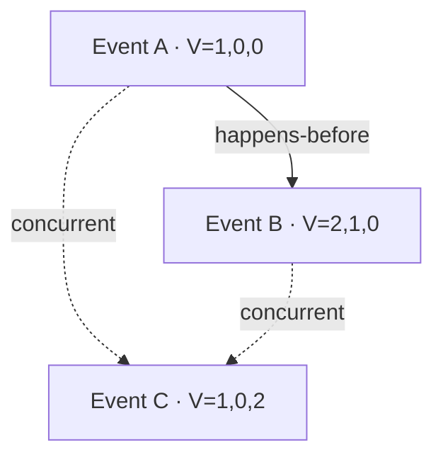

## Prerequisites



## When to use

- **Scale beyond one machine** with fault isolation and geographic spread.
- **Always-on services** where single-host failure is unacceptable.
- **Foundation** for caches, queues, databases, and ML platforms.

## When not to use

- **Single-node** apps with modest traffic — a monolith on one VM is simpler.
- **Strong global ACID** without engineering investment — distributed transactions are hard.
- **Ignoring network reality** — the fallacies of distributed computing bite every time.

## How to read the diagrams

Read **CAP** under partition, then **Lamport clocks** for causal order without trusting wall time, then **vector clocks** to detect true concurrency (feeds CRDT / eventual-consistency topics).

---

## Simple Fundamental Explanation
Imagine you run a bank.
- **Single System**: You have one giant ledger on one desk. If two people want to deposit money, they stand in a single line. The ledger is perfectly accurate, but if the building burns down, the bank is destroyed.
- **Distributed System**: You hire 5 clerks and put them in 5 different buildings across the city, each with their own copy of the ledger. If one building burns down, the bank survives! But now, if Alice deposits $10 in Building A, and Bob withdraws $10 in Building B at the exact same second, how do the clerks ensure their ledgers perfectly match without calling each other and freezing all transactions?

A **Distributed System** is a collection of independent computers that appear to its users as a single coherent system. The fundamental challenge of distributed systems theory is managing state, time, and failures across unpredictable networks.

---

## Deep Dive: How It Works Under the Hood

### The Fallacies of Distributed Computing
Engineers transitioning from single-server code to distributed architectures usually fail because they assume:
1. The network is reliable.
2. Latency is zero.
3. Bandwidth is infinite.
4. The network is secure.
5. Topology doesn't change.

In reality, networks partition (cables are cut), servers pause for garbage collection (stragglers), and clocks drift out of sync.

### Time and Ordering (Logical Clocks)
In a single computer, you order events using the CPU's clock.
In a distributed system, you cannot trust physical clocks (NTP drift means Server A might think it's 1:00 PM while Server B thinks it's 1:01 PM).
If A sends a message to B, B's timestamp might indicate it received the message *before* A sent it!

To solve this, Leslie Lamport invented **Logical Clocks**. Instead of using physical time, servers use integer counters.
- When an event occurs, increment the counter.
- When sending a message, attach the counter.
- When receiving a message, set your local counter to `MAX(local_counter, message_counter) + 1`.

This simple algorithm mathematically guarantees a causal ordering of events across the entire cluster without needing perfectly synchronized physical clocks.

### Diagram 2 — Lamport logical clocks



### Visual Diagram: The CAP Theorem

### Diagram 1 — CAP theorem (pick two under partition)



<!-- diagram -->
```diagram
          [ Consistency ]
           (Every read receives the most recent write)
             /       \
            /         \
           /           \
          /             \
[ Availability ]-------[ Partition Tolerance ]
(Every request gets    (System operates despite
 a response)            network drops)

The Theorem: You can only pick TWO.
Because the internet ALWAYS drops packets (Partitions will happen),
you must choose between CP (Lock the database, wait for the network to heal)
or AP (Serve slightly stale data immediately).
```

---

## Practical Example: Google Spanner

Google Spanner is a globally distributed SQL database. It famously claims to provide both high availability AND strong consistency, seemingly violating the CAP theorem.

How? Google controls the physical network (fiber optic cables). They heavily mitigate Partitions.
More importantly, they solved the "Physical Clock" problem using **TrueTime**. They put GPS receivers and atomic clocks in every single data center. TrueTime gives an API that returns a time *interval*: `[earliest, latest]`.
If a transaction commits at Server A, Spanner intentionally forces the server to pause and wait a few milliseconds until it is mathematically guaranteed that the `latest` bound of the physical clock has passed, ensuring no other server on Earth could possibly generate a conflicting earlier timestamp. This translates physical time back into perfect logical ordering.

---

## The Mathematics: Equations and In-Depth Analysis

### 1. Vector Clocks
Lamport clocks provide a total ordering, but they cannot definitively prove if two events were concurrent (happened at the same time independently).
Vector Clocks solve this. An event is timestamped with an array of counters, one for each node in the system: $V = [v_1, v_2, \dots, v_n]$.

Event A happened before Event B (denoted $A \to B$) if and only if:

$$
\forall i, V_A[i] \le V_B[i] \text{ and } \exists j, V_A[j] < V_B[j]
$$

If neither $A \to B$ nor $B \to A$ is true, the events are mathematically proven to be concurrent, and the system must handle the conflict (e.g., using a CRDT or Last-Write-Wins).

### Diagram 3 — Vector clocks: happens-before vs concurrent



### 2. The FLP Impossibility Result
Fischer, Lynch, and Paterson (1985) published one of the most important proofs in distributed systems.

They proved mathematically that in a purely asynchronous network (where there is no upper bound on message delay), it is **impossible** to achieve deterministic consensus among a group of nodes if even a *single node* can crash silently.

Because you cannot definitively distinguish a dead node from a very slow node in an asynchronous network, the algorithm can never confidently proceed.
This theorem is the entire reason that real-world consensus algorithms (like Raft or Paxos) rely on timeouts (assuming partial synchrony) or probability (like Gossip or Nakamoto Consensus) to bypass the mathematical impossibility of absolute deterministic agreement.
