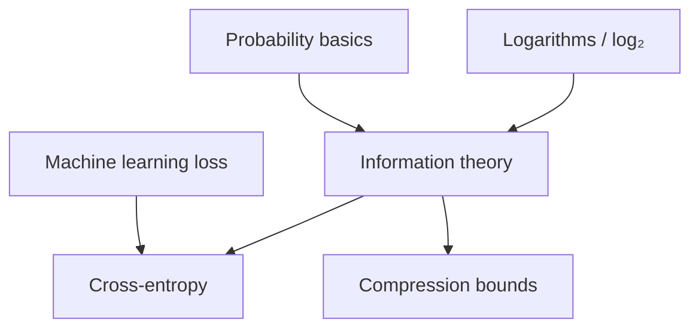

## Prerequisites



## When to use

- **Measuring uncertainty** in categorical outcomes (logs, tokens, labels) before compression or modeling.
- **Designing loss functions** (cross-entropy, KL) when a model’s predicted distribution must match reality.
- **Sizing channels & codes** — entropy lower-bounds average bits per symbol for lossless compression.

## When not to use

- Outcomes are **not probabilistic** or probabilities are unknown — entropy needs a well-defined distribution.
- You need **semantic similarity** between texts — use embeddings, not raw Shannon entropy of bytes alone.
- **Continuous** signals without discretization — differential entropy and sampling issues apply; this topic focuses on discrete symbols.

## Lab

On the [interactive information-theory lab](/topics/information-theory#lab), build a **symbol histogram**, tune **P(symbol)** on coin presets or pick **skewed vs uniform** streams, read **surprisal** per symbol and **H(X)** vs the **uniform baseline**, try **Biased 99/1** or **Uniform ×4** presets, predict whether entropy stays below the uniform ceiling, then reveal **H(P) vs H(P, Q_uniform)** and **D_KL**.

## Simple Fundamental Explanation
Imagine you have a biased coin that lands on Heads 99% of the time, and Tails 1% of the time.
If I flip it and tell you "It was Heads," you learn almost nothing. You already assumed it was going to be Heads.
If I flip it and tell you "It was Tails!" you are shocked. You just received a massive amount of *information*.

**Information Theory**, invented by Claude Shannon in 1948, proves that information is mathematically equivalent to "surprise." The less probable an event is, the more information it contains. This theory forms the absolute foundation of data compression, network communication, encryption, and Machine Learning.

---

## Deep Dive: How It Works Under the Hood

### Bits as Uncertainty
A "bit" in information theory isn't just a 0 or a 1 in a computer. It is the amount of information required to resolve a 50/50 uncertainty. If I flip a fair coin, telling you the result transmits exactly 1 bit of information.

### Entropy
Entropy is the measure of average uncertainty (or information content) in a system.
- If a data stream is highly predictable (like a log file filled with "Success, Success, Success"), its entropy is very low. It can be heavily compressed (like ZIP or GZIP).
- If a data stream is purely random (like an encrypted password file), its entropy is maximized. It cannot be compressed at all.

### Channel Capacity
Shannon also proved that every communication channel (a fiber optic cable, a wireless signal, or a database connection) has a maximum theoretical limit to how much error-free data can be sent through it per second, known as the Shannon Limit.

### Visual Diagram: Entropy and Compression

```text
Stream A (Low Entropy): A A A A A A A A A B
(Highly predictable. We can compress this to "9A 1B").

Stream B (High Entropy): A C X Z B Q P M Y T
(Completely random. Cannot compress. Must send exactly as is).

Information Theory proves that the absolute minimum size a file can be compressed to is strictly equal to its Entropy.
```

---

## Practical Example: Machine Learning Cross-Entropy

When you train a Large Language Model (or any classifier classifier), the neural network outputs a probability distribution (e.g., "90% Dog, 10% Cat").
The true answer is "100% Dog, 0% Cat".

How do we mathematically calculate how "wrong" the AI is, so we can adjust its weights? We use **Cross-Entropy Loss**, a direct application of Information Theory.
Cross-Entropy measures the number of bits required to transmit an event from the *true* probability distribution, if we mistakenly used the *predicted* probability distribution to encode it. By minimizing the Cross-Entropy, we mathematically force the AI's predictions to perfectly match reality.

---

## The Mathematics: Equations and In-Depth Analysis

### 1. Information Content (Surprisal)
The information content $I$ of an event $x$ is inversely proportional to its probability $P(x)$. It is measured in bits (base 2 logarithm):

$$
I(x) = -\log_2(P(x))
$$

If $P(\text{Heads}) = 0.5$, $I = -\log_2(0.5) = 1$ bit.
If $P(\text{Tails}) = 0.01$, $I = -\log_2(0.01) \approx 6.64$ bits.

### 2. Shannon Entropy ($H$)
The entropy $H(X)$ of a random variable $X$ is the expected value (average) of the information content of all possible outcomes.

$$
H(X) = -\sum_{i} P(x_i) \log_2(P(x_i))
$$

If a coin is fair ($P=0.5$), $H = -(0.5 \log_2 0.5 + 0.5 \log_2 0.5) = 1.0$.
If a coin is biased ($P=0.99$), $H = -(0.99 \log_2 0.99 + 0.01 \log_2 0.01) \approx 0.08$.
A highly biased system has almost zero entropy (uncertainty).

### 3. Kullback-Leibler (KL) Divergence
KL Divergence measures how one probability distribution $Q$ (e.g., our AI's prediction) diverges from a second, expected probability distribution $P$ (e.g., the true labels).

$$
D_{KL}(P \parallel Q) = \sum_{x} P(x) \log_2 \left( \frac{P(x)}{Q(x)} \right)
$$

KL Divergence is literally the extra number of bits you are forced to transmit if you encode the data using the wrong assumption ($Q$) instead of the true distribution ($P$). It is the foundational loss function for Variational Autoencoders (VAEs) and Generative AI.
